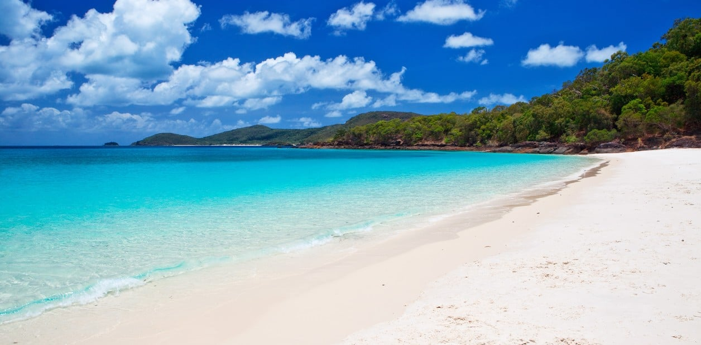
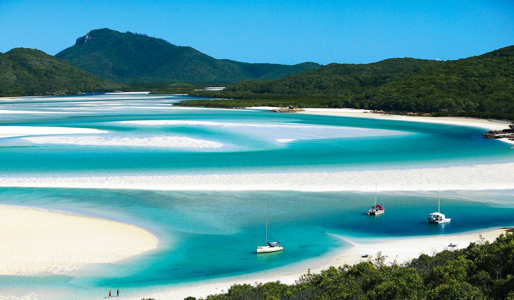
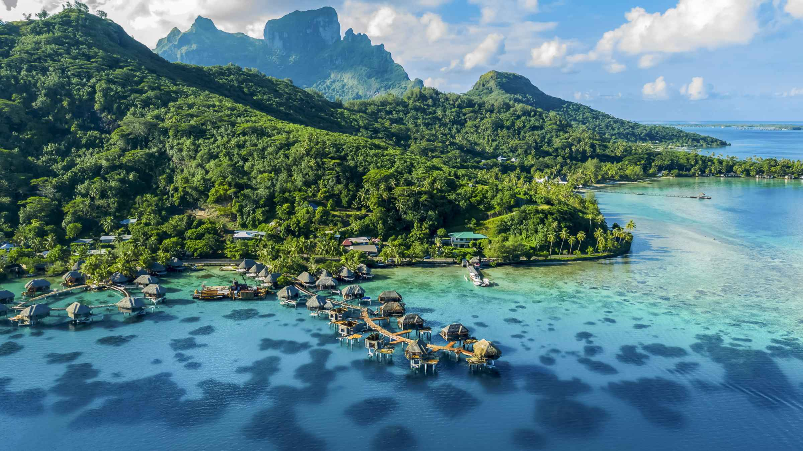
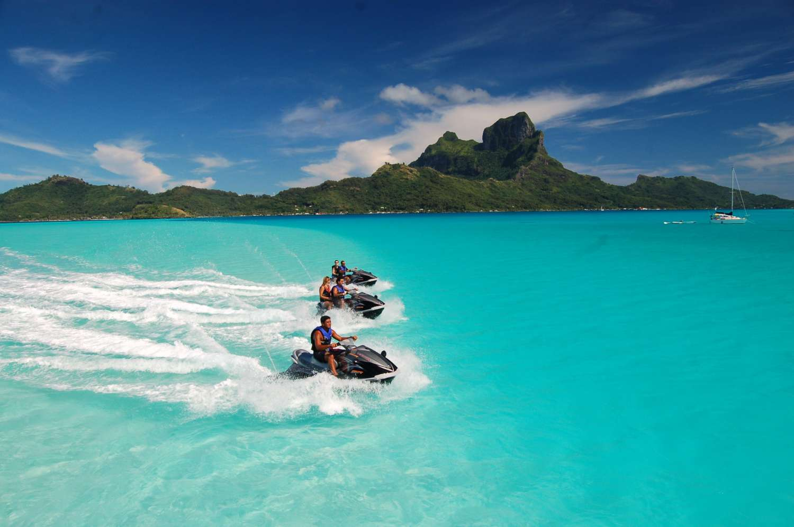
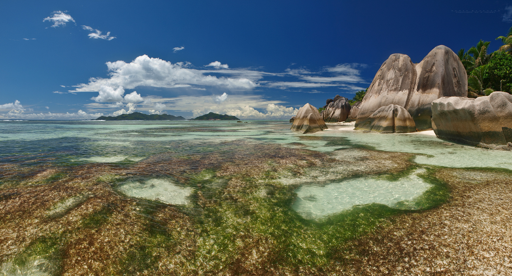
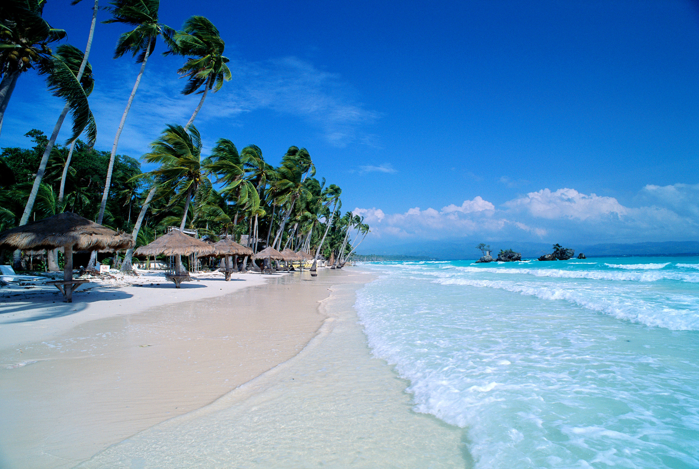

When it comes to breathtaking beaches, there are plenty of options to choose from. Here are three stunning beaches that you must know about.

## 1. Whitehaven Beach
Located in the Whitsunday Islands of Australia, Whitehaven Beach is renowned for its pristine white sands and crystal-clear turquoise waters. Stretching over seven kilometers, this picturesque beach offers a tranquil paradise for beach lovers. With its unspoiled beauty and serene atmosphere, it's no wonder that Whitehaven Beach is often referred to as one of the most beautiful beaches in the world.

## 2. Bora Bora
Situated in the South Pacific, Bora Bora is a tropical paradise that enchants visitors with its vibrant coral reefs, turquoise lagoons, and luxurious overwater bungalows. Known for its breathtaking sunsets and stunning scenery, Bora Bora is a dream destination for those seeking a romantic beach getaway.

## 3. Anse Source d'Argent
Anse Source d'Argent in Seychelles is a true tropical paradise. With its unique granite rock formations, crystal-clear waters, and palm-fringed shores, this beach is a photographer's dream. The contrast between the white sandy beach and the granite boulders creates a surreal and captivating landscape that will leave you in awe.

These three beautiful beaches offer a glimpse of paradise on Earth. Whether you're looking for tranquility, romance, or stunning scenery, each of these beaches is a must-visit destination for beach enthusiasts.

