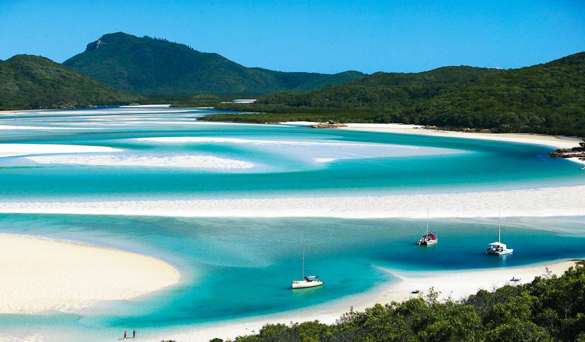
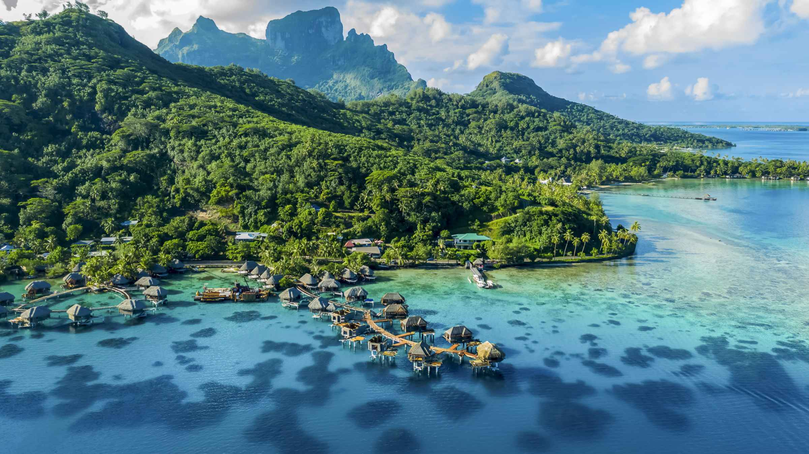
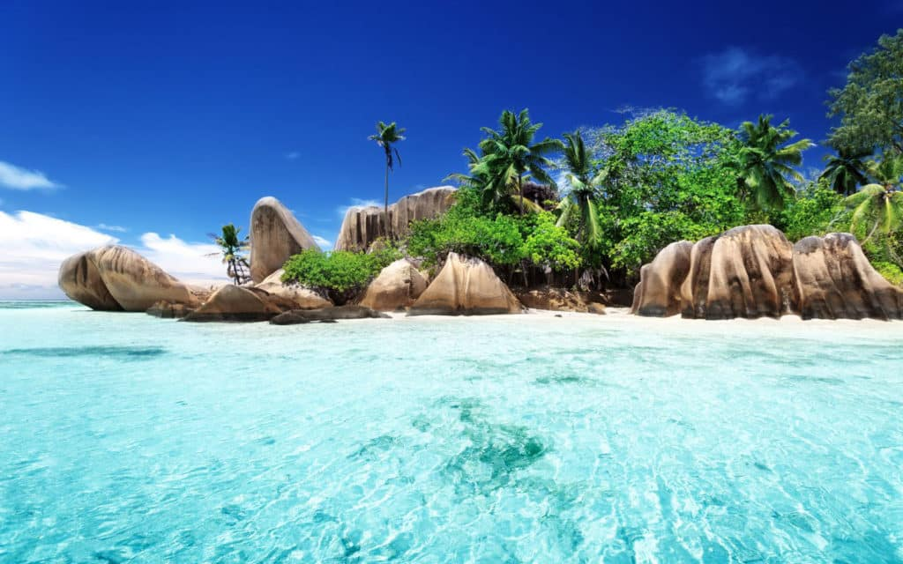
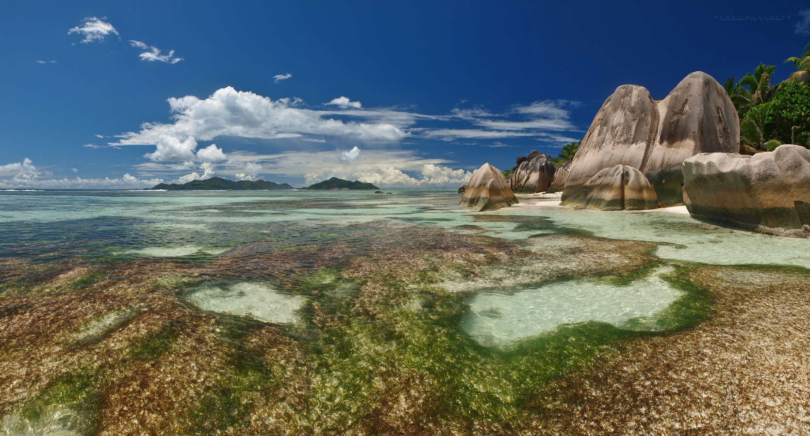

숨이 멎을 듯 아름다운 해변은 세계 각지에 있으며, 그에 대한 선택할 수 있는 옵션이 많이 있습니다.

당신에게 꼭 알아야 할 멋진 해변 3곳을 소개합니다.

## 1. 호주, 화이트헤븐 비치

호주 휘트선데이 제도에 위치한 Whitehaven Beach는 깨끗한 백사장과 맑은 청록색 바다로 유명합니다.

7km 이상 뻗어 있는 이 그림 같은 해변은 해변을 사랑하는 사람들에게 고요한 낙원을 제공합니다.
때묻지 않은 아름다움과 고요한 분위기로 인해 Whitehaven Beach가 종종 세계에서 가장 아름다운 해변 중 하나로 언급되는 것은 놀라운 일이 아닙니다.

## 2. 남태평양, 보라보라
남태평양에 위치한 보라보라는 활기찬 산호초, 청록색 석호, 호화로운 수상 방갈로로 방문객을 매혹시키는 열대 낙원입니다.

숨이 멎을 듯 아름다운 일몰과 멋진 풍경으로 유명한 보라보라는 낭만적인 해변 휴양지를 찾는 사람들에게 꿈의 목적지입니다.

## 3. 세이셸, 안세 사우어스 드아전트
아프리카 세이셸의 안세 사우어스 드아전트는 진정한 열대 낙원입니다.

독특한 화강암 암석, 수정처럼 맑은 바닷물, 야자수가 늘어선 해안이 있는 이 해변은 사진작가의 꿈입니다.
백사장과 화강암 바위 사이의 대조는 경이로움을 느끼게 할 초현실적이고 매혹적인 풍경을 만듭니다.

이 세 개의 아름다운 해변은 지구상의 낙원을 엿볼 수 있게 해줍니다.
고요함, 로맨스 또는 멋진 풍경을 찾고 있든 상관없이 이 해변은 해변 애호가라면 반드시 방문해야 할 목적지입니다.

