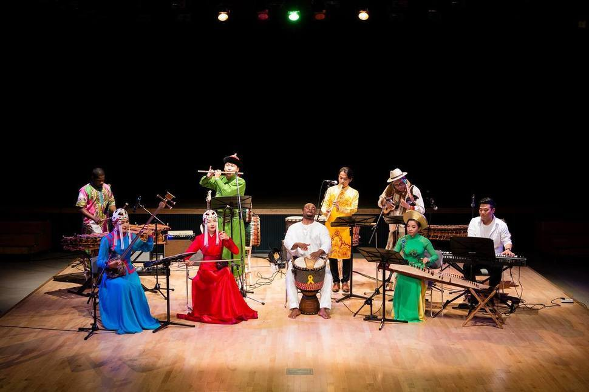
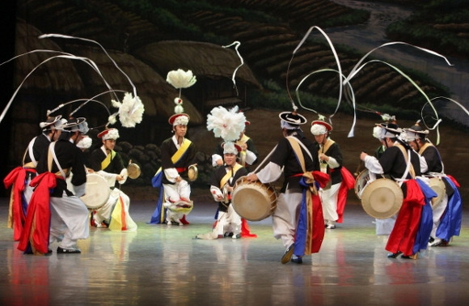

한국음악은 독특하고 다채로운 음악적 스타일과 풍부한 문화적 배경을 가지고 있어, 다른 나라의 음악과는 다른 새로운 음악적 경험을 제공합니다. 오늘은 활기찬 한국음악의 세 가지 핵심 사실을 알아보겠습니다.

## 1. K-Pop

케이팝은 대한민국에서 유래된 세계적인 현상입니다. 중얼거리는 멜로디, 조율된 안무 그리고 화려한 비주얼로 인해 K-Pop은 전 세계 수백만 팬들을 매료시켜왔습니다. BTS, 블랙핑크, EXO와 같은 아티스트들은 국제적인 성공을 거두었을 뿐만 아니라 음악 산업, 패션, 뷰티, 문화 트렌드에도 영향을 끼치고 있습니다.

## 2. 전통한국음악

한국문화에 깊은 의미를 담은 전통한국음악은 국내에서 중요한 역할을 수행합니다. 가야금과 장구 같은 악기들이 모여 독특한 멜로디를 연주하며 국가의 풍요로운 역사를 반영합니다. 판소리는 전통 무용과 의식에 자주 동반되며 감동적인 이야기를 전하는데, 이는 듣는 이들에게 감정적인 깊이를 전달합니다.

## 3. 인디 씬

케이인디 또는 한국 인디 음악 씬은 예술적 표현의 보물창고입니다. 록, 포크, 힙합과 같은 다양한 장르들이 많은 재능 있는 음악가 덕분에 주목받고 있습니다. IU의 내심 담긴 멜로디나 10cm의 애수 넘치는 노래와 같은 다양한 음악들은 진정성과 깊이를 추구하는 청취자들에게 공감을 불러일으킵니다.

한국음악을 통해 한국의 역사, 전통, 가치관 등을 이해할 수 있으며, 한국문화에 대한 폭넓은 시각과 깊은 이해를 도모할 수 있습니다. 앞으로도 기대해 주세요. 기억하세요, 지식은 힘입니다!

