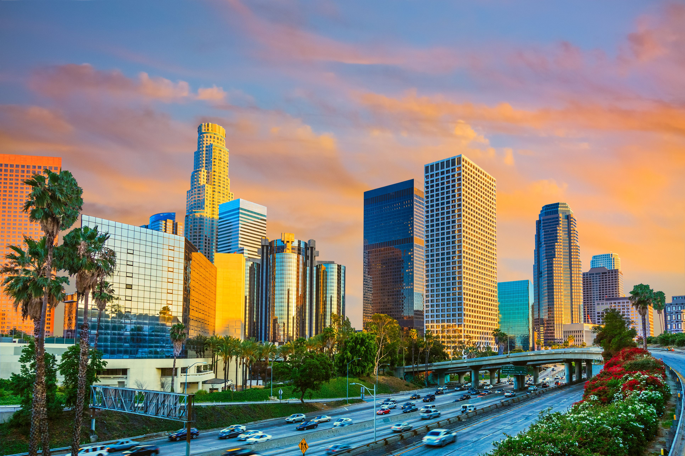
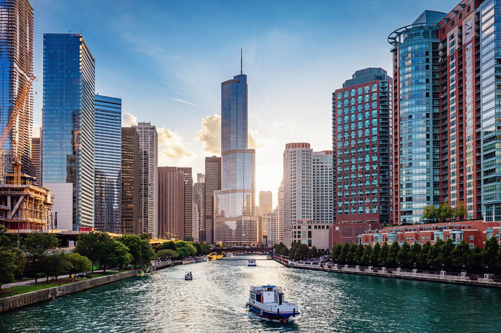
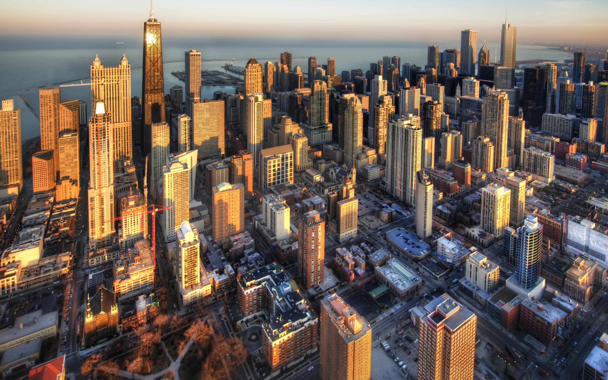
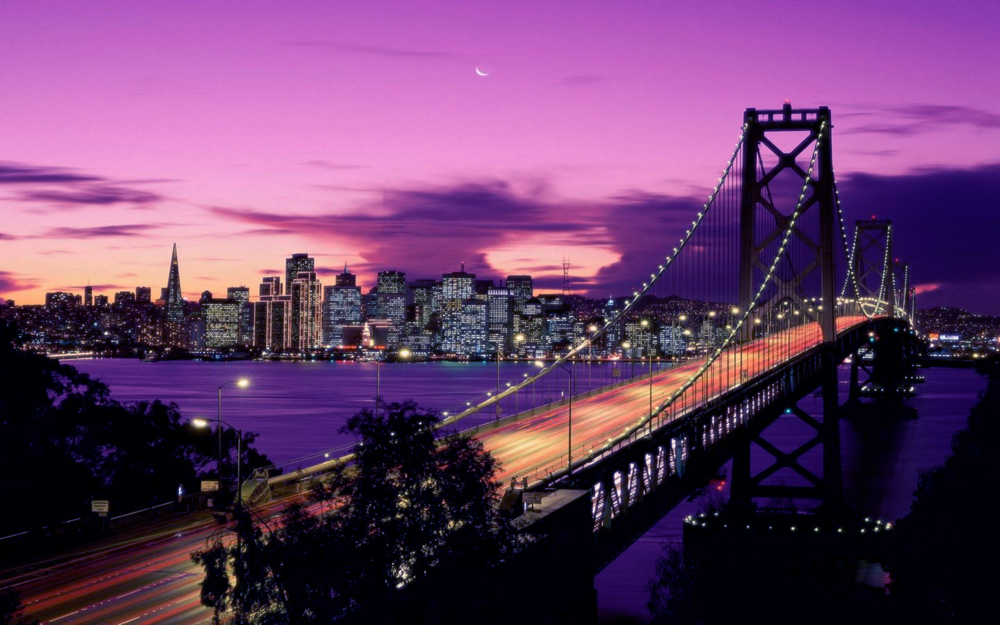
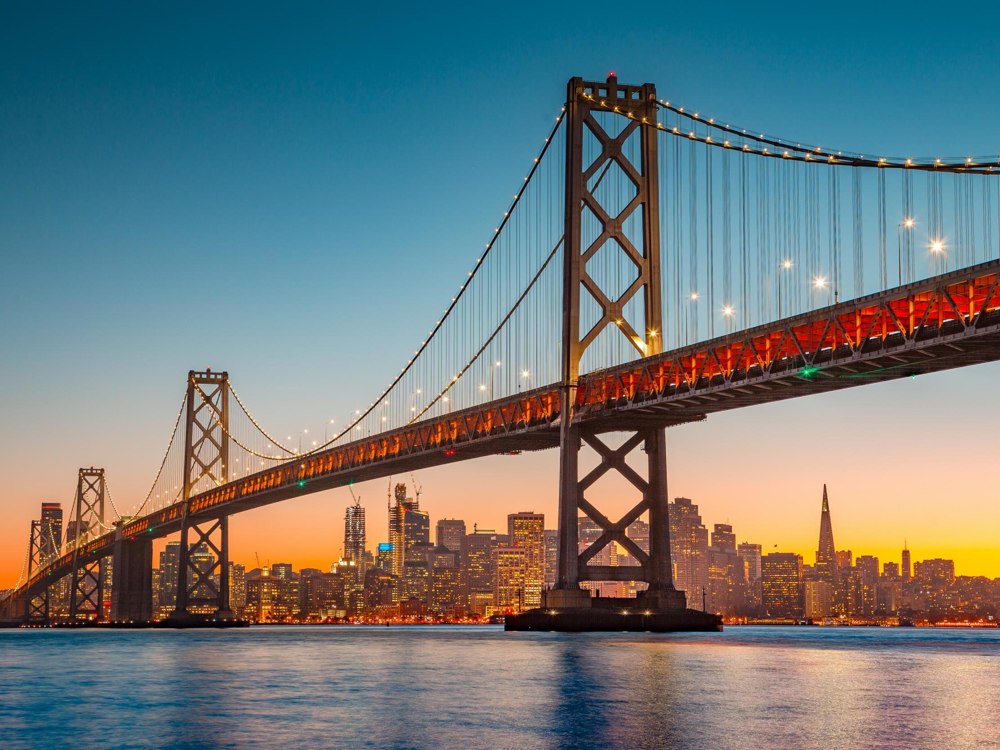
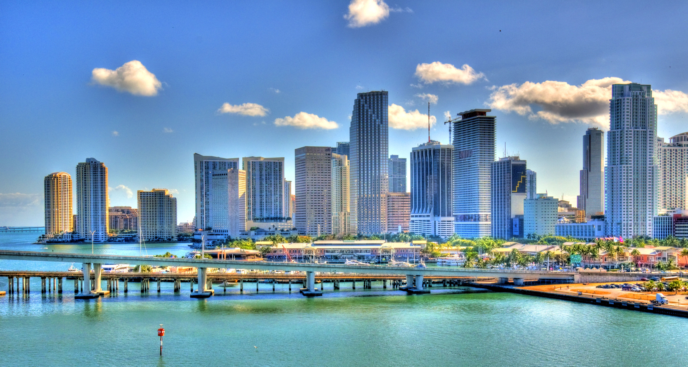
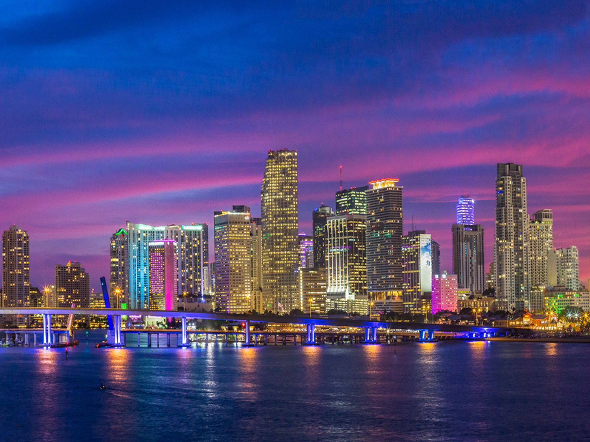
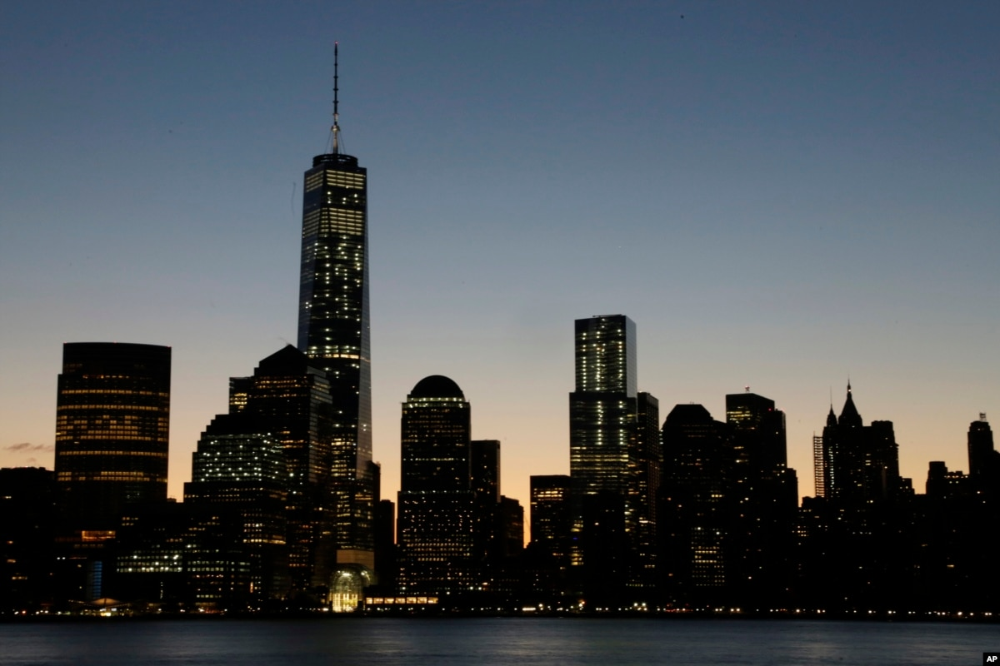

Are you ready to explore the wonders of the United States? Let's take a closer look at five captivating cities that define the spirit of America.

## New York City
Known as the 'Big Apple', New York City is a global hub of culture, finance, and entertainment. Home to iconic landmarks like the Statue of Liberty, Times Square, and Central Park, this bustling metropolis never sleeps.

## Los Angeles
Famous for its glitz and glamour, Los Angeles is the entertainment capital of the world. From the Hollywood Walk of Fame to the stunning beaches of Malibu, LA offers a unique blend of celebrity culture and natural beauty.

## Chicago
Located on the shores of Lake Michigan, Chicago is renowned for its stunning architecture, deep-dish pizza, and vibrant arts scene. Don't miss the breathtaking view from the Willis Tower Skydeck or a stroll along the Magnificent Mile.

## San Francisco
With its iconic Golden Gate Bridge, hilly streets, and historic cable cars, San Francisco is a city like no other. Indulge in delicious seafood at Fisherman's Wharf or explore the vibrant neighborhoods of Chinatown and Mission District.

## Miami
Known for its stunning beaches, vibrant nightlife, and diverse culture, Miami is a tropical paradise. Immerse yourself in the vibrant atmosphere of South Beach or take a boat tour through the picturesque Biscayne Bay.

These five US cities offer unique experiences and embody the diverse spirit of the United States. Whether you're seeking culture, adventure, or relaxation, there's a city waiting to captivate you.

