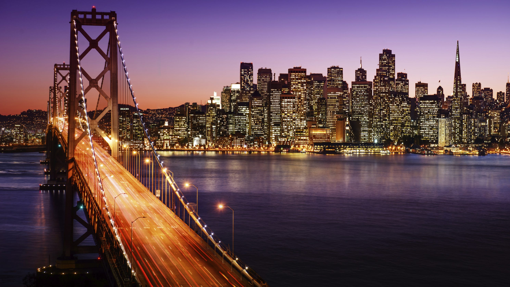
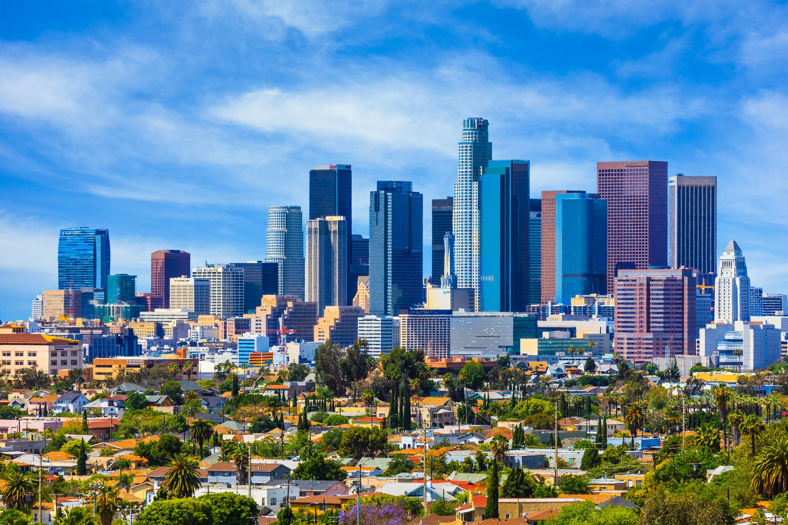
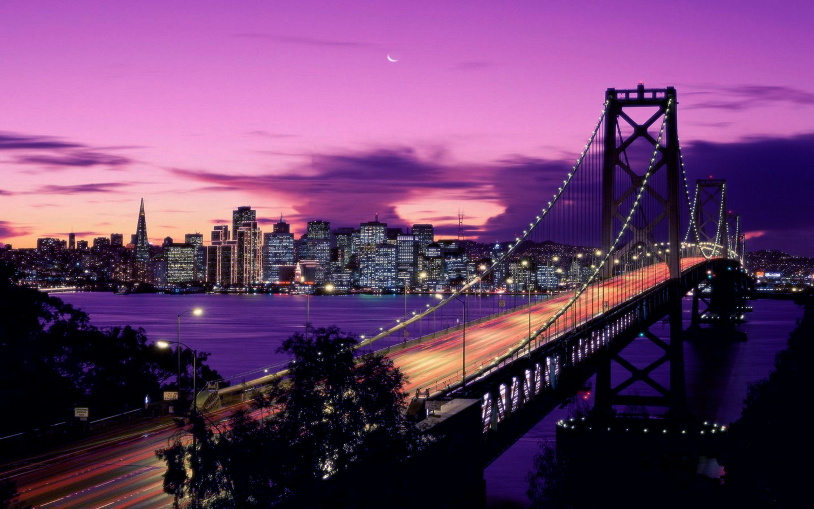
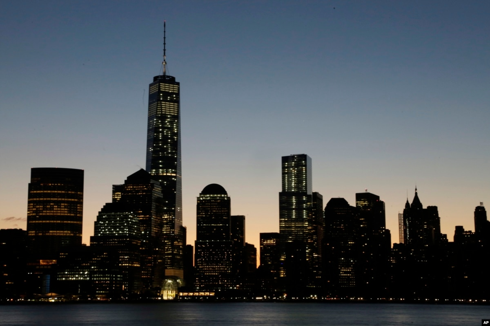

미국의 경이로움을 탐험할 준비가 되셨습니까? 미국의 정신을 정의하는 매력적인 다섯 도시를 자세히 살펴보겠습니다.

## 뉴욕시
'빅 애플'로 알려진 뉴욕시는 문화, 금융 및 엔터테인먼트의 글로벌 허브입니다. 자유의 여신상, 타임스퀘어, 센트럴 파크와 같은 상징적인 랜드마크가 있는 이 번화한 대도시는 잠들지 않습니다.

## 로스앤젤레스
현란함과 매력으로 유명한 로스앤젤레스는 세계 엔터테인먼트의 중심지입니다. 할리우드 명예의 거리(Hollywood Walk of Fame)부터 말리부의 멋진 해변까지, LA는 유명 인사 문화와 자연의 아름다움이 독특하게 어우러진 곳입니다.

## 시카고
미시간 호수 기슭에 위치한 시카고는 멋진 건축물, 딥 디쉬 피자, 활기찬 예술 현장으로 유명합니다. Willis Tower Skydeck에서 바라보는 숨막히는 전경이나 매그니피션트 마일(Magnificent Mile) 산책을 놓치지 마세요.

## 샌프란시스코
상징적인 금문교, 언덕이 많은 거리, 유서 깊은 케이블카가 있는 샌프란시스코는 다른 어느 곳과도 비교할 수 없는 도시입니다. Fisherman's Wharf에서 ​​맛있는 해산물을 즐기거나 활기찬 차이나타운과 미션 디스트릭트 지역을 둘러보세요.

## 마이애미
멋진 해변, 활기찬 나이트라이프, 다양한 문화로 유명한 마이애미는 열대 낙원입니다. 사우스 비치의 활기찬 분위기에 흠뻑 빠져보거나 그림 같은 비스케인 만을 따라 보트 투어를 즐겨보세요.

이 5개의 미국 도시는 독특한 경험을 제공하고 미국의 다양한 정신을 구현합니다. 문화, 모험 또는 휴식을 찾고 계시다면 마음을 사로잡을 도시가 기다리고 있습니다.

