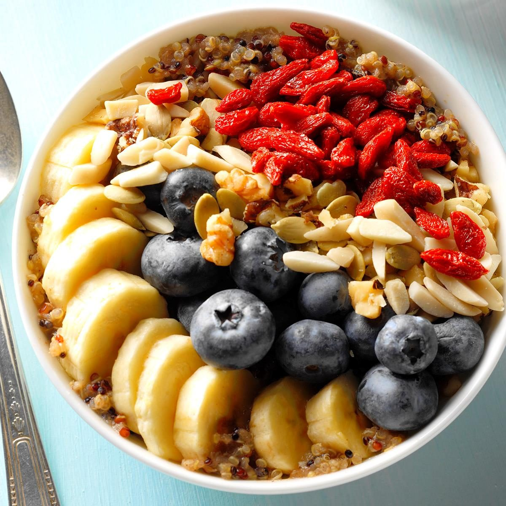
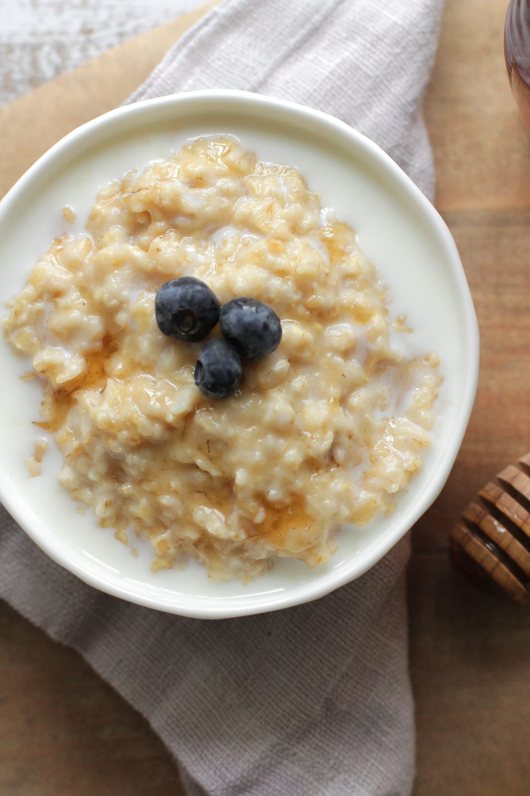
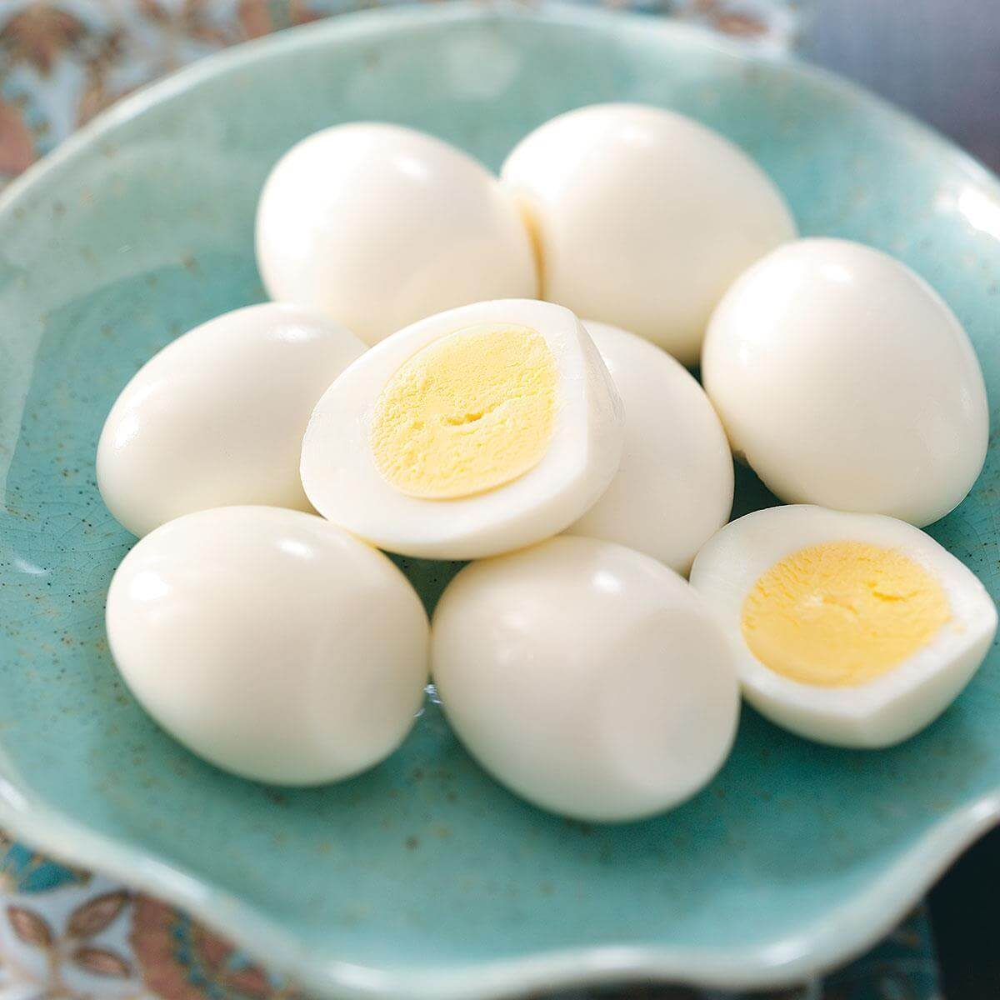
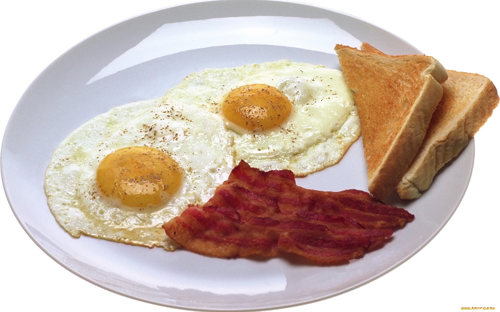
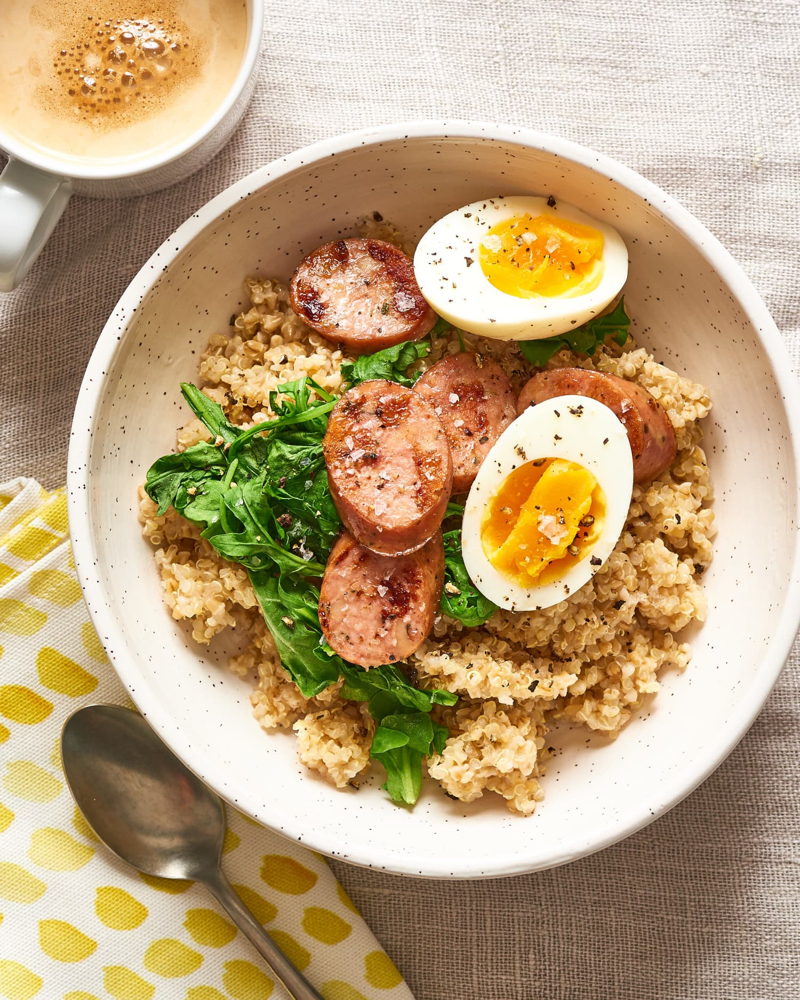
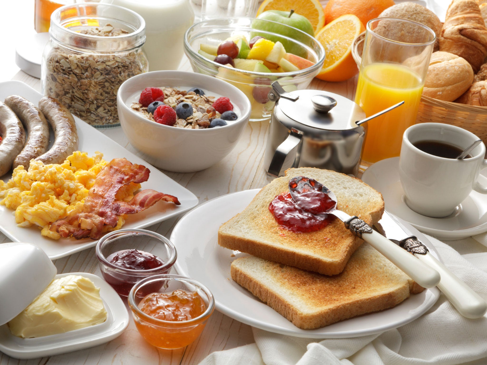

Breakfast is the most important meal of the day, and choosing the right foods can provide you with the energy and nutrients you need to start your day. In this article, we will explore three breakfast foods that you must know to kick-start your morning.

## 1. Oatmeal
Oatmeal is a nutritious and filling breakfast option. It is rich in fiber, which helps to keep you full and satisfied until lunchtime. Oats also provide complex carbohydrates, which are a great source of energy. Additionally, oatmeal is known to reduce cholesterol levels and improve heart health. You can top your oatmeal with fruits, nuts, or honey for added flavor and nutrients.

## 2. Eggs
Eggs are an excellent source of protein and provide essential amino acids that support muscle growth and repair. They are also packed with important vitamins and minerals such as vitamin D, vitamin B12, selenium, and choline. Eggs can be prepared in various ways, such as boiled, scrambled, or as an omelette. Pair them with whole wheat toast and veggies for a wholesome breakfast.

## 3. Greek Yogurt
Greek yogurt is a creamy and delicious breakfast option that is high in protein and low in calories. It provides probiotics, which promote a healthy gut and aid digestion. Greek yogurt is also rich in calcium and contains essential nutrients like potassium and vitamin B12. You can add fresh fruits, granola, or a drizzle of honey to enhance the taste of your Greek yogurt.

Incorporating these three breakfast foods into your morning routine can set you up for a productive and energetic day. Remember to choose whole grain options, incorporate fruits and vegetables, and keep your breakfast balanced and nutritious.

