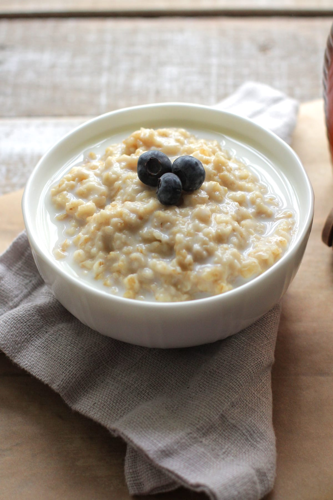
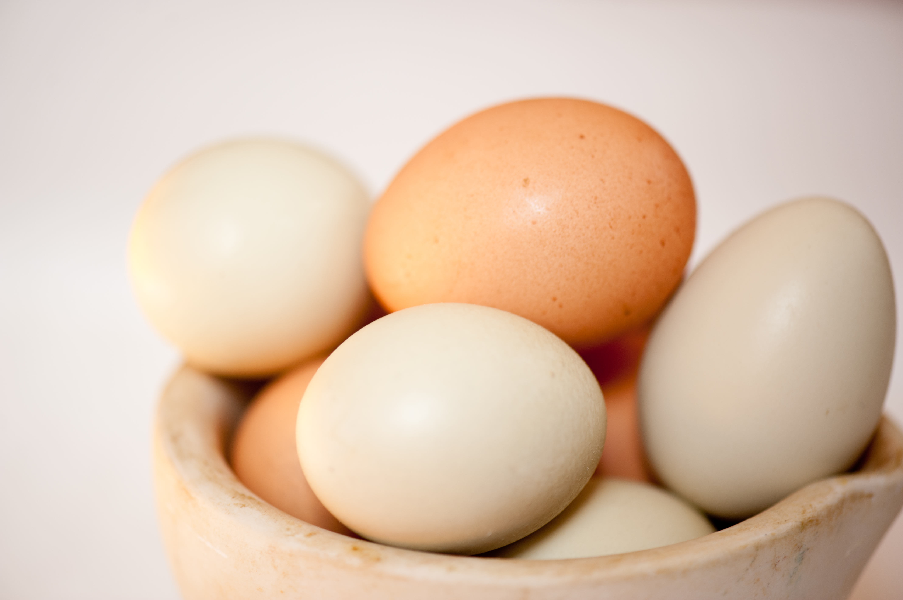
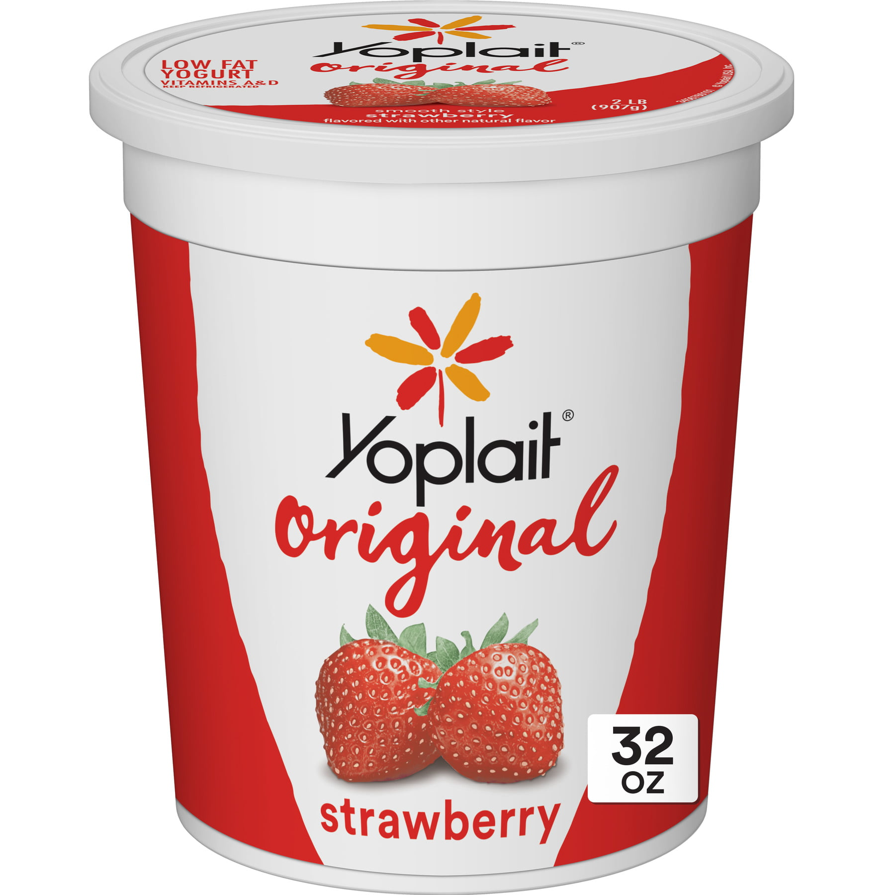

아침 식사는 하루 중 가장 중요한 식사이며 올바른 음식을 선택하면 하루를 시작하는 데 필요한 에너지와 영양분을 얻을 수 있습니다. 이 기사에서는 아침을 시작하기 위해 알아야 할 세 가지 아침 식사 음식을 살펴보겠습니다.

## 1. 오트밀
오트밀은 영양가가 풍부하고 포만감을 주는 아침 식사 옵션입니다. 섬유질이 풍부하여 점심시간까지 포만감을 유지하는데 도움을 줍니다. 귀리는 또한 훌륭한 에너지원인 복합 탄수화물을 제공합니다. 또한 오트밀은 콜레스테롤 수치를 낮추고 심장 건강을 개선하는 것으로 알려져 있습니다. 풍미와 영양분을 더하기 위해 과일, 견과류 또는 꿀을 오트밀 위에 얹을 수 있습니다.

## 2. 계란
계란은 훌륭한 단백질 공급원이며 근육 성장과 회복을 지원하는 필수 아미노산을 제공합니다. 그들은 또한 비타민 D, 비타민 B12, 셀레늄 및 콜린과 같은 중요한 비타민과 미네랄로 가득 차 있습니다. 계란은 삶거나 스크램블하거나 오믈렛으로 만드는 등 다양한 방법으로 준비할 수 있습니다. 건강한 아침 식사를 위해 통밀 토스트 및 채소와 짝을 이룹니다.

## 3. 그릭 요거트
그릭 요거트는 단백질 함량이 높고 칼로리가 낮은 크리미하고 맛있는 아침 식사 옵션입니다. 건강한 장을 촉진하고 소화를 돕는 프로바이오틱스를 제공합니다. 그릭 요거트는 또한 칼슘이 풍부하고 칼륨 및 비타민 B12와 같은 필수 영양소를 함유하고 있습니다. 신선한 과일, 그래놀라 또는 꿀을 조금 넣어 그릭 요거트의 맛을 더할 수 있습니다.

이 세 가지 아침 식사 음식을 아침 일과에 통합하면 생산적이고 활기찬 하루를 보낼 수 있습니다. 통곡물 옵션을 선택하고, 과일과 채소를 포함하고, 아침 식사의 균형과 영양을 유지하는 것을 잊지 마십시오.

