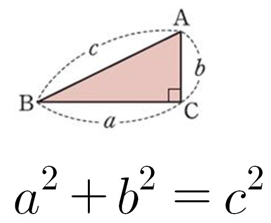
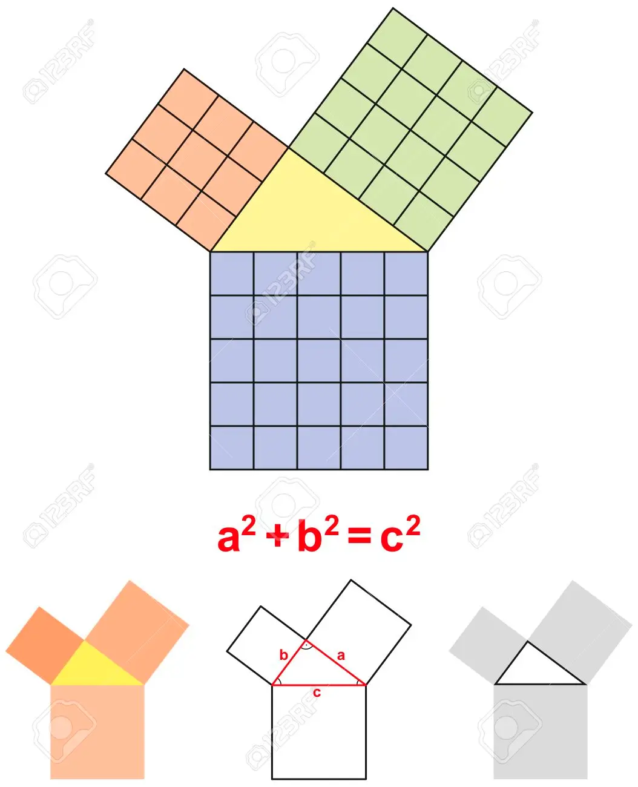
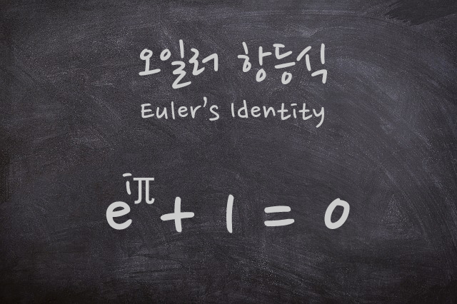
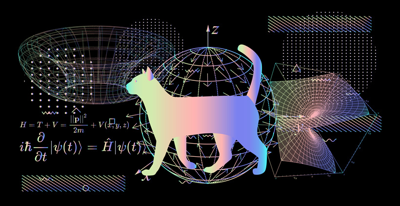
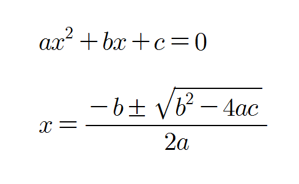
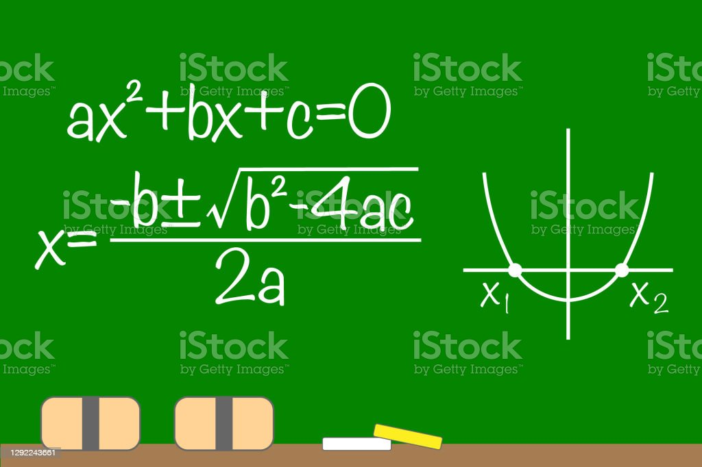

# 수학 공식

죽기 전에 반드시 알아야 할 수학 공식 세 가지에 대한 오늘의 비디오 프레젠테이션에 오신 것을 환영합니다. 바로 알아보겠습니다!

## 1. 피타고라스의 정리

피타고라스의 정리는 직각삼각형에서 빗변(직각을 나타내는 가장 긴 변)의 제곱이 다른 두 변의 제곱의 합과 같다는 것을 말합니다. 이는 "a 제곱 더하기 b 제곱은 c 제곱과 같다"로 표현될 수 있습니다. 이 영원한 공식을 통해 우리는 직각삼각형에서 빠진 변의 길이를 구할 수 있게 되며, 이는 건축, 공학, 항해 등 다양한 분야에서 핵심 도구로 사용됩니다.

## 2. 오일러의 항등식

오일러의 항등식은 수학에서 가장 아름다운 공식 중 하나로 간주됩니다. 이 공식은 영(0), 일(1), 원주율(pi), 자연로그의 밑(e) 그리고 허수(i)를 연결합니다. 이 놀라운 등식인 e^(iπ) + 1 = 0은 대수학, 삼각함수, 복소수해석 등 다양한 분야를 통합합니다.

## 3. 이차 방정식 공식

이차 방정식 공식은 실생활 문제에서 종종 나타나는 이차 방정식을 풀기 위해 꼭 필요한 도구입니다. x는 -b에 루트의 b 제곱에서 4ac를 뺀 값, 모두 2a로 나눈 것이며, 이를 통해 x의 해를 구할 수 있습니다. 이는 투사 운동 계산, 최적화, 리스크 분석과 같은 많은 과학, 기술, 금 융 분야에서 중요한 역할을 담당하고 있습니다.

기억하세요. 이 세 가지 수학 공식을 이해하고 적용하는 것은 우리의 문제 해결 능력을 크게 향상시키며, 생활의 다양한 측면에서 도전을 정복할 수 있게 해줍니다. 그러니 이별을 고하고나서 수학의 아름다움과 실용성을 받아들이도록 합시다.

시청해 주셔서 감사합니다! 교육적인 콘텐츠 더 많이 보시려면 좋아요, 공유, 구독을 잊지마세요. 모두 즐거운 하루 되세요!