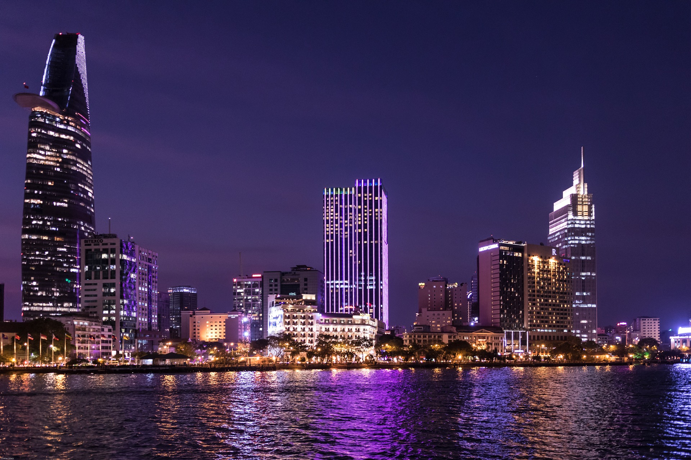
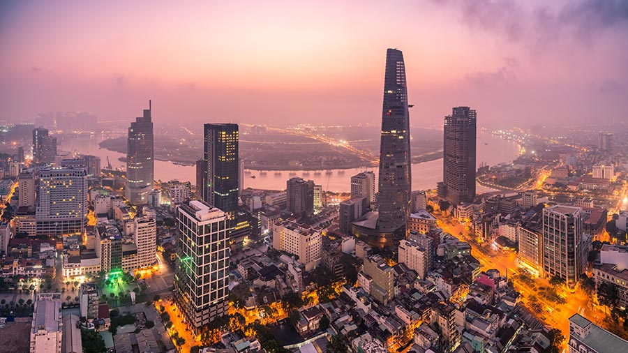
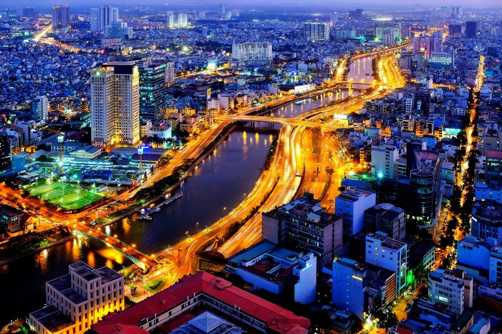

Ho Chi Minh City, formerly known as Saigon, is the largest city in Vietnam and a popular tourist destination. Here are 5 key points you should know about this vibrant city.

## Rich History
Ho Chi Minh City has a rich history that dates back to ancient times. The city has been influenced by various cultures, including the Khmer Empire, the Chinese, and the French colonial period. It played a significant role during the Vietnam War and is home to many historical landmarks and museums.

## Cosmopolitan Hub
Ho Chi Minh City is a bustling cosmopolitan hub with a vibrant cityscape. It offers a blend of modern skyscrapers, bustling streets, street markets, shopping centers, and luxurious hotels. The city's skyline is constantly evolving with impressive architectural structures.

## Cultural Heritage
The city is known for its rich cultural heritage, with a fusion of Vietnamese, Chinese, and French influences. Visitors can explore various cultural attractions such as pagodas, temples, museums, and traditional markets. The local cuisine is also a unique blend of flavors influenced by different cultures.

## Thriving Street Food Scene
Ho Chi Minh City is renowned for its vibrant street food scene. From delicious pho and banh mi to fresh seafood and tropical fruits, the city offers a wide variety of mouthwatering dishes. Exploring the local street food stalls and markets is a must-do experience for food enthusiasts.

## Economic Center
Ho Chi Minh City is a major economic center in Vietnam. It has a strong economy driven by industries such as finance, commerce, tourism, and technology. The city boasts modern infrastructure, business districts, and is a key player in the country's rapid economic growth.

Ho Chi Minh City offers a captivating blend of history, culture, and modernity. Whether you're interested in exploring its rich heritage, indulging in delicious street food, or experiencing its vibrant city life, this dynamic city has something for everyone.

