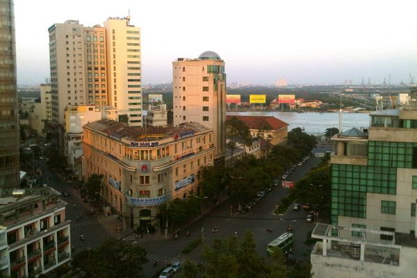
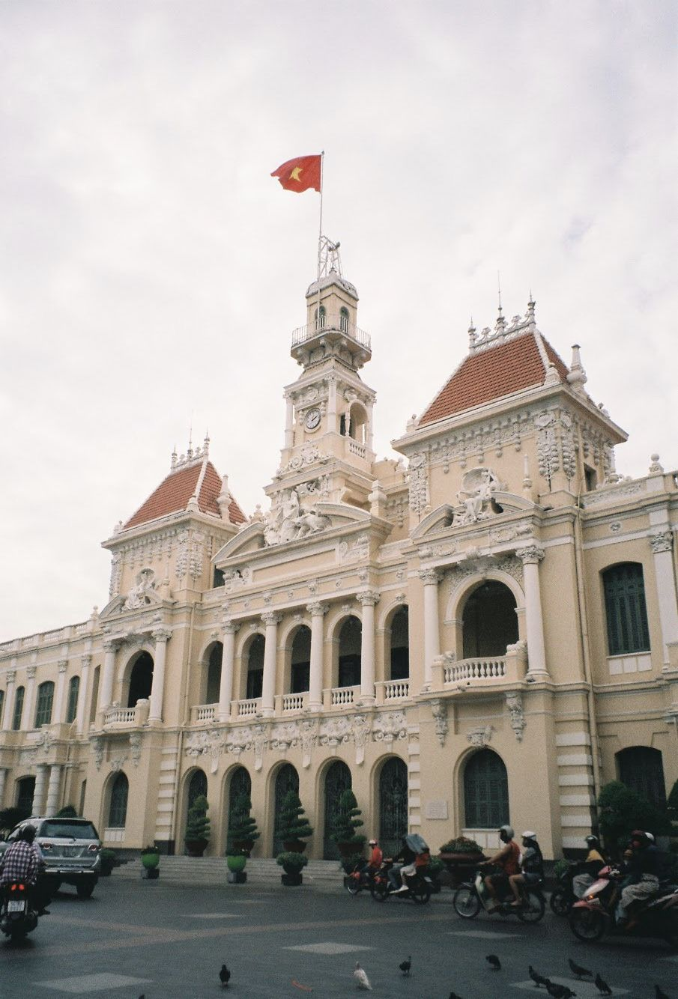
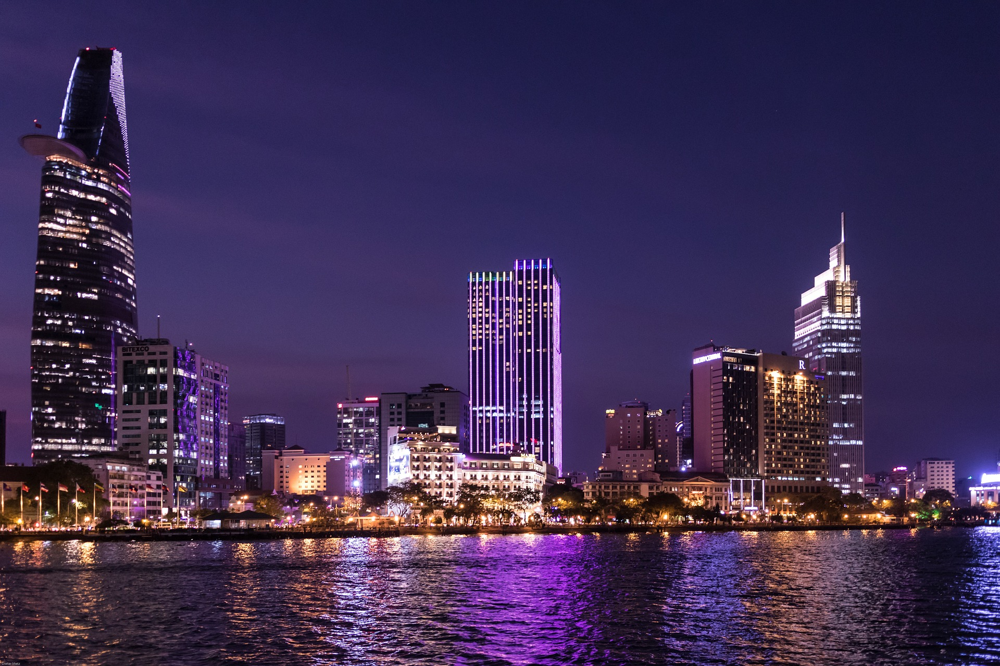
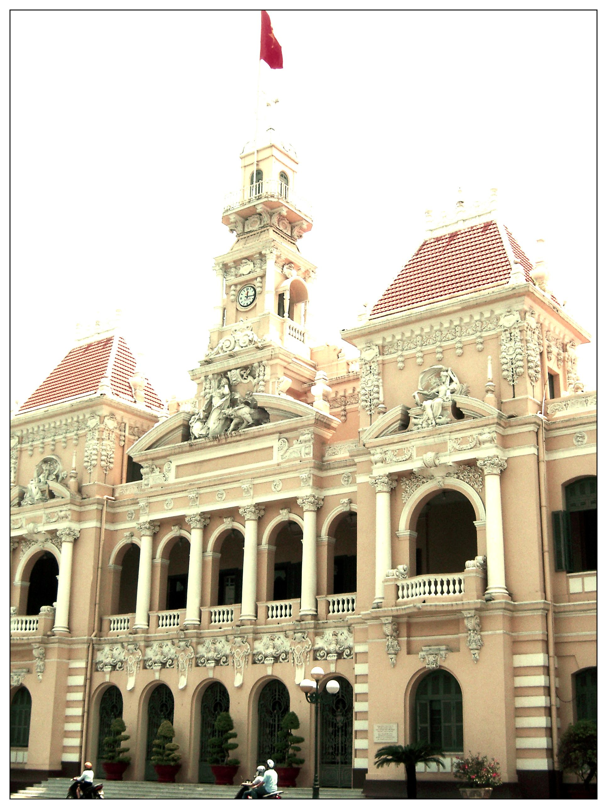
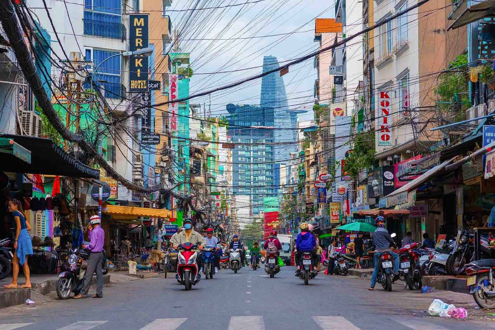
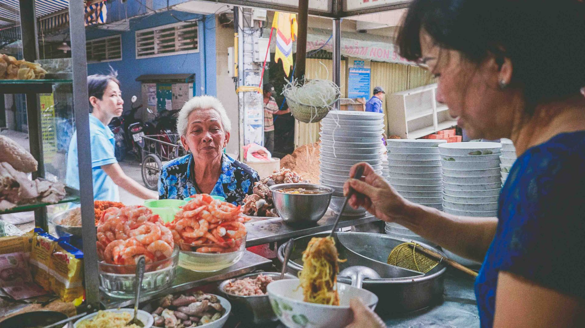
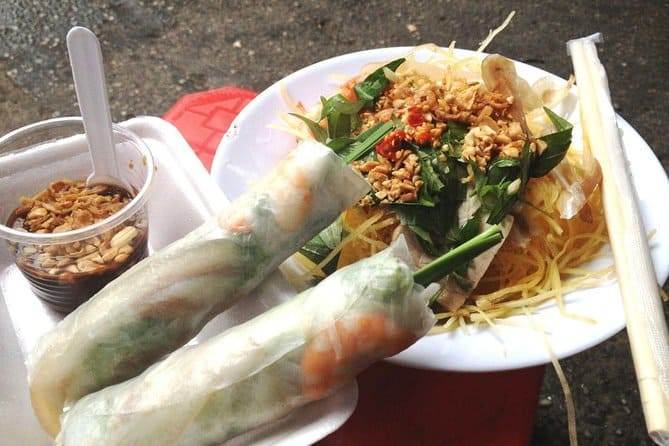
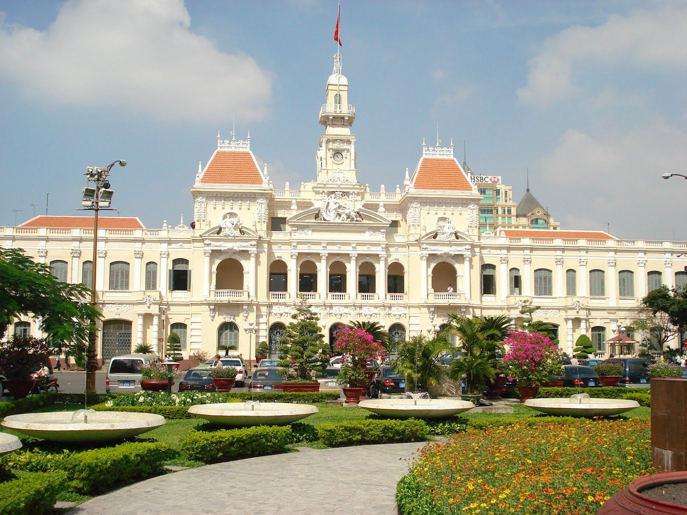
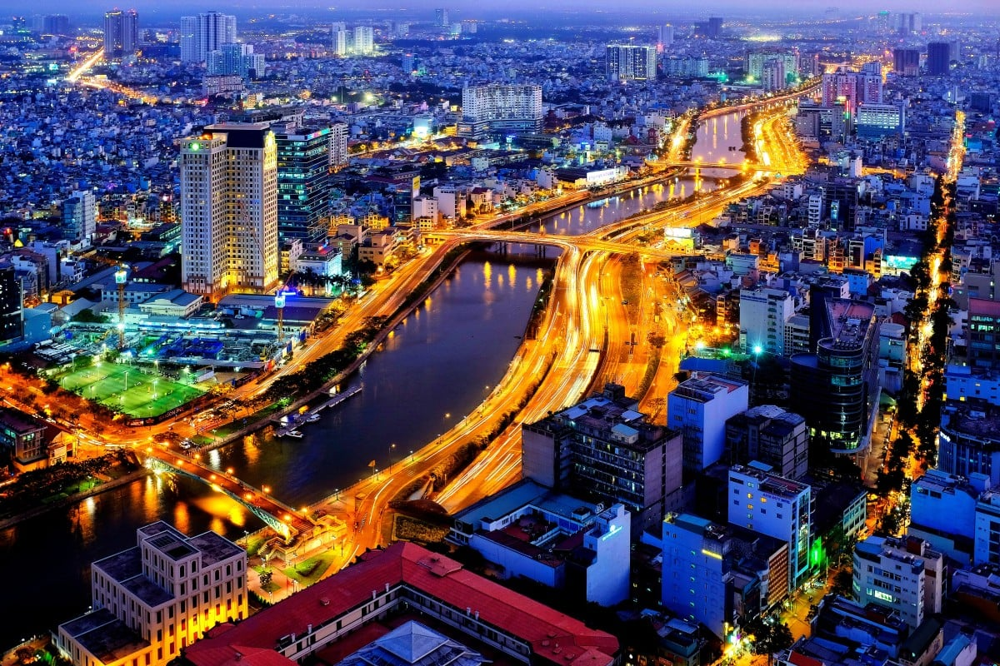

이전에 사이공으로 알려진 호치민시는 베트남에서 가장 큰 도시이자 인기있는 관광지입니다. 이 활기찬 도시에 대해 알아야 할 5가지 핵심 사항이 있습니다.

## 풍부한 역사
호치민시는 고대로 거슬러 올라가는 풍부한 역사를 가지고 있습니다. 이 도시는 크메르 제국, 중국, 프랑스 식민지 시대 등 다양한 문화의 영향을 받았습니다. 이곳은 베트남 전쟁 동안 중요한 역할을 했으며 많은 역사적 명소와 박물관이 있는 곳입니다.

## 코스모폴리탄 허브
호치민시는 활기찬 도시 경관을 자랑하는 분주한 국제 도시입니다. 현대적인 고층 빌딩, 분주한 거리, 거리 시장, 쇼핑 센터 및 고급 호텔이 조화를 이루고 있습니다. 도시의 스카이라인은 인상적인 건축물로 끊임없이 진화하고 있습니다.

## 문화 유산
이 도시는 베트남, 중국, 프랑스의 영향이 융합된 풍부한 문화 유산으로 유명합니다. 탑, 사찰, 박물관, 전통시장 등 다양한 문화명소를 탐방할 수 있다. 현지 요리는 또한 다양한 문화의 영향을 받은 풍미가 독특하게 조화를 이루고 있습니다.

## 다양한 길거리 음식
호치민시는 활기찬 길거리 음식으로 유명합니다. 맛있는 포와 반미부터 신선한 해산물과 열대 과일에 이르기까지 이 도시는 군침이 도는 다양한 요리를 제공합니다. 현지 길거리 음식 가판대와 시장을 탐험하는 것은 음식 애호가들에게 꼭 필요한 경험입니다.

## 경제 센터
호치민시는 베트남의 주요 경제 중심지입니다. 그것은 금융, 상업, 관광 및 기술과 같은 산업이 주도하는 강력한 경제를 가지고 있습니다. 이 도시는 현대적인 인프라, 비즈니스 지구를 자랑하며 국가의 급속한 경제 성장의 핵심 역할을 합니다.

호치민시는 역사, 문화 및 현대성이 매혹적인 조화를 이루고 있습니다. 풍부한 유산 탐험, 맛있는 길거리 음식 탐닉 또는 활기찬 도시 생활 경험에 관심이 있든, 이 역동적인 도시에는 모두를 위한 무언가가 있습니다.

