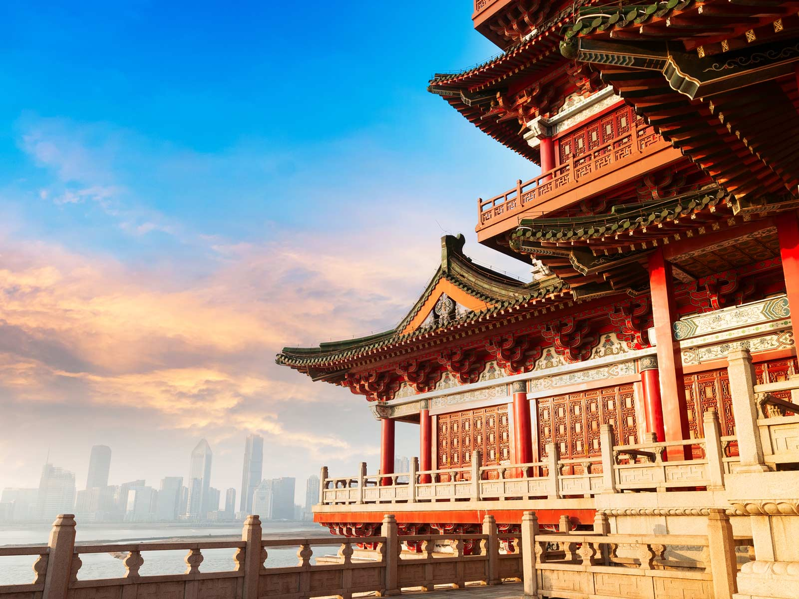
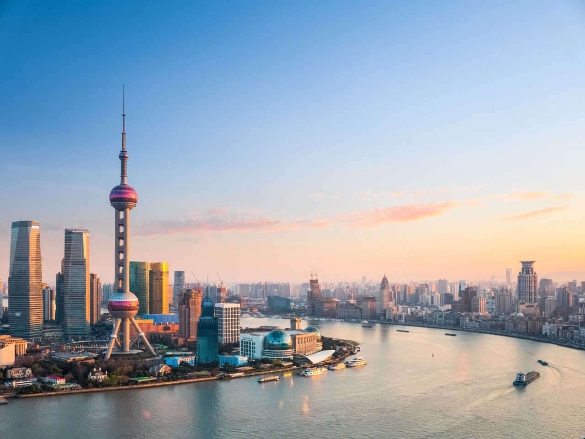
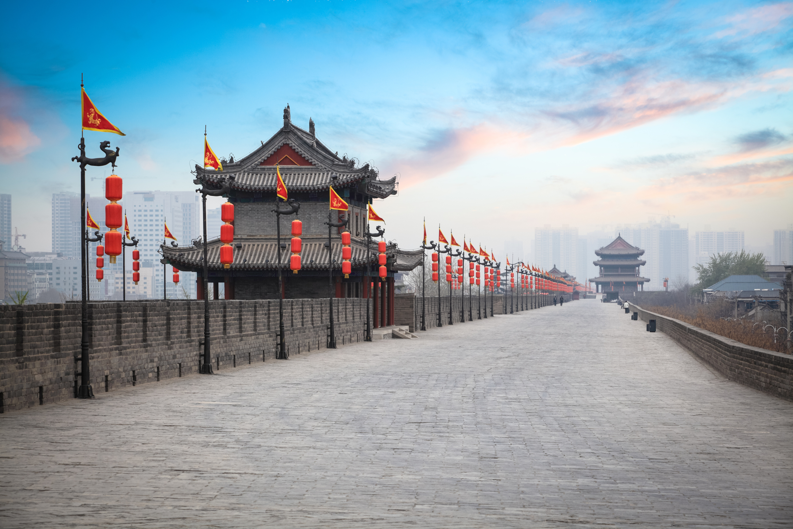
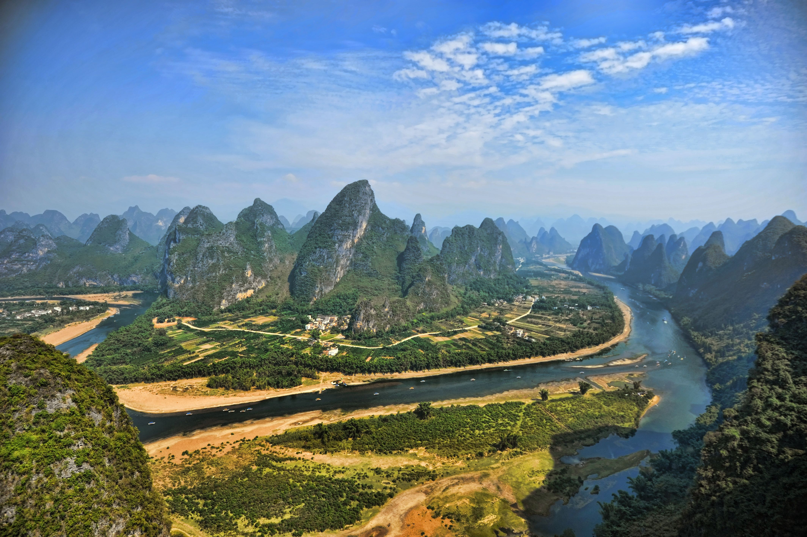
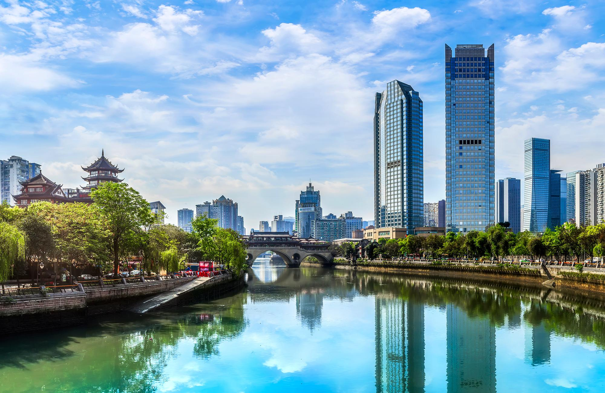
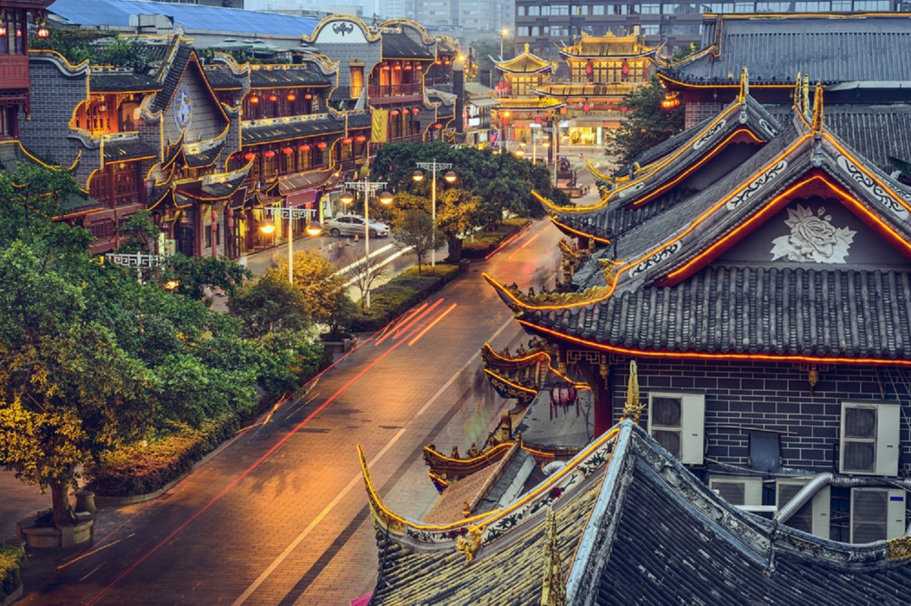

Planning a trip to China? Here are five must-visit cities that should be on your itinerary.

## Beijing
Beijing, the capital city of China, is known for its rich history and iconic landmarks such as the Great Wall and the Forbidden City. Explore the ancient alleys of the hutongs or indulge in the delicious street food at Wangfujing Snack Street.

## Shanghai
Shanghai, the largest city in China, is a global financial hub with a vibrant blend of modern architecture and traditional culture. Take a stroll along the famous Bund, visit the Oriental Pearl TV Tower, or shop till you drop on Nanjing Road.

## Xi'an
Xi'an is home to the Terracotta Army, a UNESCO World Heritage Site that attracts millions of visitors every year. Marvel at the life-sized clay soldiers and explore the ancient city walls that surround the historic heart of Xi'an.

## Guilin
Located in southern China, Guilin is famous for its stunning karst landscape and picturesque Li River. Take a boat cruise to enjoy the breathtaking scenery, hike through the Longji Rice Terraces, or explore the Reed Flute Cave.

## Chengdu
Chengdu is the hometown of the adorable giant pandas. Visit the Chengdu Research Base of Giant Panda Breeding to get up close and personal with these gentle creatures. Don't miss trying the famous Sichuan cuisine, known for its spicy and flavorful dishes.

These five cities offer a diverse range of experiences, from ancient history to modernity, natural beauty to culinary delights. Plan your trip to China and create lifelong memories in these captivating cities.

