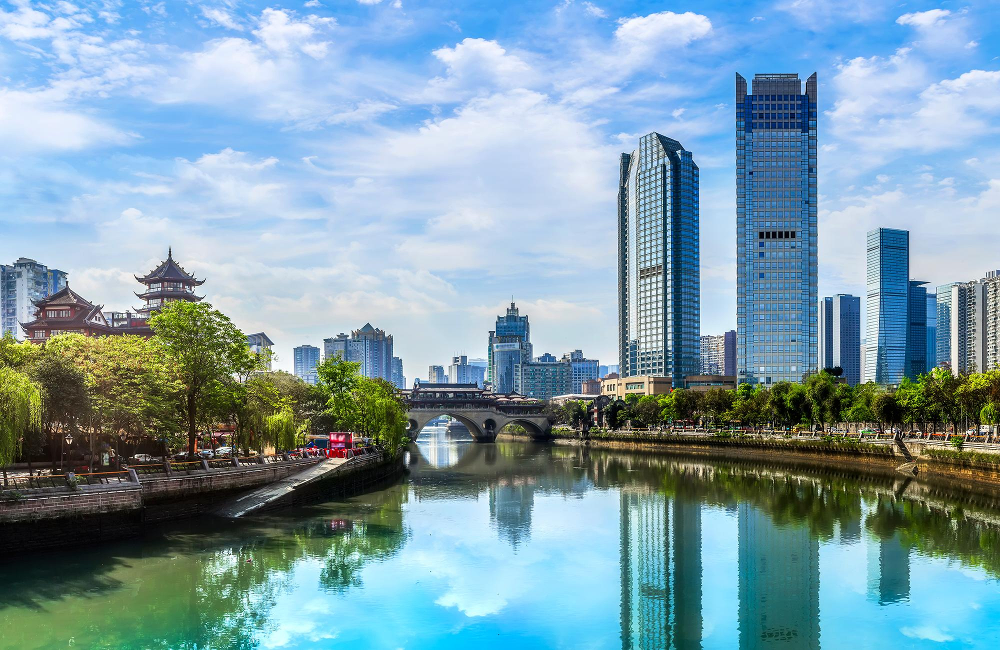
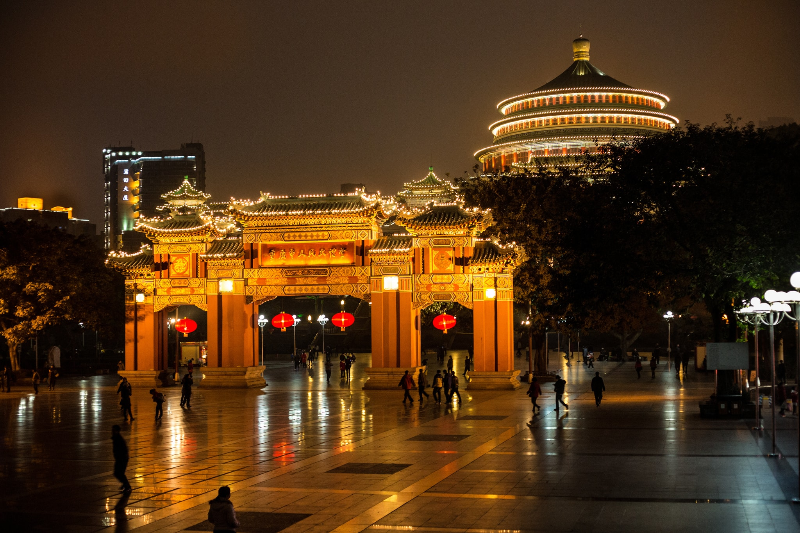

중국 여행을 계획 중이신가요? 여행 일정에 포함되어야 하는 5개의 꼭 방문해야 할 도시를 소개합니다.

## 베이징
중국의 수도인 베이징은 풍부한 역사와 만리장성, 자금성과 같은 상징적인 랜드마크로 유명합니다. 후통의 고대 골목을 탐험하거나 왕푸징 스낵 스트리트에서 맛있는 길거리 음식에 빠져보세요.

## 상하이
중국에서 가장 큰 도시인 상하이는 현대 건축과 전통 문화가 활기차게 조화를 이루는 글로벌 금융 허브입니다. 유명한 와이탄을 따라 산책하거나 동방명주탑을 방문하거나 난징루에 들를 때까지 쇼핑을 즐겨보세요.

## 시안
시안은 매년 수백만 명의 방문객을 끌어들이는 유네스코 세계 문화 유산인 병마용의 고향입니다. 실물 크기의 점토 병사에 감탄하고 시안의 역사적인 중심지를 둘러싸고 있는 고대 성벽을 탐험하세요.

## 구이린
중국 남부에 위치한 구이린은 아름다운 카르스트 풍경과 그림 같은 리 강으로 유명합니다. 보트 크루즈를 타고 숨이 멎을 듯 아름다운 풍경을 감상하고, Longji 계단식 논을 하이킹하거나 갈대 피리 동굴을 탐험하세요.

## 청두
청두는 사랑스러운 자이언트 판다의 고향입니다. 자이언트 판다 사육 청두 연구 기지를 방문하여 이 온순한 판다를 가까이에서 직접 만나보세요. 매콤하고 풍미 가득한 요리로 유명한 유명한 사천 요리를 맛보는 것을 놓치지 마세요.

이 5개 도시는 고대 역사에서 현대, 자연의 아름다움, 요리의 즐거움에 이르기까지 다양한 경험을 제공합니다. 중국 여행을 계획하고 이 매력적인 도시에서 평생 기억에 남을 추억을 만드십시오.

