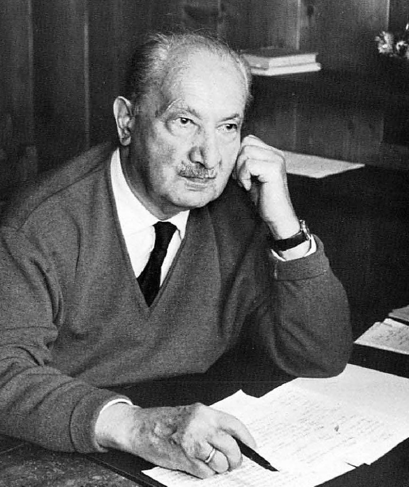
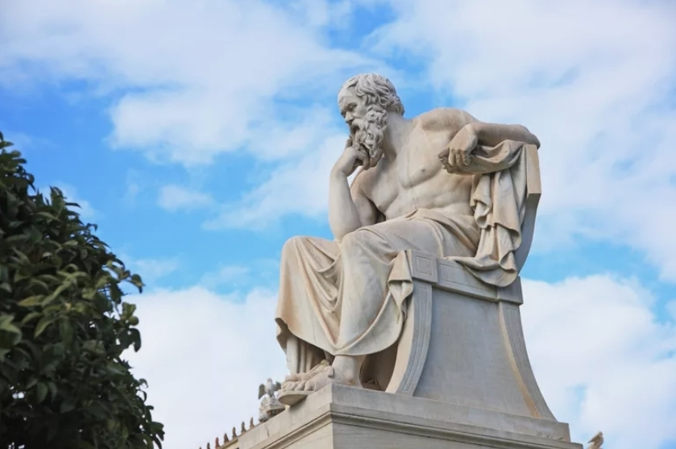
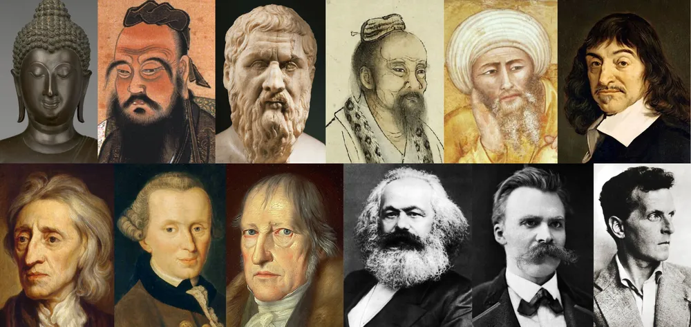

오늘은 우리가 반드시 알아야 할 세 명의 중요한 철학자에 대해 이야기하려고 합니다.

![https://www.youtube.com/watch?v=bHxjnXDndIk]

## 1. 마르틴 하이데거

하이데거는 20세기의 유명한 철학자로, 존재주의에 대한 연구로 유명합니다.
그는 우리 인간의 존재의미와 의식의 복잡성을 탐구하였으며,
인간이 직면한 윤리적인 문제에 대한 해법을 제시했습니다.
이를 통해 우리는 당면한 삶의 의문에 대해 생각해 볼 수 있습니다.

## 2. 소크라테스

소크라테스는 고대 그리스의 유명한 철학자로, 소크라티스적 방법론과
함께 인류의 형성 및 지식 탐구에 큰 영향력을 끼쳤습니다.
그의 철학적 개념은 아직도 현대 사회에서 많은 영감을 주고 있으며,
그의 미학적 가치와 윤리적 원칙은 저희 삶을 더욱 의미있게 만들어 줄 수 있습니다.

## 3. 미셸 푸코

미셸 푸코는 현대 프랑스의 철학자이자 사회학자로, 조세펀 이론과 바오더리아드 사상으로 유명합니다. 그는 권력과 지식, 성과 사람의 관계에 대한 비판적인 시각을 제시했습니다. 그의 작품을 공부함으로써 우리는 정치, 사회 및 개인의 역할에 대해 독자적인 생각을 발전시킬 수 있습니다.

## 결론

이들의 철학적인 견해와 이론이 우리가 삶을 살아가는 데 어떠한 영감을 줄 수 있는지, 한번 고민해 보시는 건 어떨까요? 저희는 지식과 이해의 공유로 즐거운 여정을 함께 하기를 바랍니다.

