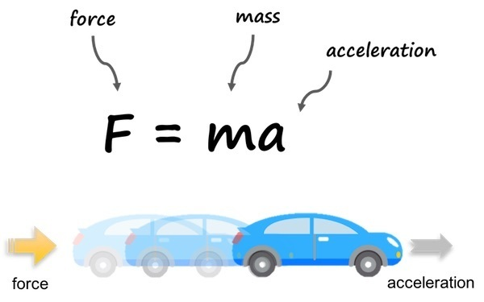
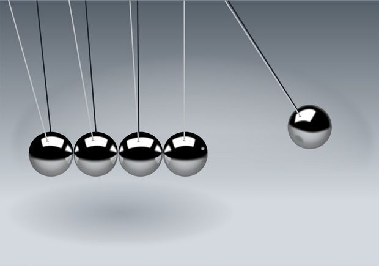
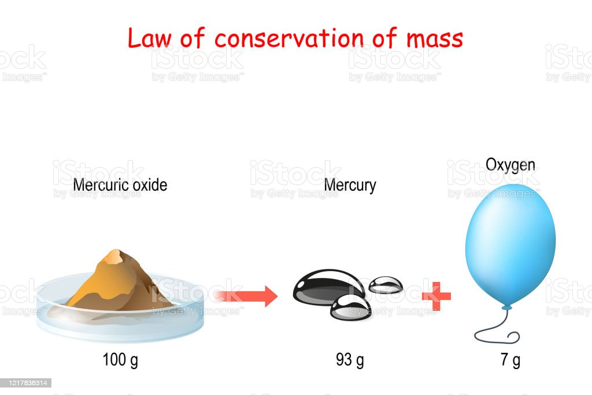
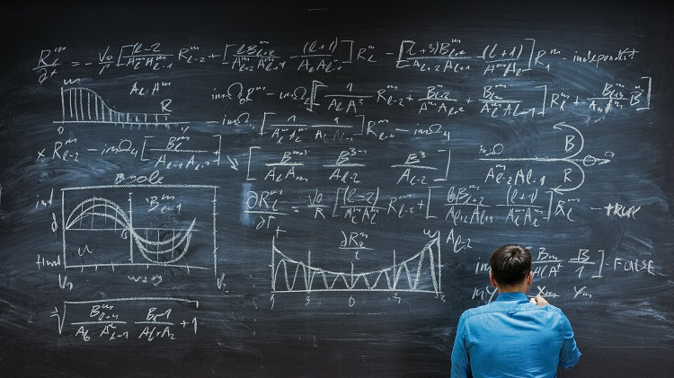

우리가 알아야 할 3가지 [물리법칙][topic]에 대해 알려드릴게요.

## 첫 번째 운동의 법칙

F = MA. 물체는 처음에 가속도를 받으면 움직이게 되고, 질량과 힘이 관련되어 있어서 힘을 가하면 움직임이 변화합니다.

## 두 번째 작용과 반작용 법칙

모든 힘은 동시에 같은 크기의 반대 방향의 힘으로 반응한다는 말씀이에요. 하지만 이 힘들은 다른 물체에 가하는 힘과는 별개로 작용하므로 주의해야 합니다.

## 세 번째 에너지 보존의 법칙

에너지는 만들어질 수 없고, 단지 변환될 수 있다는 것을 의미해요. 따라서 우리는 에너지를 최대한 효율적으로 사용하고 보존해야 합니다.

[topic]: https://www.google.com/search?q=[물리법칙][topic]