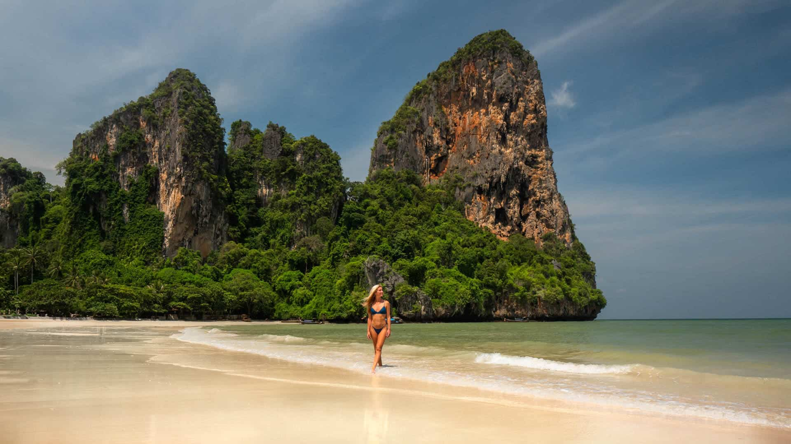
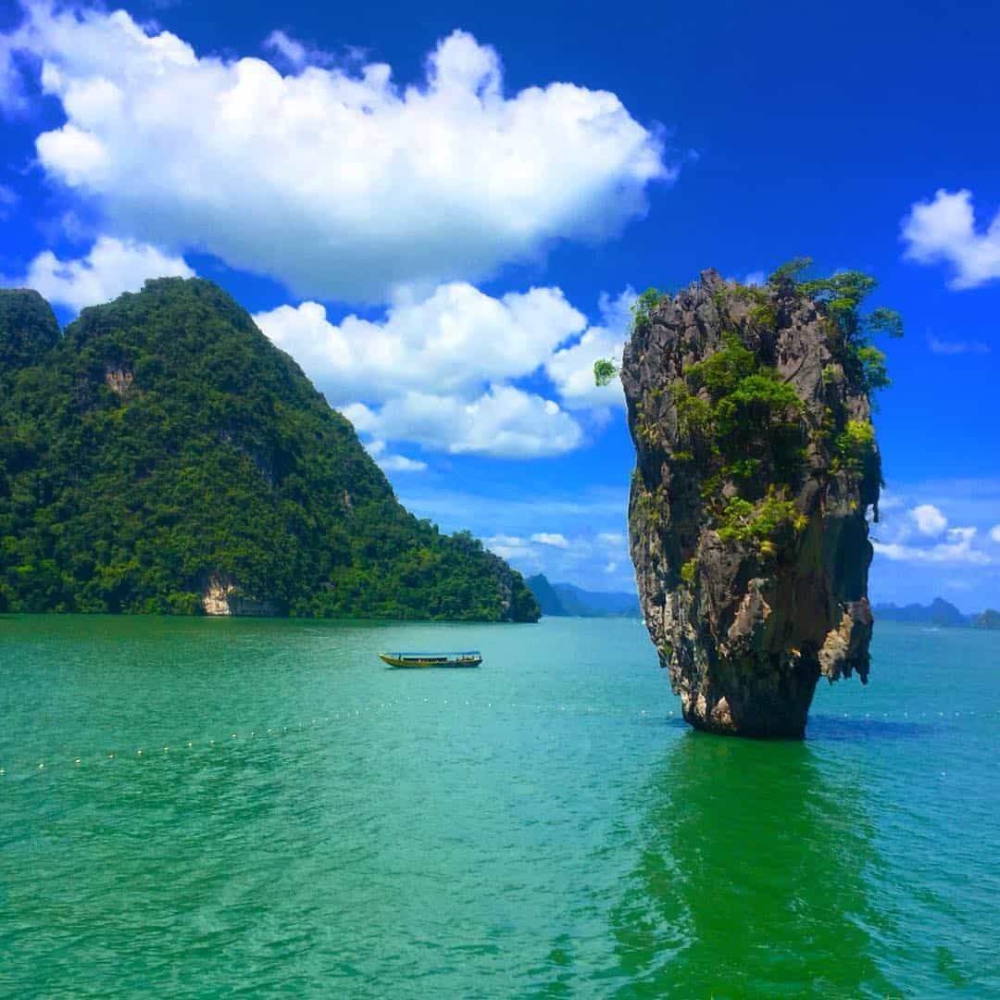
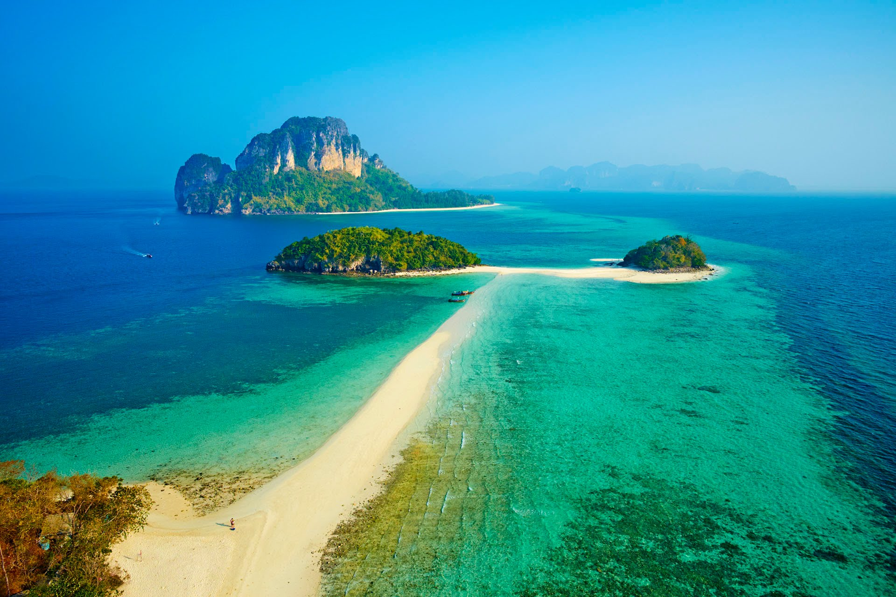
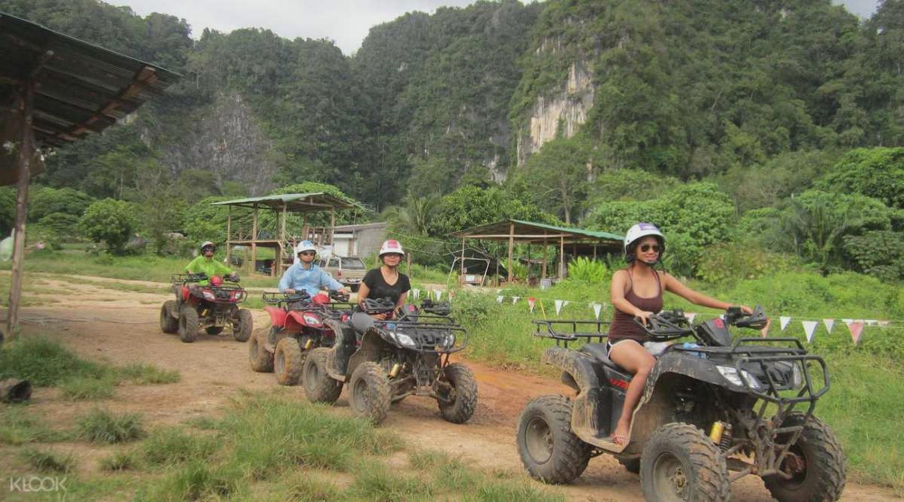
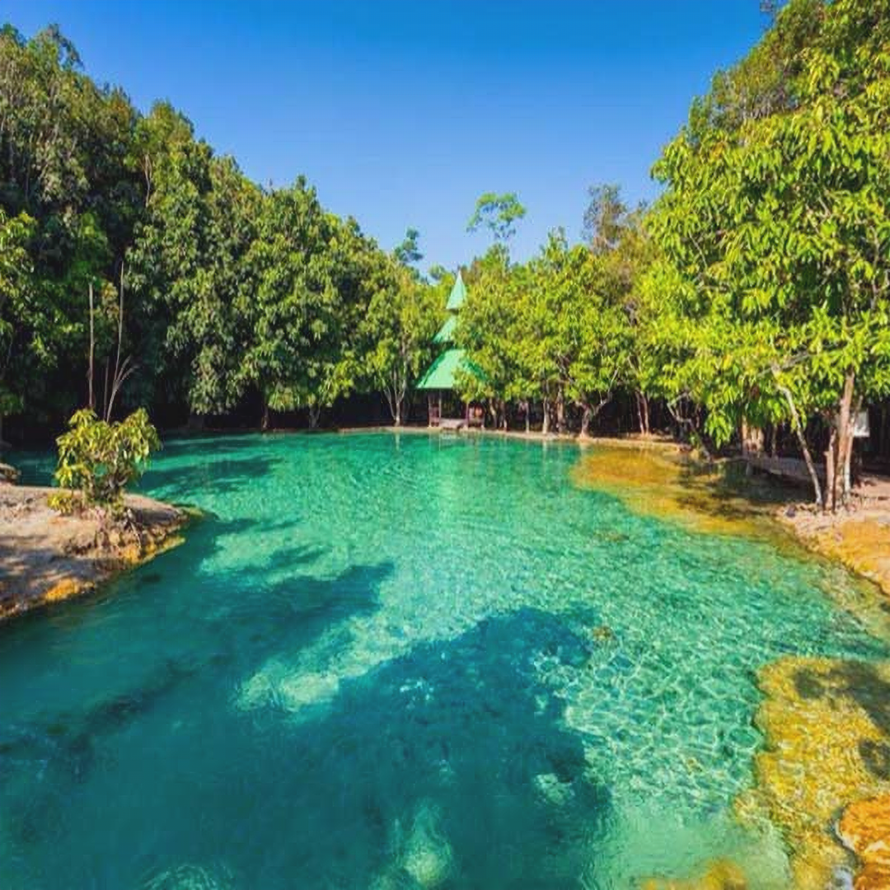
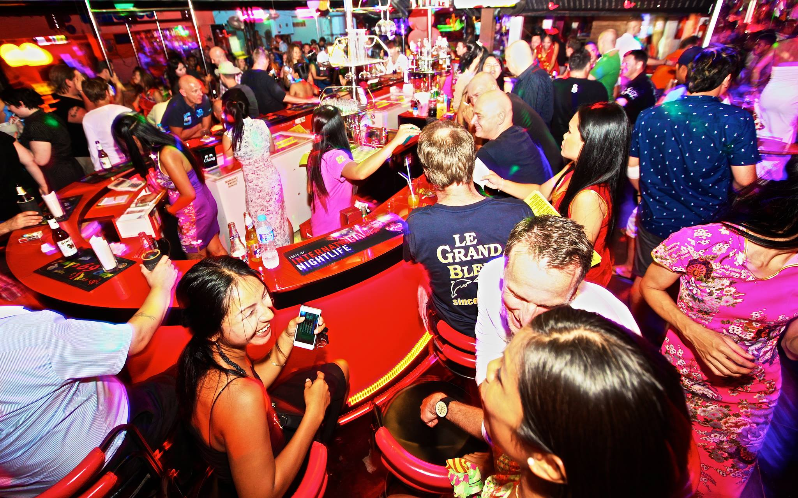
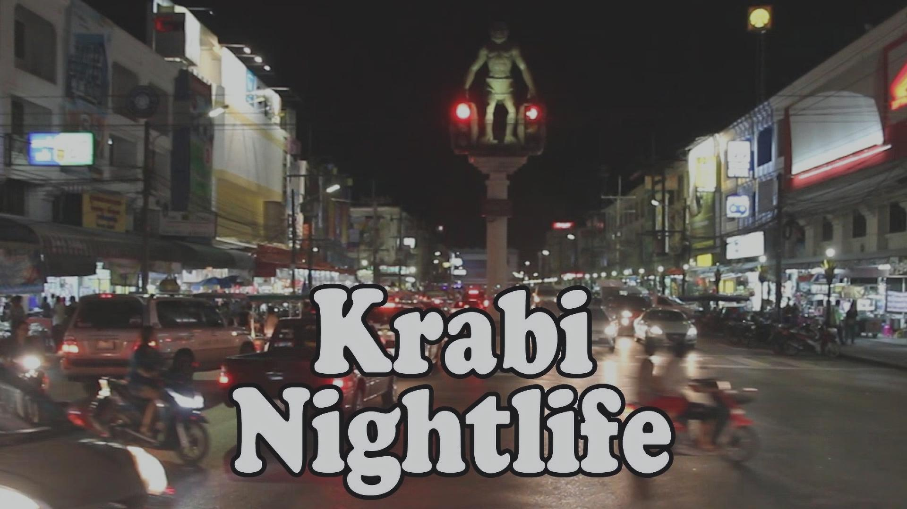

Welcome to Krabi, Nature's Playground! Let's discover the 5 main things you must know about this breathtaking destination.

## 1. Stunning Beaches
Krabi is renowned for its magnificent beaches with crystal-clear waters, pristine sands, and towering limestone cliffs. From the iconic Railay Beach to the secluded Phra Nang Beach, there's a beach for every preference and the ideal spot to relax, swim, and soak up the sun.

## 2. Spectacular Islands
Krabi is blessed with a myriad of islands, each possessing its unique charm. Don't miss the famous Phi Phi Islands, a paradise for snorkeling and diving enthusiasts. Explore the breathtaking beauty of the Hong Islands or visit the enchanting Chicken Island. These islands offer unforgettable experiences and stunning natural sights.

## 3. Thrilling Outdoor Adventures
Krabi is a playground for adventure seekers. Scale the iconic limestone cliffs for rock climbing, go jungle trekking through lush rainforests, or embark on exhilarating water activities such as kayaking, paddleboarding, or even trying your hand at Muay Thai. There's no shortage of thrilling experiences for adrenaline junkies.

## 4. Emerald Pools and Hot Springs
Take a break from the sun and visit the natural wonders of Krabi's emerald pools and hot springs. The Emerald Pool, or Sra Morakot, is renowned for its stunning green-hued water set amidst the lush jungle. Soothe your muscles in the geothermal hot springs, known for their healing properties. It's a rejuvenating experience for both mind and body.

## 5. Vibrant Nightlife and Street Food
When the sun sets, Krabi comes to life with its vibrant nightlife. Explore the bustling night markets, indulge in a wide array of delicious street food, and experience the lively bars and beach clubs. From relaxed beachfront bars to energetic dance floors, there's something for everyone to enjoy after dark in Krabi.

Krabi truly is Nature's Playground, offering stunning beaches, breathtaking islands, thrilling adventures, natural wonders, and vibrant nightlife. Plan your visit and immerse yourself in the beauty and wonders of Krabi.

