자연의 놀이터 끄라비에 오신 것을 환영합니다! 이 숨막히는 목적지에 대해 알아야 할 5가지 주요 사항을 알아보십시오.

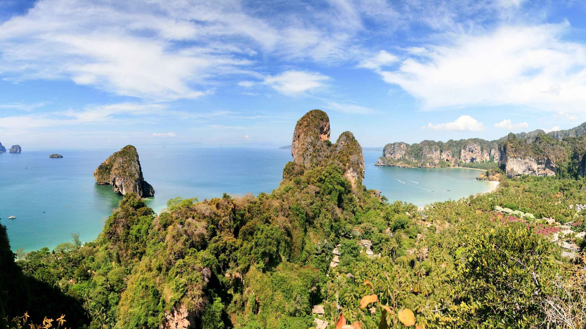

## 1. 멋진 해변
끄라비는 수정처럼 맑은 물, 깨끗한 모래, 우뚝 솟은 석회암 절벽이 있는 웅장한 해변으로 유명합니다. 상징적인 라일레이 해변에서 한적한 프라낭 해변까지 모든 취향에 맞는 해변과 휴식, 수영, 태양을 만끽할 수 있는 이상적인 장소가 있습니다.

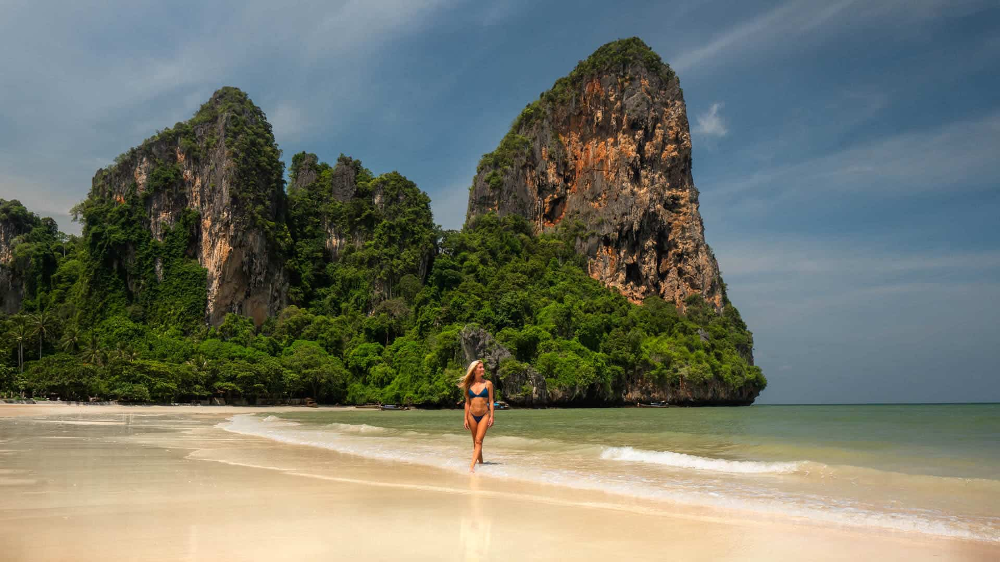
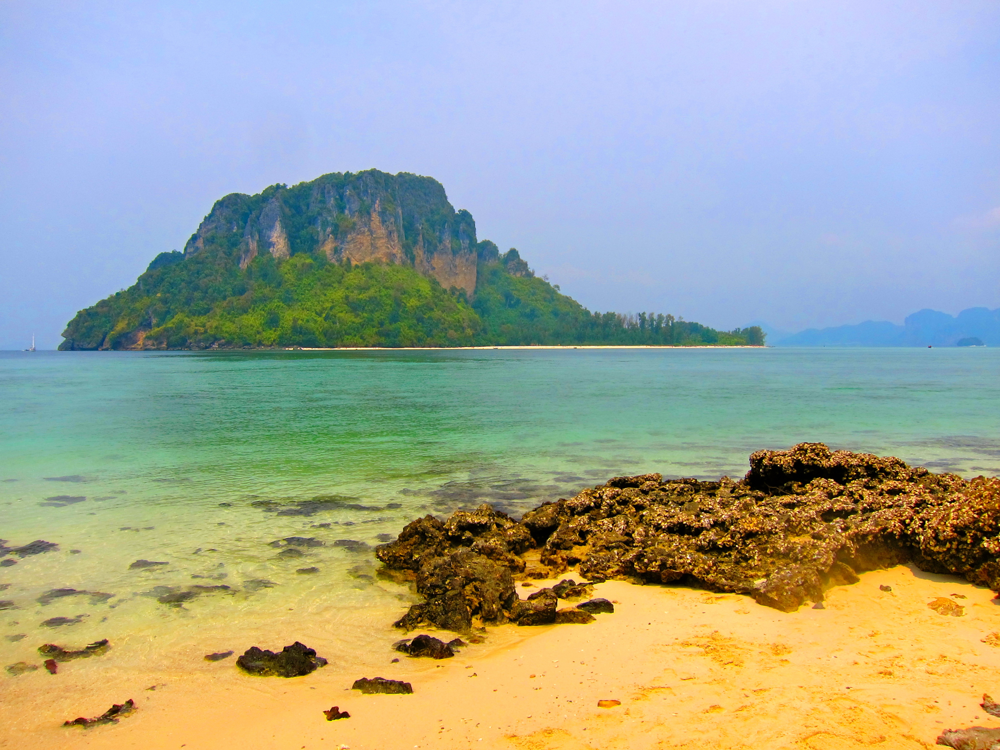

## 2. 장관을 이루는 섬들
끄라비에는 각각 고유한 매력을 지닌 무수한 섬이 있습니다. 스노클링과 다이빙 애호가들의 천국인 유명한 피피섬을 놓치지 마세요. 숨이 멎을 듯 아름다운 홍섬을 탐험하거나 매혹적인 치킨 아일랜드를 방문하세요. 이 섬들은 잊을 수 없는 경험과 놀라운 자연 경관을 제공합니다.

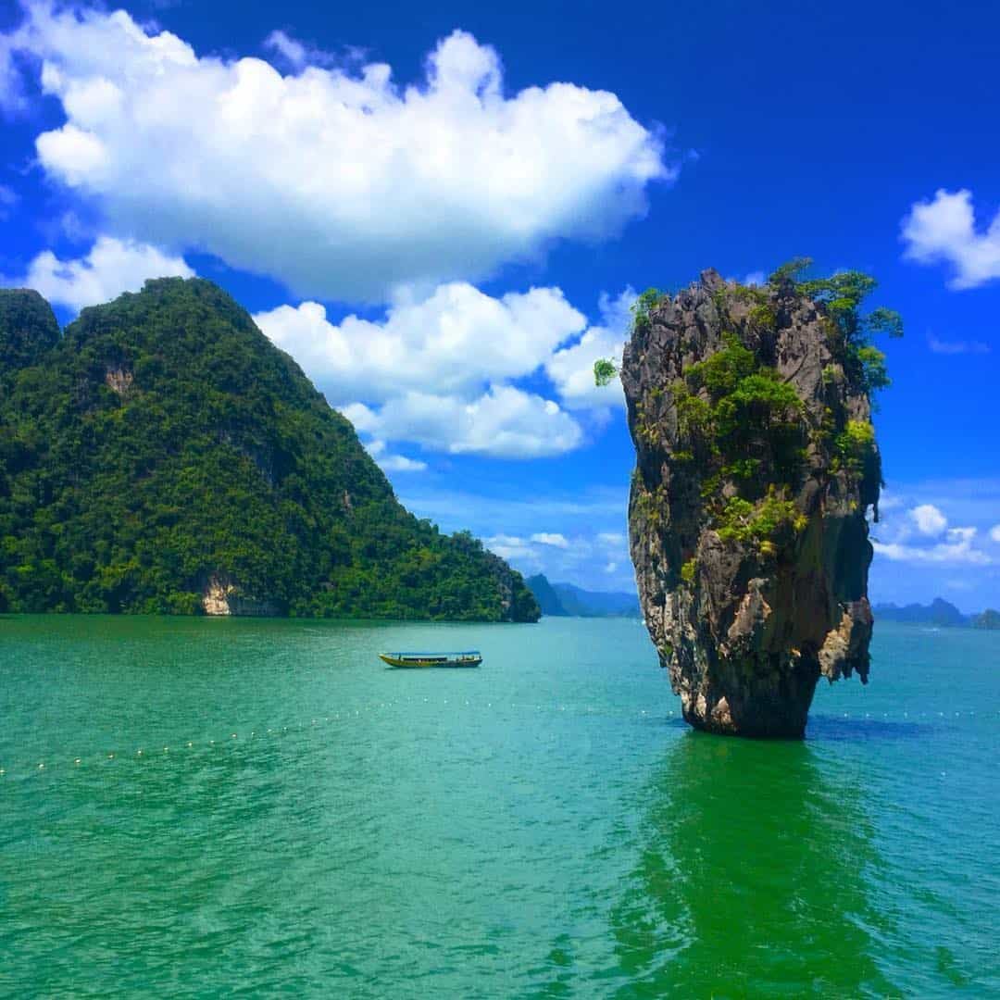
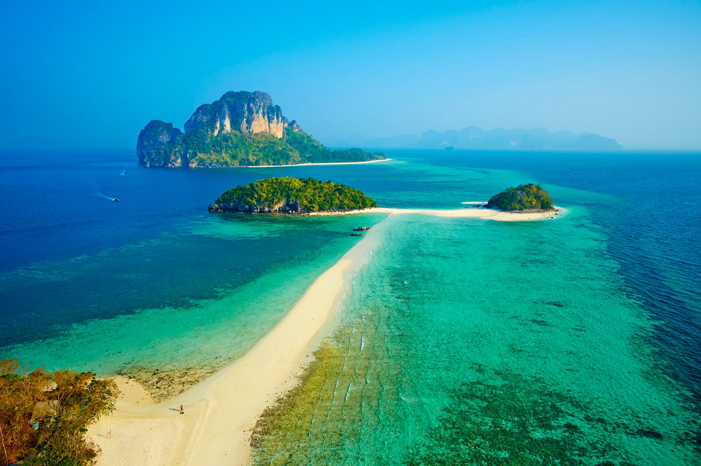

## 3. 스릴 넘치는 야외 모험
끄라비는 모험을 찾는 사람들을 위한 놀이터입니다. 암벽 등반을 위해 상징적인 석회암 절벽을 오르고, 울창한 열대우림을 통과하는 정글 트레킹을 가거나, 카약, 패들보드 또는 무에타이와 같은 신나는 수상 활동을 시작하십시오. 아드레날린 중독자에게는 스릴 넘치는 경험이 부족하지 않습니다.

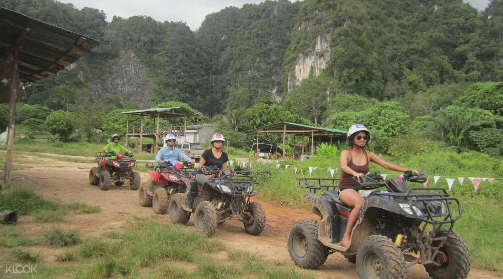
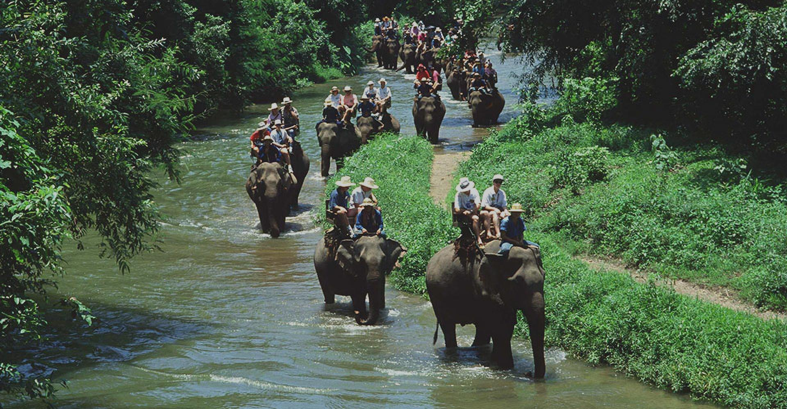

## 4. 에메랄드 풀과 온천
태양에서 휴식을 취하고 끄라비의 에메랄드 풀과 온천의 경이로운 자연을 방문하십시오. 에메랄드 풀 또는 스라 모라콧은 울창한 정글 한가운데 자리 잡은 멋진 녹색 물빛으로 유명합니다. 치유력으로 유명한 지열 온천에서 근육을 풀어보세요. 몸과 마음이 모두 재충전되는 경험입니다.

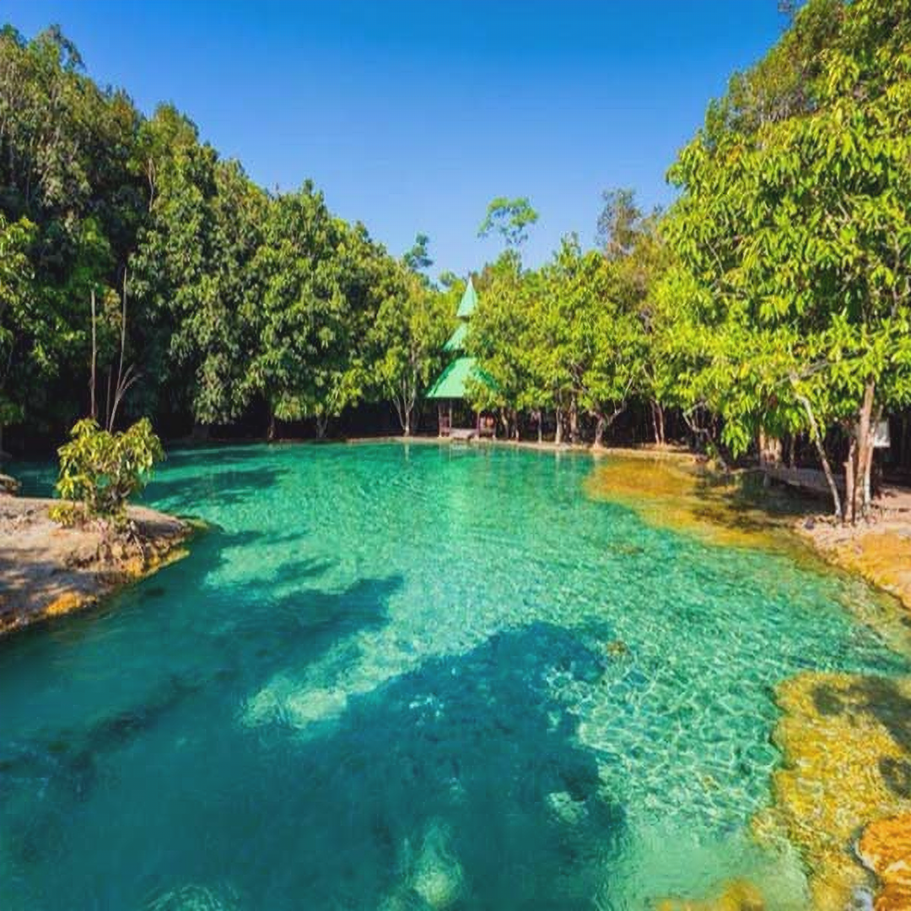
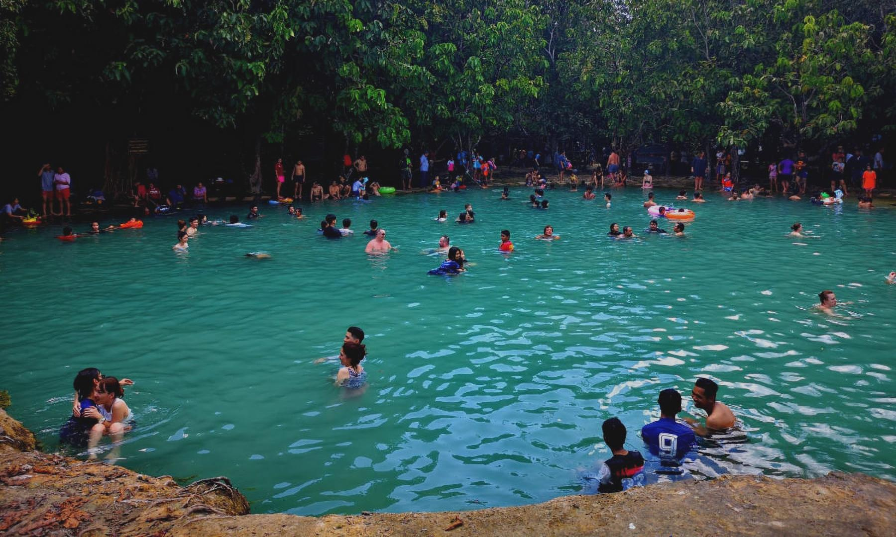

## 5. 활기찬 나이트라이프와 길거리 음식
해가 지면 끄라비는 활기찬 나이트라이프로 활기를 띱니다. 번화한 야시장을 둘러보고 다양한 종류의 맛있는 길거리 음식을 맛보고 활기 넘치는 바와 비치 클럽을 경험해 보세요. 여유로운 해변가 바부터 활기 넘치는 댄스 플로어까지 크라비에는 해가 진 후 모두가 즐길 수 있는 것이 있습니다.

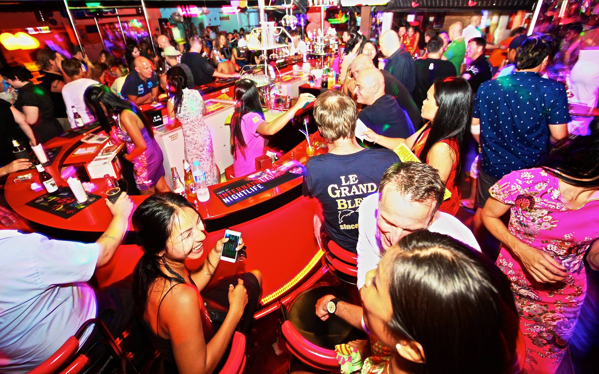
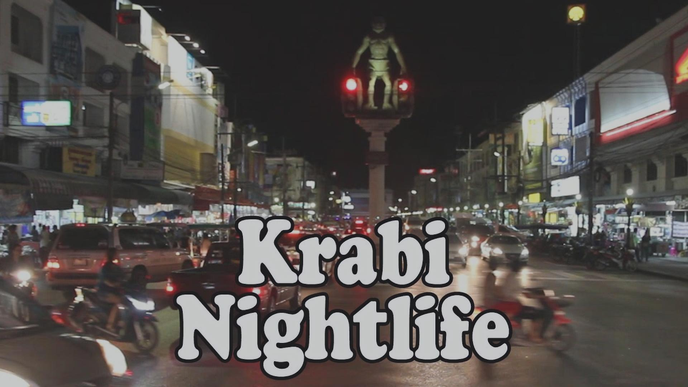

끄라비는 진정한 자연의 놀이터로 멋진 해변, 숨이 멎을 듯한 섬, 스릴 넘치는 모험, 자연의 경이로움, 활기찬 나이트라이프를 제공합니다. 방문을 계획하고 끄라비의 아름다움과 경이로움에 빠져보세요.

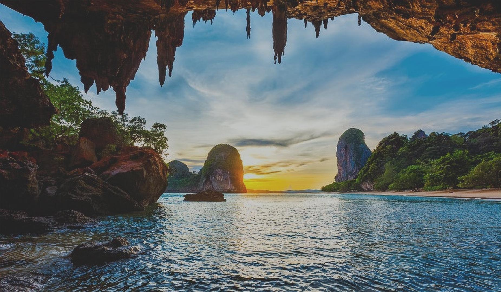
