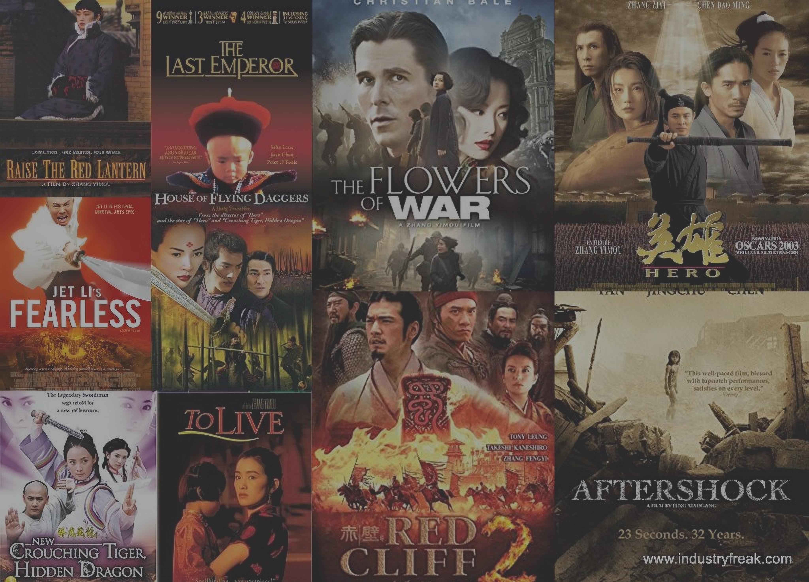
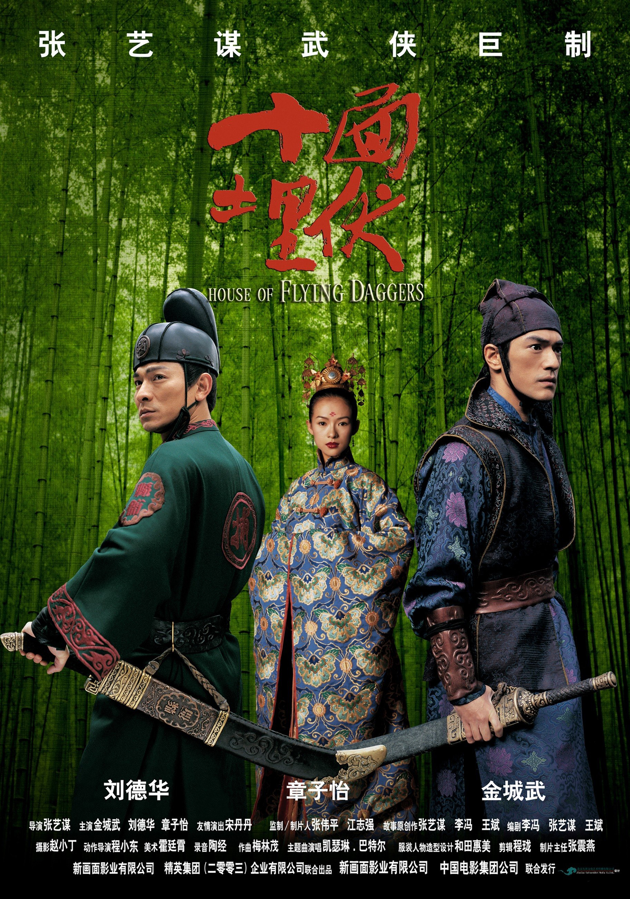
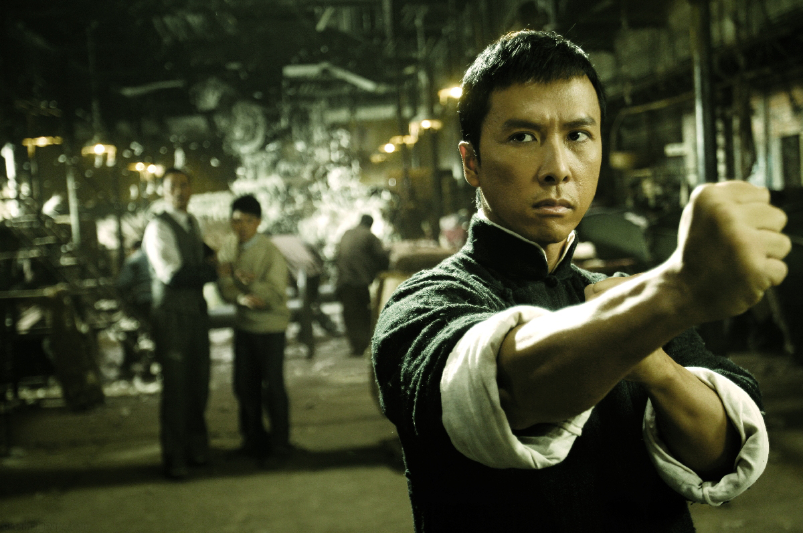
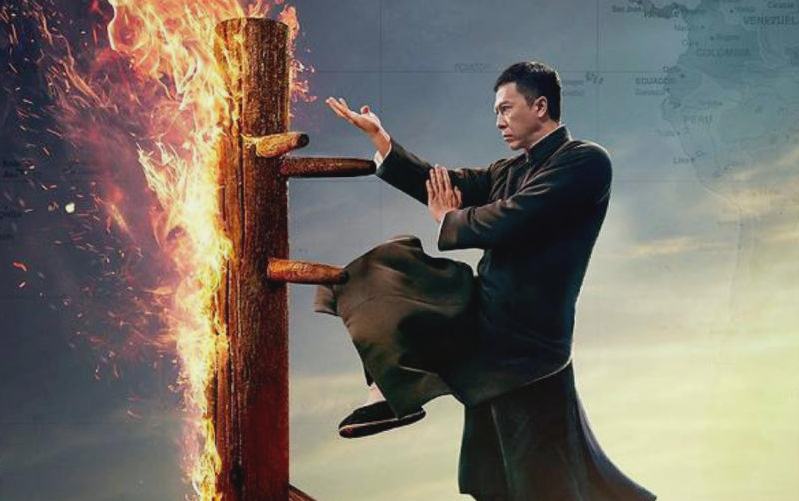

In a land steeped in rich history and cultural heritage, Chinese cinema has captivated audiences worldwide with its diverse storytelling and breathtaking visuals. Join us as we embark on a cinematic journey through five unforgettable Chinese movies that have left an indelible mark on the world of film

## Crouching Tiger, Hidden Dragon
Released in 2000, Crouching Tiger, Hidden Dragon is a martial arts masterpiece directed by Ang Lee. This film showcases stunning fight scenes, captivating storytelling, and mesmerizing cinematography.

## Hero
Directed by Zhang Yimou in 2002, Hero is a visually breathtaking martial arts film. The movie explores themes of honor, loyalty, and sacrifice, and features incredible action sequences and a star-studded cast.

## House of Flying Daggers
With its visually stunning cinematography and captivating romance, House of Flying Daggers, directed by Zhang Yimou in 2004, is a must-watch. This movie combines poetic storytelling and thrilling action sequences.

## Ip Man
Based on the life of the Wing Chun grandmaster, Ip Man (2008) tells a compelling story about perseverance and martial arts. With outstanding fight choreography and an excellent performance by Donnie Yen, this film is a martial arts classic.

## Red Cliff
Directed by John Woo, Red Cliff (2008) is an epic historical drama set in ancient China. It showcases intense battle sequences, political intrigue, and strategic storytelling, making it a must-see for any fan of Chinese movies.

These 5 movies, including Crouching Tiger, Hidden Dragon, Hero, House of Flying Daggers, Ip Man, and Red Cliff, represent the essence of Chinese martial arts cinema. Each film offers a unique blend of action, emotion, and stunning visuals that will leave a lasting impression on viewers.

