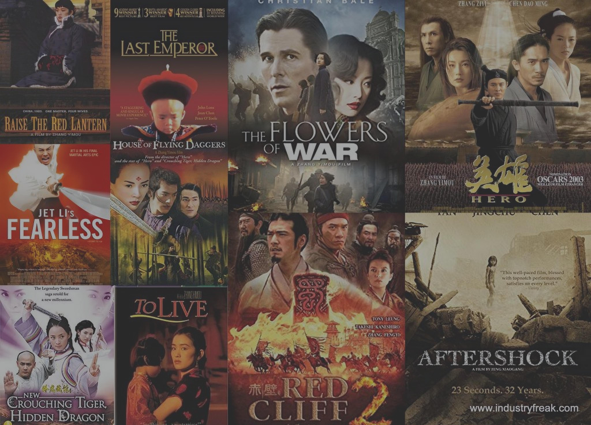
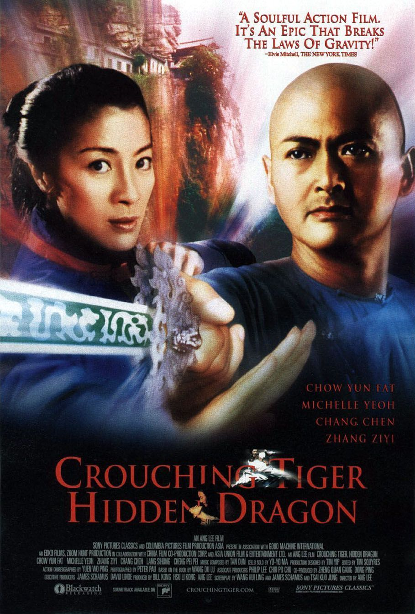
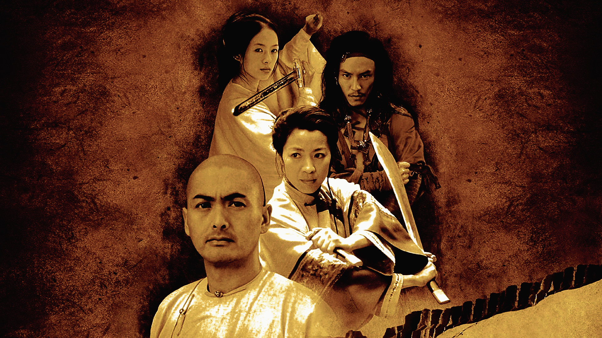
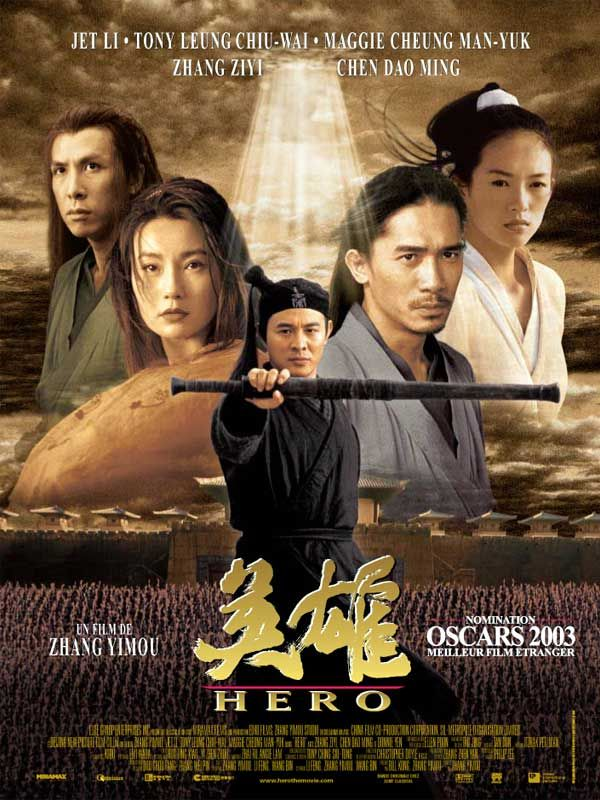
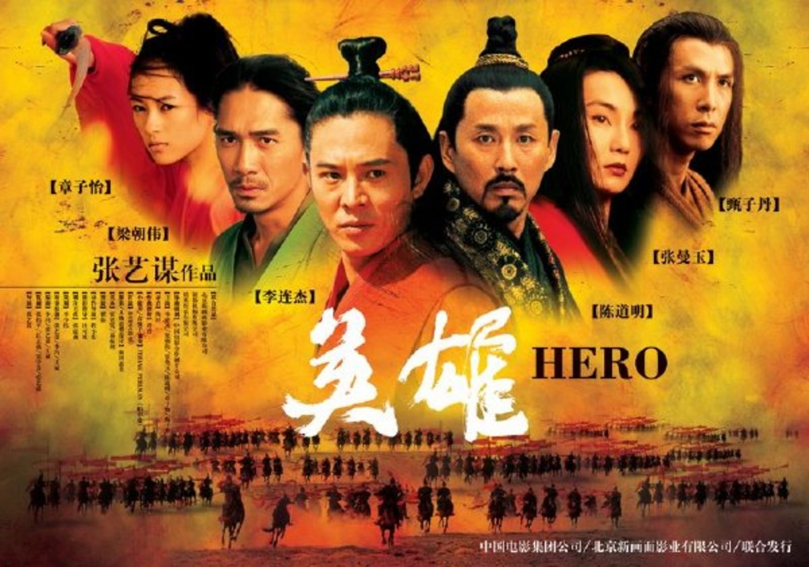
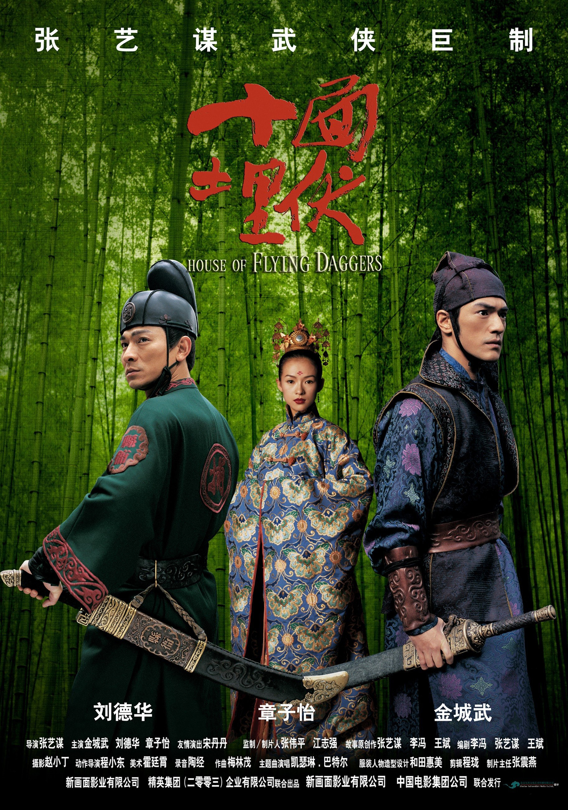
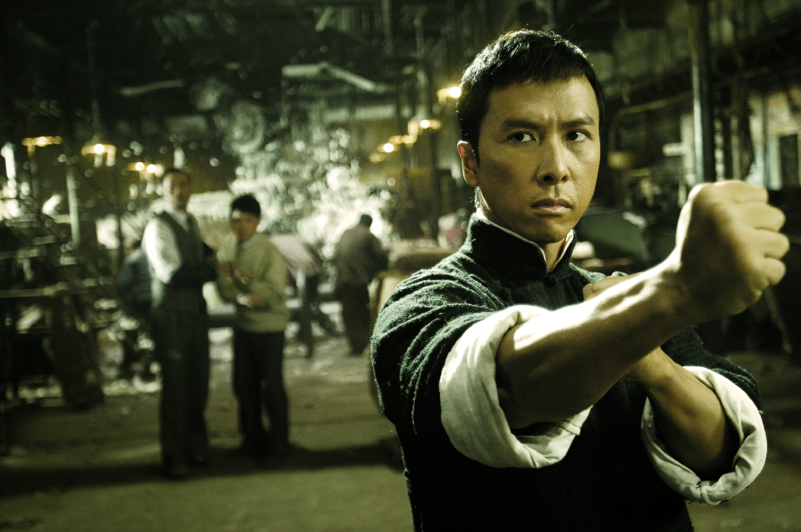
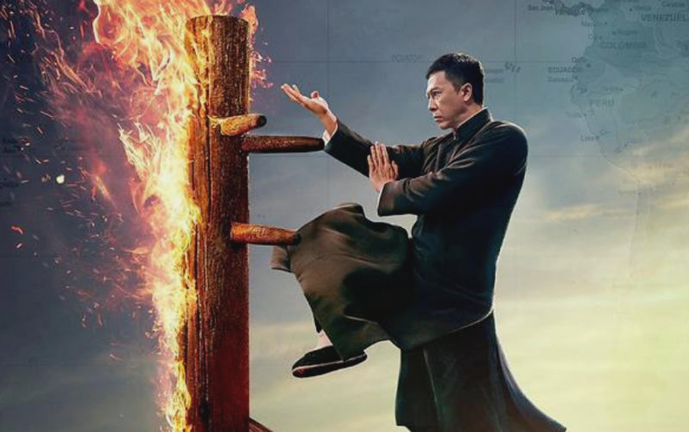
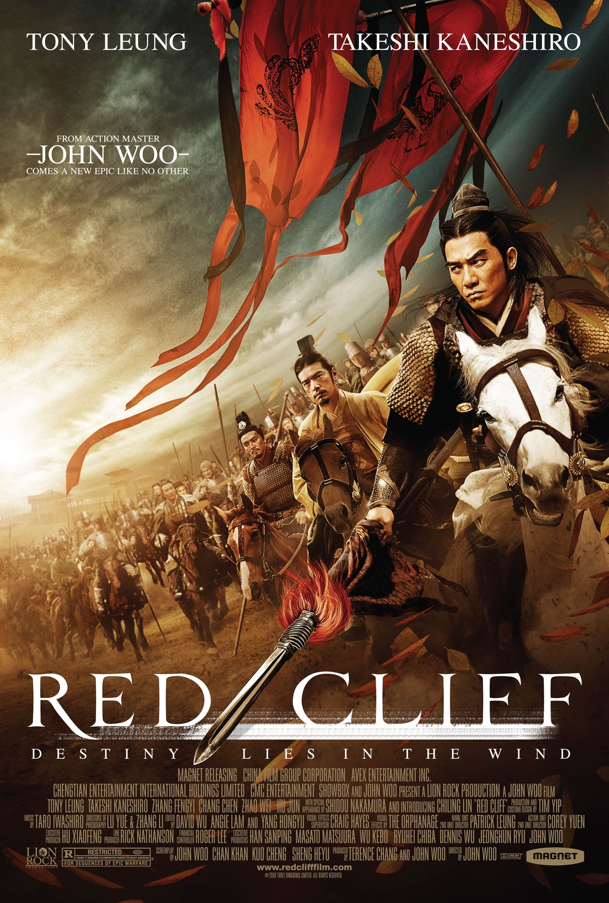
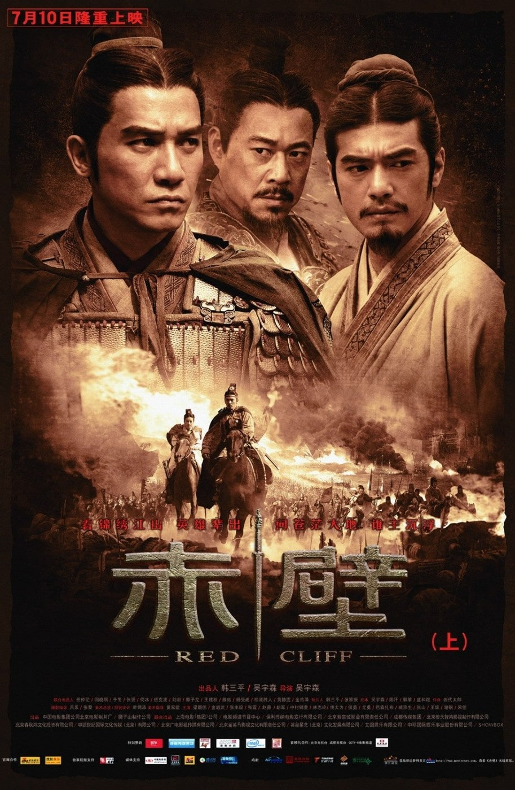

풍부한 역사와 문화 유산이 가득한 땅에서 중국 영화는 다양한 스토리텔링과 숨막히는 비주얼로 전 세계 관객을 사로잡았습니다. 영화계에 지울 수 없는 족적을 남긴 잊을 수 없는 중국 영화 5편을 통해 영화 여행을 시작하세요.

## 와호장룡
2000년 개봉한 와호장룡은 이안 감독의 무협 명작이다. 이 영화는 놀라운 전투 장면, 매혹적인 스토리텔링, 매혹적인 영화 촬영법을 보여줍니다.

## 영웅
2002년 Zhang Yimou 감독의 Hero는 시각적으로 숨막히는 무술 영화입니다. 이 영화는 명예, 충성, 희생이라는 주제를 탐구하고 놀라운 액션 시퀀스와 스타들이 박힌 출연진을 특징으로 합니다.

## 연인
2004년 Zhang Yimou가 감독한 연인는 시각적으로 놀라운 영화 촬영법과 매혹적인 로맨스로 반드시 봐야 할 작품입니다. 이 영화는 시적인 스토리텔링과 스릴 넘치는 액션 시퀀스가 ​​결합되어 있습니다.

## 엽문
영춘권 그랜드 마스터의 삶을 바탕으로 한 엽문 (2008)은 인내와 무술에 대한 매력적인 이야기를 들려줍니다. 뛰어난 격투 안무와 도니 옌의 뛰어난 연기가 어우러진 이 영화는 무술의 고전이다.

## 적벽
우오우삼 감독의 적벽(2008)은 고대 중국을 배경으로 한 대서사극이다. 강렬한 전투 시퀀스, 정치적 음모, 전략적인 스토리텔링을 선보이며 중국 영화 팬이라면 꼭 봐야 할 영화입니다.

와호장룡, 영웅, 연인, 엽문, 적벽 등 5편의 영화는 중국 무술영화의 진수를 대표한다. 각 영화는 시청자에게 지속적인 인상을 남길 액션, 감정 및 놀라운 영상의 독특한 조화를 제공합니다.

