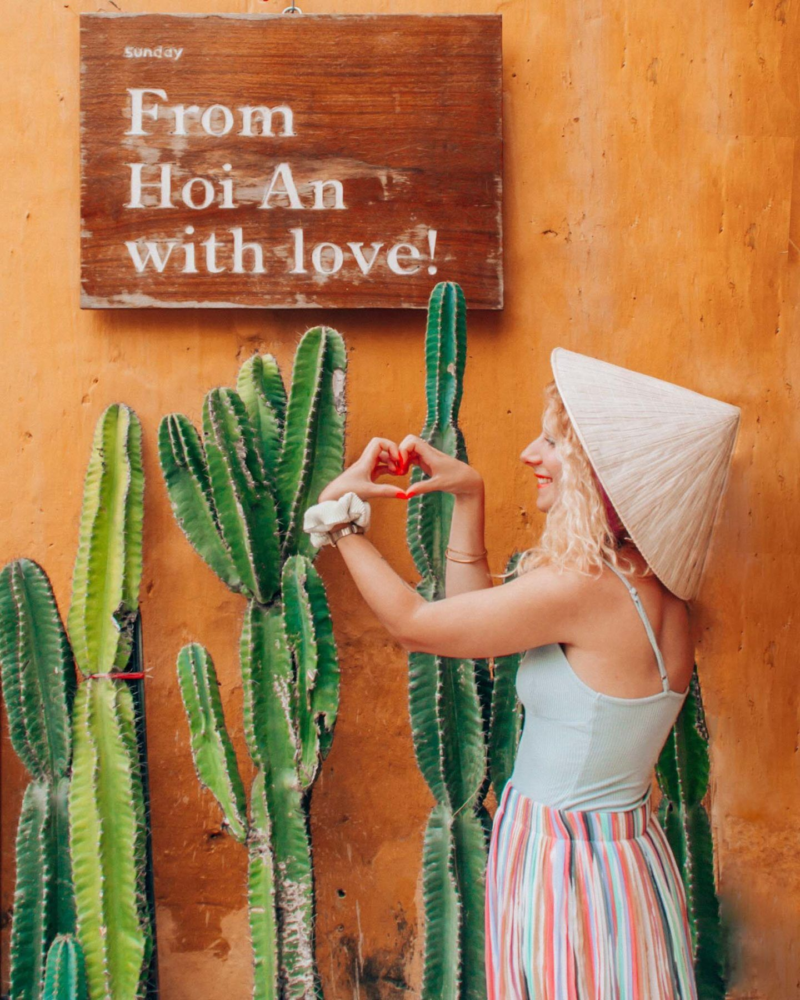
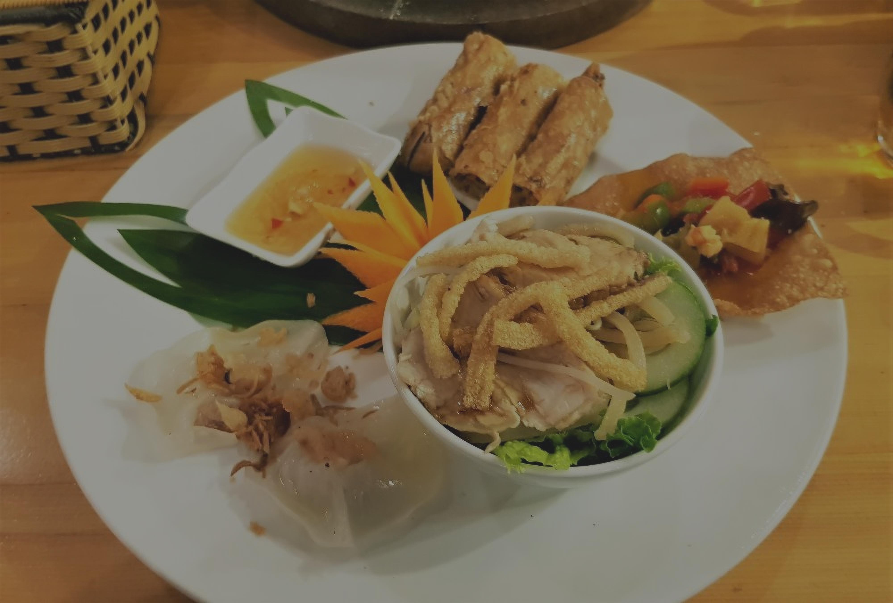
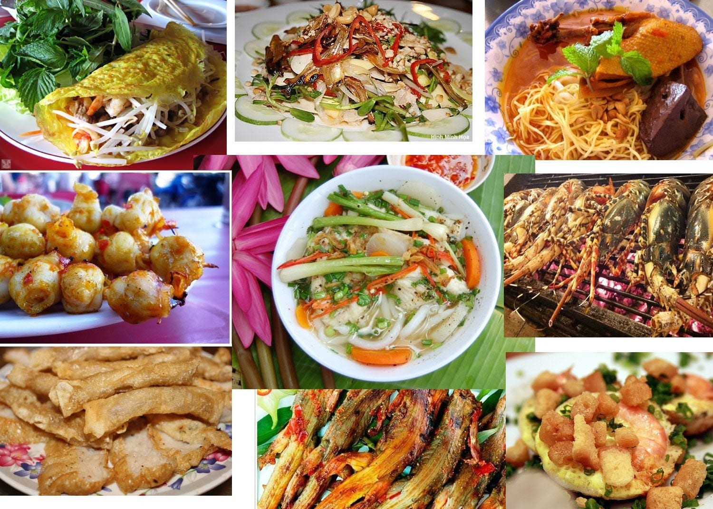
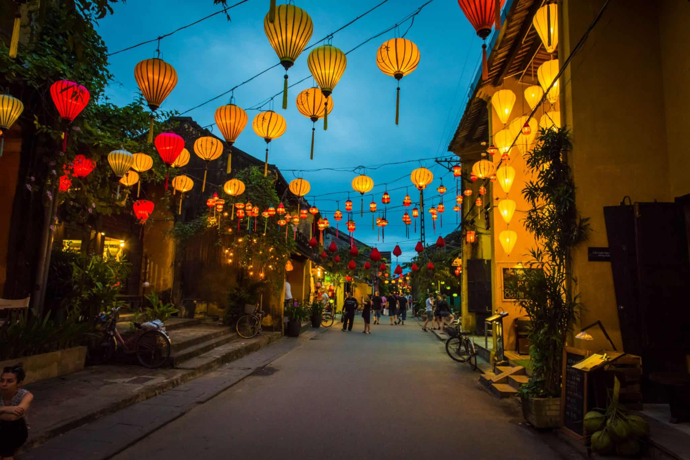

Hoian, a charming town in Vietnam, is known for its rich history and well-preserved ancient architecture. Let's explore five key aspects of Hoian that you should know!

## Historical Significance
Hoian was once a bustling international trading port, attracting merchants from around the world. Its ancient town is a UNESCO World Heritage site, showcasing a harmonious blend of Chinese, Japanese, and Vietnamese cultures.

## Architectural Marvels
The streets of Hoian are adorned with stunning architectural masterpieces, including the iconic Japanese Covered Bridge and beautifully preserved merchant houses. These architectural wonders provide a glimpse into the town's glorious past.

## Artisan Traditions
Hoian is famous for its skilled artisans who specialize in traditional crafts. From intricate lantern making to skilled tailoring, you can witness the artistic craftsmanship that has been passed down through generations in this vibrant town.

## Culinary Delights
Indulge in the culinary delights of Hoian, where you can savor the unique flavors of Central Vietnamese cuisine. Don't miss trying iconic dishes like Cao Lau and White Rose Dumplings, which are exclusive to this region.

## Festivals and Traditions
Hoian comes alive during festive seasons with colorful lantern festivals and traditional celebrations. The most famous is the Full Moon Lantern Festival, where the town is beautifully illuminated by thousands of lanterns.

Hoian offers a unique blend of history, architecture, culture, cuisine, and traditions. Discover the magic of this enchanting town and create unforgettable memories during your visit!

