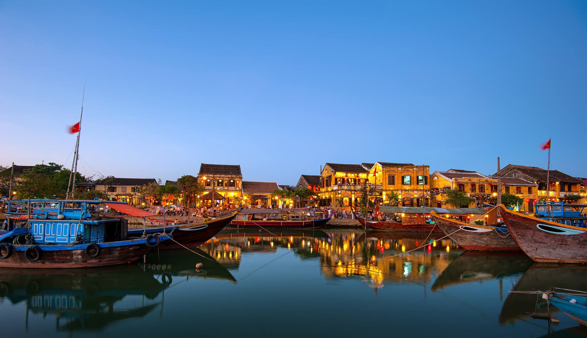
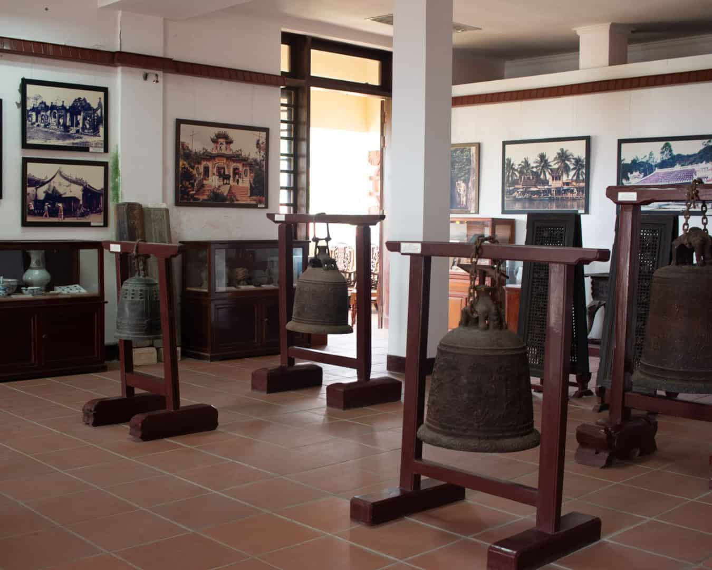
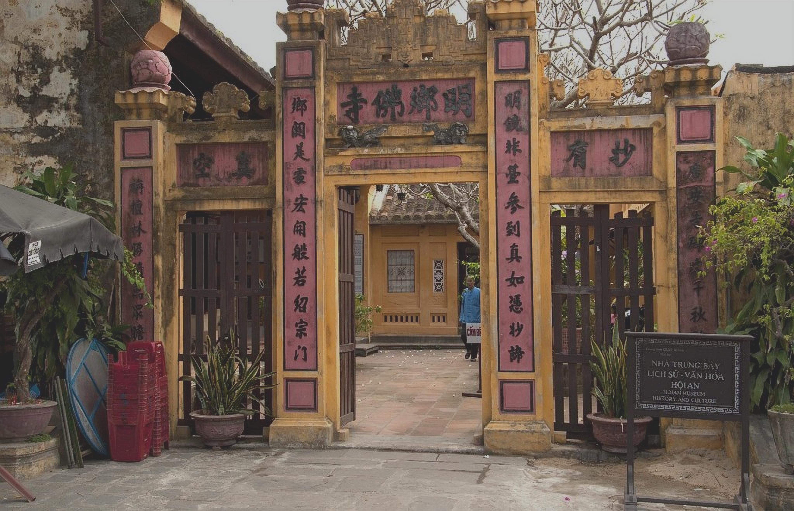
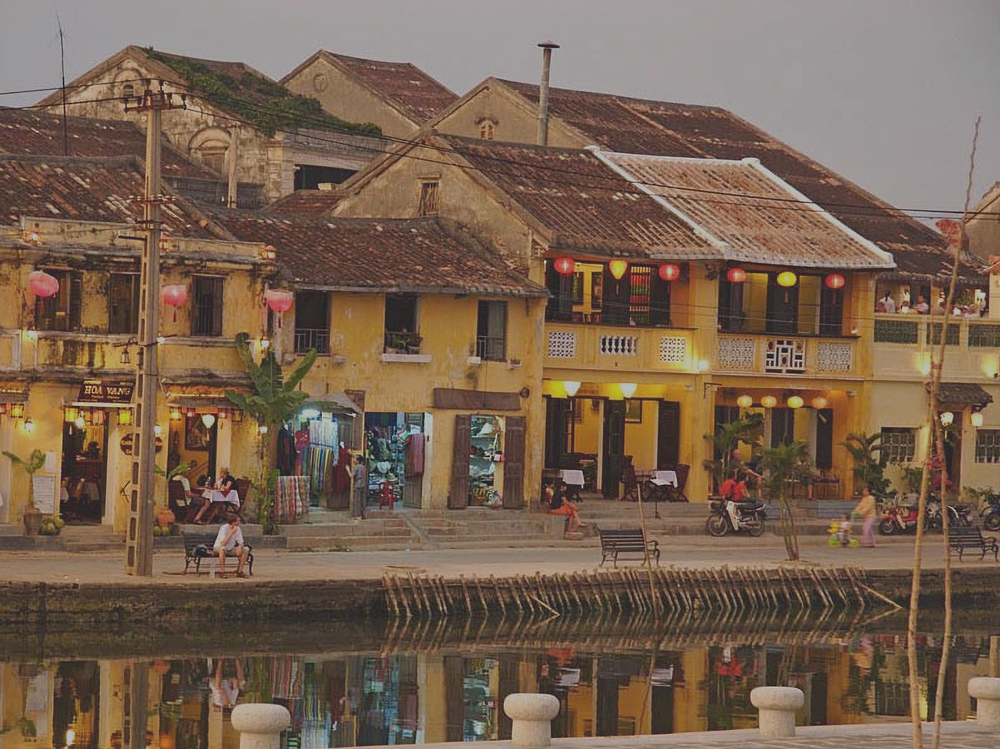
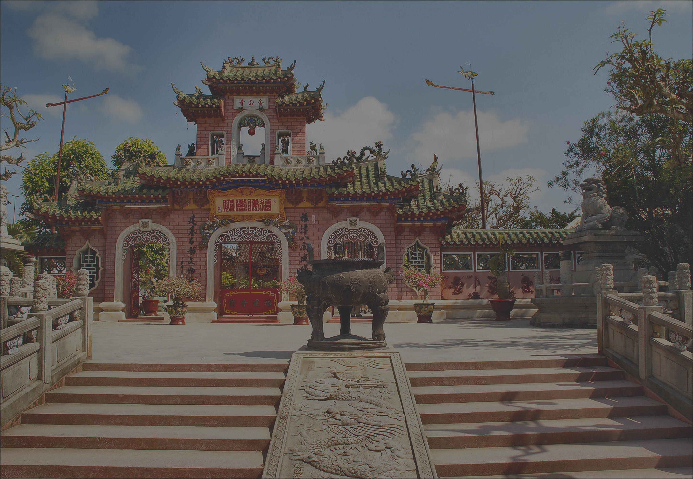
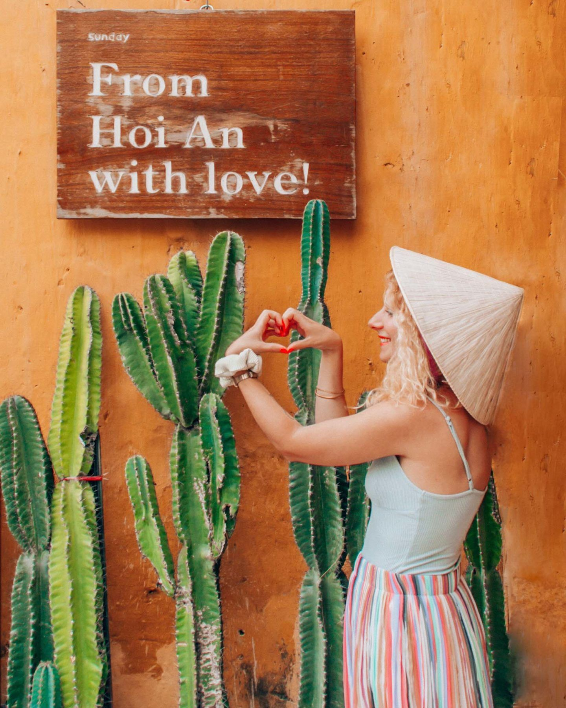
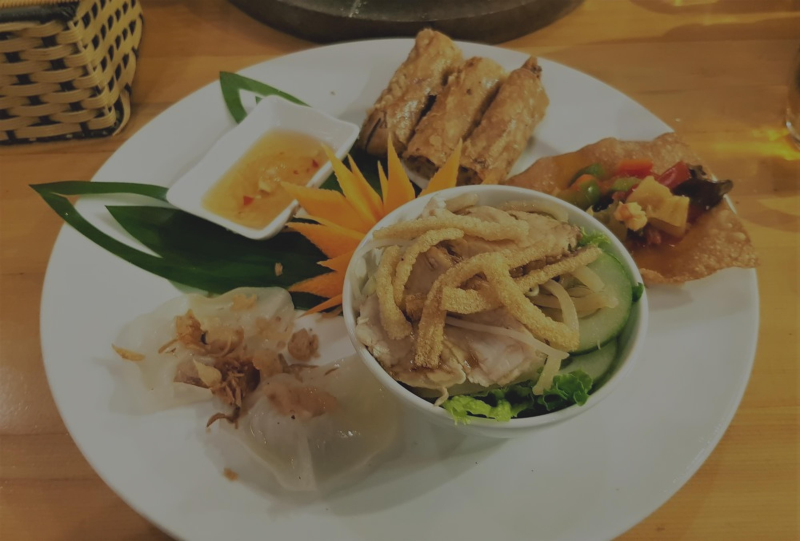
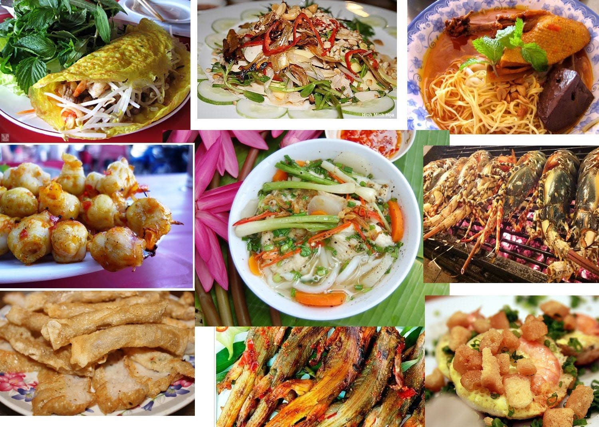
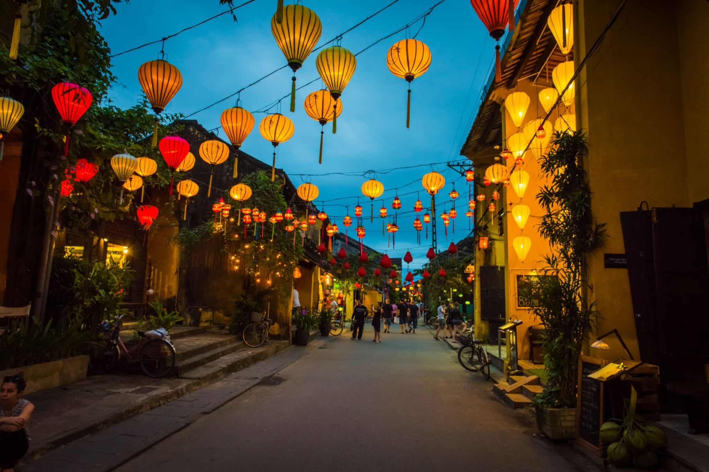

베트남의 매력적인 도시인 호이안은 풍부한 역사와 잘 보존된 고대 건축물로 유명합니다. 꼭 알아야 할 호이안의 5가지 주요 측면을 살펴보겠습니다!

## 역사적 의의
호이안은 한때 번화한 국제 무역항으로 전 세계 상인들을 끌어들였습니다. 고대 마을은 유네스코 세계 문화 유산으로 중국, 일본, 베트남 문화가 조화롭게 어우러진 모습을 보여줍니다.

## 건축 경이로움
호이안의 거리는 상징적인 일본 다리와 아름답게 보존된 상가를 포함하여 놀라운 건축 걸작으로 장식되어 있습니다. 이 경이로운 건축물은 도시의 영광스러운 과거를 엿볼 수 있게 해줍니다.

## 장인의 전통
호이안은 전통 공예를 전문으로 하는 숙련된 장인들로 유명합니다. 복잡한 등불 만들기부터 숙련된 재봉까지, 이 활기찬 마을에서 여러 세대에 걸쳐 전해져 내려온 예술적인 장인 정신을 목격할 수 있습니다.

## 요리의 즐거움
베트남 중부 요리의 독특한 풍미를 맛볼 수 있는 호이안의 요리의 즐거움에 빠져보세요. 이 지역에서만 맛볼 수 있는 Cao Lau와 White Rose Dumplings와 같은 상징적인 요리를 맛보는 것을 놓치지 마세요.

## 축제와 전통
호이안은 화려한 등불 축제와 전통 행사로 축제 시즌에 활기를 띱니다. 가장 유명한 것은 보름달 등불 축제로, 수천 개의 등불이 마을을 아름답게 비춥니다.

호이안은 역사, 건축, 문화, 요리, 전통이 독특하게 어우러진 곳입니다. 이 매혹적인 마을의 ​​마법을 발견하고 방문하는 동안 잊을 수 없는 추억을 만드세요!

