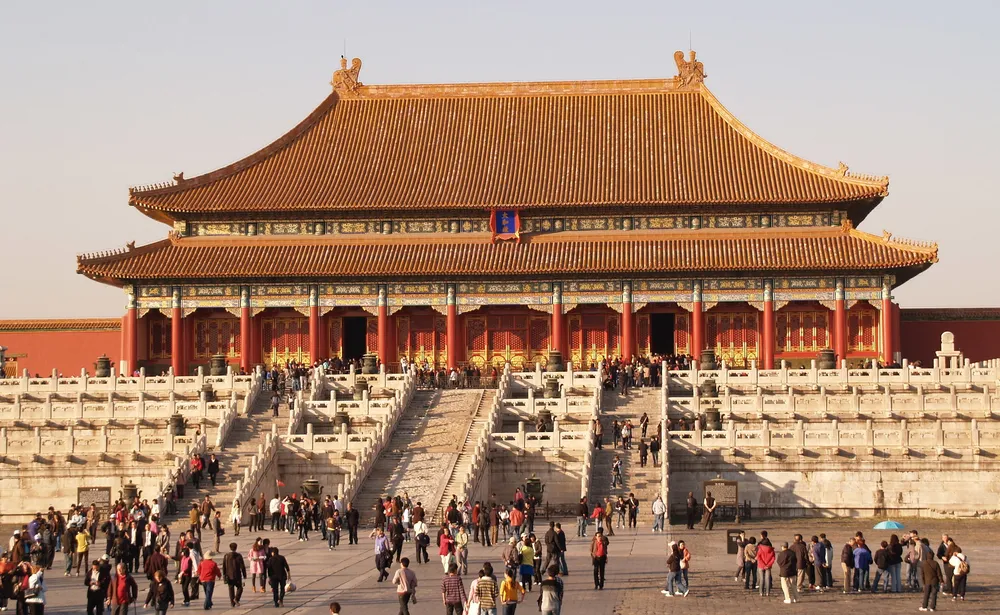
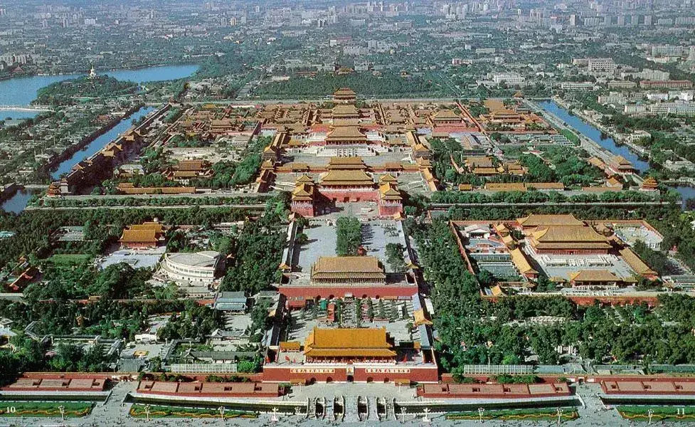
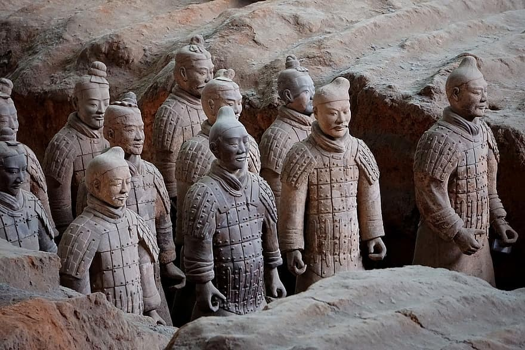
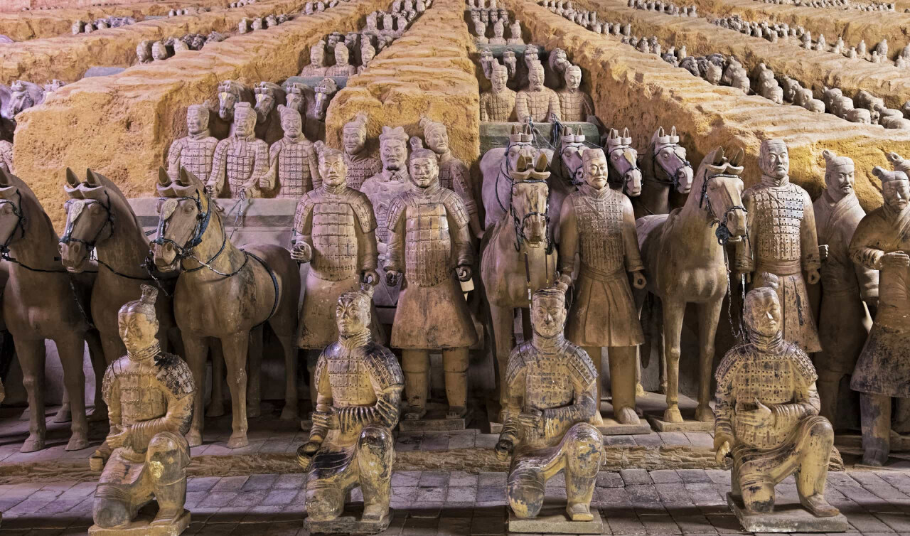
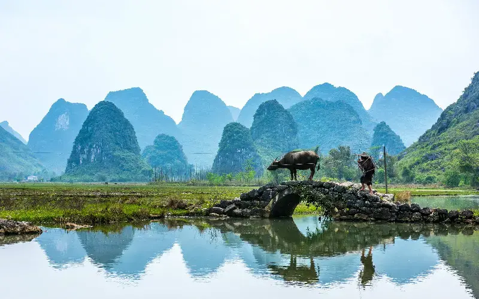
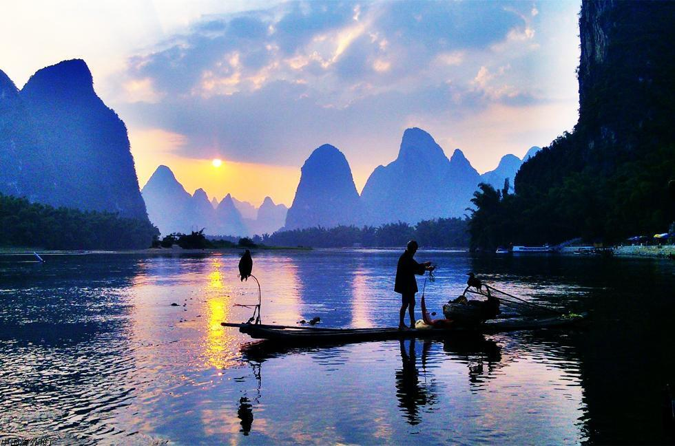

꼭 알아야 할 중국 여행지 3곳을 소개합니다. 중국은 풍부한 역사와 문화를 지니고 있어 매력적인 여행지로 알려져 있습니다. 다양한 명소와 풍경을 경험하며 중국의 아름다움을 느껴보세요.

## 1. 베이징 금지된 도시

베이징의 중심에 위치한 자금성은 건축적 경이로움으로 중국 황제들이 500년 동안 사용되어 왔습니다. 복잡한 디자인과 웅장함으로 중국의 풍요로운 역사를 상징하는 곳입니다.

## 2. 시안 테라코타 군사

중국 최초의 황제인 천시황제와 함께 묻힌 실물 크기의 동상들이 그의 묘를 지키고 있습니다. 인상적인 장인 정신과 대단한 규모를 가진 이 고대 군대를 감탄해 보세요.

## 3. 구이린시와 리강

수 세기 동안 시인과 화가들에게 영감을 주었던 완벽한 풍경이 전해집니다. 강상을 유랑하며 평화로운 물결, 웅장한 카스트 산맥, 그리고 상쾌한 시골 풍경을 감상하세요.

중국의 아름다운 여행지를 방문하여 풍부한 역사와 문화를 경험해보세요. 이 멋진 장소들에서 특별한 순간을 만들어 나만의 추억을 만들어보세요.