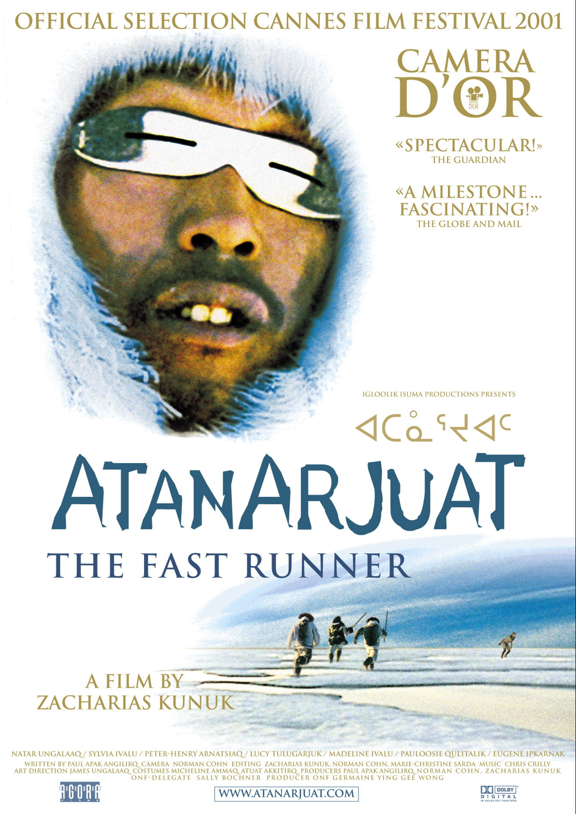
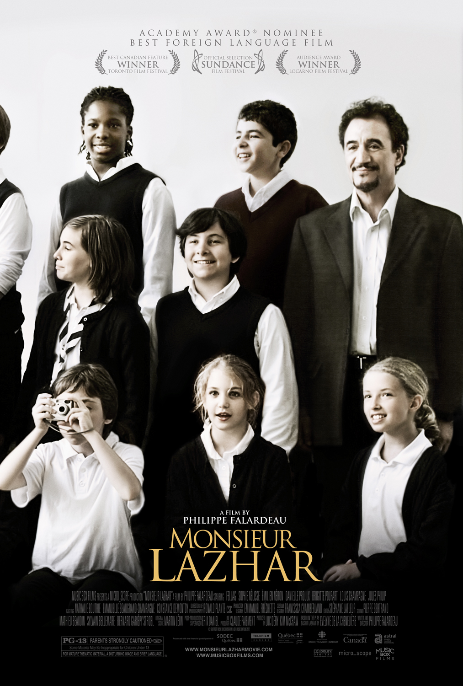

We will explore five iconic Canadian movies that have made a significant impact on the film industry. Get ready for a journey through Canadian cinematography!

## Bon Cop, Bad Cop
A bilingual action-comedy film that brings together detectives from Ontario and Quebec to solve a crime, highlighting the cultural differences between the two provinces. Bon Cop, Bad Cop is a must-watch for its hilarious dialogue and unique blend of English and French languages.

## The Sweet Hereafter
Adapted from Russell Banks' novel, this powerful drama explores the aftermath of a tragic school bus accident in a small town. The Sweet Hereafter is known for its evocative storytelling and stellar performances, making it a prominent landmark in Canadian cinema history.

## C.R.A.Z.Y.
A coming-of-age drama that follows the life of a young man named Zachary. Set in Montreal, C.R.A.Z.Y. delves into themes of family, identity, and self-discovery. This critically acclaimed film captured hearts with its emotional depth and enriched portrayal of personal struggles.

## Atanarjuat: The Fast Runner
This epic Inuit film explores the ancient legends and traditions through the story of Atanarjuat, a young hunter who faces betrayal and supernatural challenges. Atanarjuat: The Fast Runner is celebrated for its breathtaking cinematography and authentic representation of Inuit culture.

## Monsieur Lazhar
A touching drama that tells the story of an Algerian immigrant hired as a substitute teacher in a Montreal school. Monsieur Lazhar is a heartwarming and thought-provoking film that tackles themes of loss, healing, and the importance of human connection.

These five Canadian movies showcase the diversity and excellence of the country's film industry. From comedy to drama, they demonstrate the unique perspectives and storytelling techniques that have made Canadian cinema internationally acclaimed.

