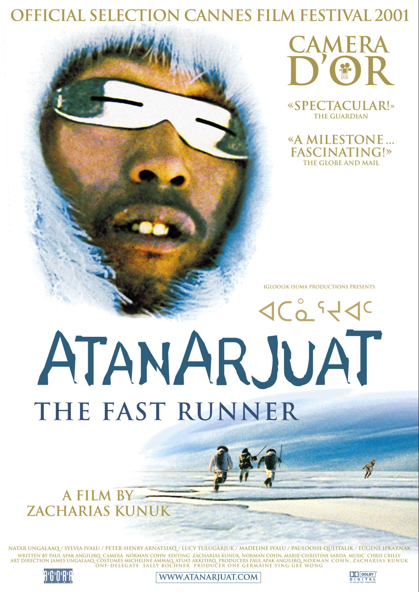

우리는 영화 산업에 중대한 영향을 미친 5개의 상징적인 캐나다 영화를 살펴볼 것입니다. 캐나다 영화를 통한 여행을 준비하세요!

## 좋은 경찰, 나쁜 경찰
범죄를 해결하기 위해 온타리오와 퀘벡의 형사들이 모여 두 지역의 문화적 차이를 강조하는 이중 언어 액션 코미디 영화입니다. 좋은 경찰, 나쁜 경찰은 유쾌한 대화와 영어와 프랑스어의 독특한 조합으로 꼭 봐야 할 게임입니다.

## 달콤한 후세
러셀 뱅크스의 소설을 각색한 이 강력한 드라마는 작은 마을에서 발생한 비극적인 스쿨버스 사고의 여파를 탐구합니다. 달콤한 후세는 연상시키는 스토리텔링과 눈부신 연기로 유명하여 캐나다 영화 역사에서 중요한 랜드마크가 되었습니다.

## 크.레.이.지.
재커리라는 청년의 삶을 따라가는 성장 드라마. 몬트리올을 배경으로 하는 영화 크레이지는 가족, 정체성, 자기 발견이라는 주제를 탐구합니다. 비평가들의 찬사를 받은 이 영화는 감정의 깊이와 개인적인 투쟁에 대한 풍부한 묘사로 마음을 사로잡았습니다.

## 아타나주아
이 서사시적인 이누이트 영화는 배신과 초자연적인 도전에 직면한 젊은 사냥꾼 아타나르주아트의 이야기를 통해 고대 전설과 전통을 탐구합니다. 아타나주아는 숨막히는 영화 촬영법과 이누이트 문화의 진정한 표현으로 유명합니다.

## 미스터 라자르
몬트리올의 한 학교에서 대리 교사로 고용된 알제리 이민자의 이야기를 담은 감동적인 드라마. 무슈 라자르는 상실, 치유, 인간 관계의 중요성이라는 주제를 다루는 마음이 따뜻해지고 생각을 자극하는 영화입니다.

이 5편의 캐나다 영화는 캐나다 영화 산업의 다양성과 우수성을 보여줍니다. 코미디에서 드라마에 이르기까지 그들은 캐나다 영화를 국제적으로 인정받게 만든 독특한 관점과 스토리텔링 기법을 보여줍니다.

