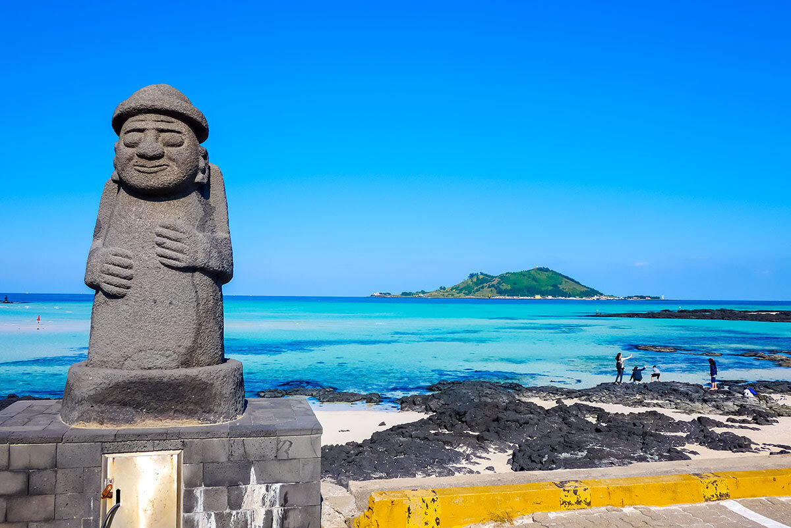
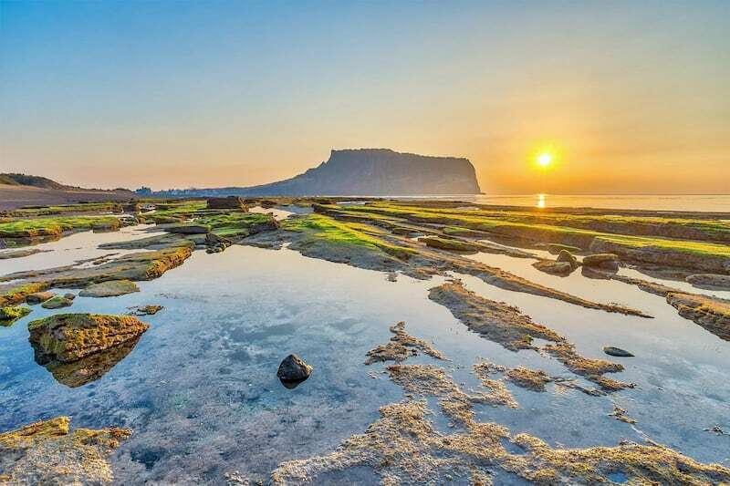
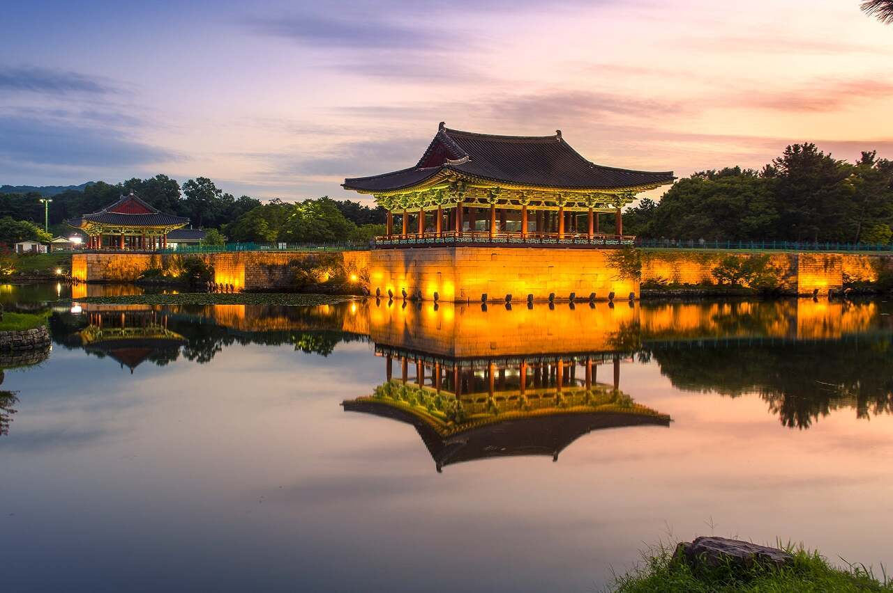
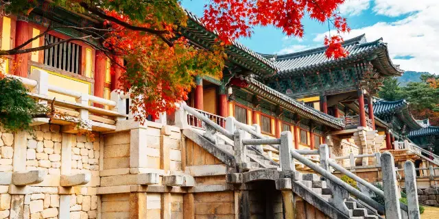
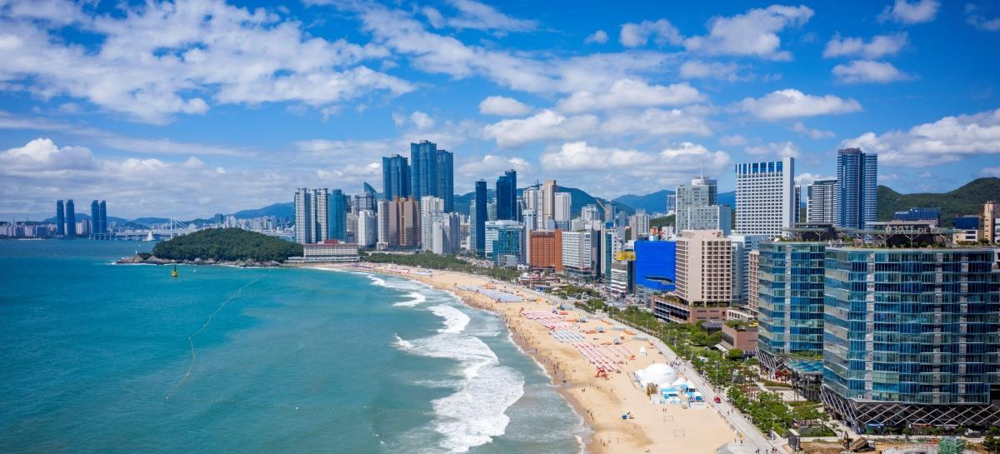
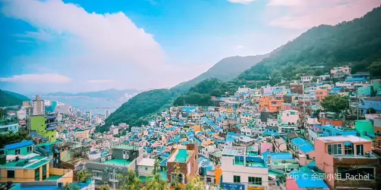

여러분은 한국에서 꼭 가봐야 할 여행지를 찾고 계신가요? 이제 죽기 전에 알아야 할 [국내 여행지][topic] 3곳을 소개합니다. [국내 여행지][topic]는 다양한 문화와 경험을 통해 시야를 넓히고 세계를 더 잘 이해할 수 있는 기회를 제공합니다. 또한, 자연 경관, 역사 유적, 독특한 문화 등 다양한 매력을 갖고 있어 풍부한 여행 경험을 쌓을 수 있습니다. 이러한 이유로 [국내 여행지][topic]를 알아두는 것은 여행을 좋아하는 사람들에게 큰 도움이 될 것입니다.

## 1. [제주도][main1]

신들의 섬으로 알려진 [제주도][main1]는 숨막히는 자연 경관 뿐만 아니라 독특한 문화를 선사합니다. 아름다운 폭포, 위광할 한라산, 그리고 성산일출봉과 같은 멋진 명소도 놓치지 마세요.

## 2. [경주][main2]

역사의 박물관이라 불리는 [경주][main2]는 풍부한 역사를 간직한 도시입니다. 불국사와 토속 고분들로 유명한 유네스코 세계문화유산지를 탐험해보세요.

## 3. [부산][main3]

[부산][main3]은 활기 넘치는 해안 도시로 해운대와 광안리 같은 아름다운 해변으로 유명합니다. 분주한 시장 문화와 풍성한 해산물, 그리고 아이코닉한 감천문화마을도 꼭 방문해보세요.

이 훌륭한 [국내 여행지][topic]의 매력을 발견하며 여행 경험을 더욱 풍요롭게 만들어보세요.

[topic]: https://www.google.com/search?q=국내여행지
[main1]: https://www.google.com/search?q=제주도
[main2]: https://www.google.com/search?q=경주
[main3]: https://www.google.com/search?q=부산