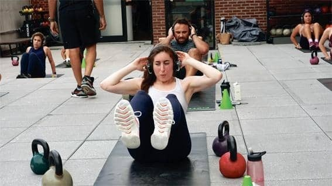
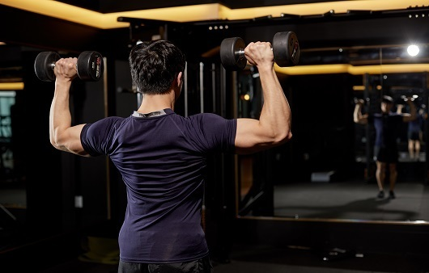
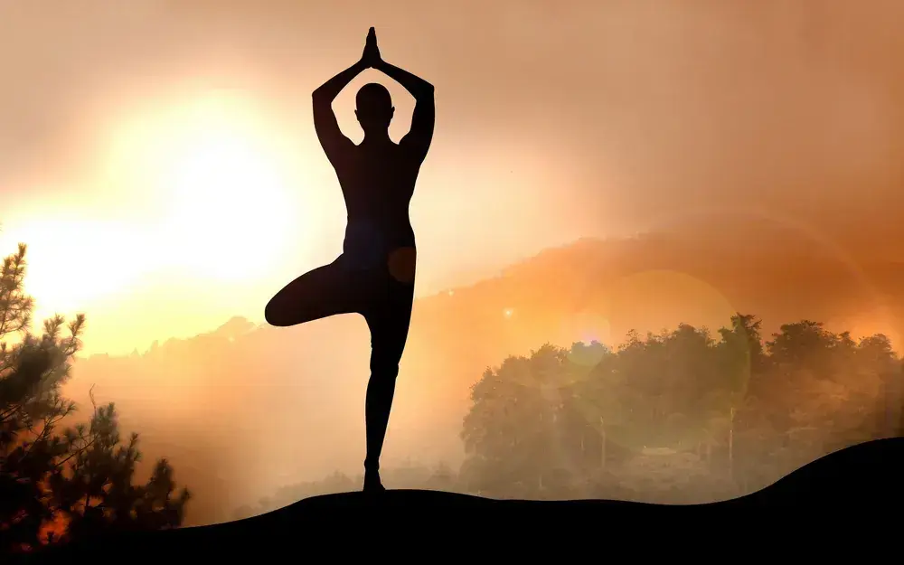
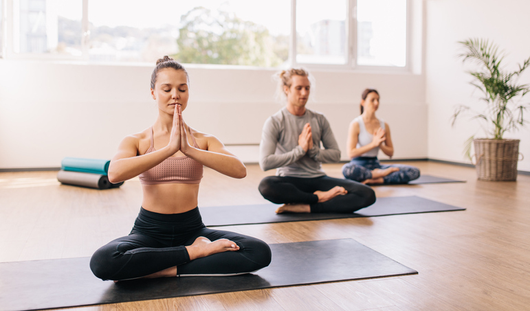

행복한 삶을 위해선 건강이 최우선이 되어야하는데요. 우리가 꼭 알아야 할 세 가지 운동 방법에 대해 궁금해 해 보셨나요?

## 1. 고강도 간격 운동 히트

히트 (HIIT)는 짧은 강도의 운동을 하고 그 뒤에 짧은 휴식 시간을 가지는 방식입니다. 이는 유산소 피트니스를 향상시키고 빠르게 칼로리를 태우는 데 도움이 됩니다.

## 2. 근력 훈련

근력 훈련은 근육을 키우고 힘을 키우는 데 초점을 맞춥니다. 이는 뼈 밀도를 향상시키고 신진대사를 촉진하여 탄력적인 체형을 얻을 수 있도록 도와줍니다.

## 3. 요가

요가는 체형 자세, 조절된 호흡 및 명상을 결합한 운동입니다. 이는 유연성을 향상시키고 휴식을 촉진하며 전반적인 웰빙을 향상시킵니다.

그러니까 기억하세요, 여러분의 피트니스 여정을 최대한 활용하려면 이 세 가지 운동 방법을 한 번 시도해보세요! 활동적이고 건강하게 지내세요!