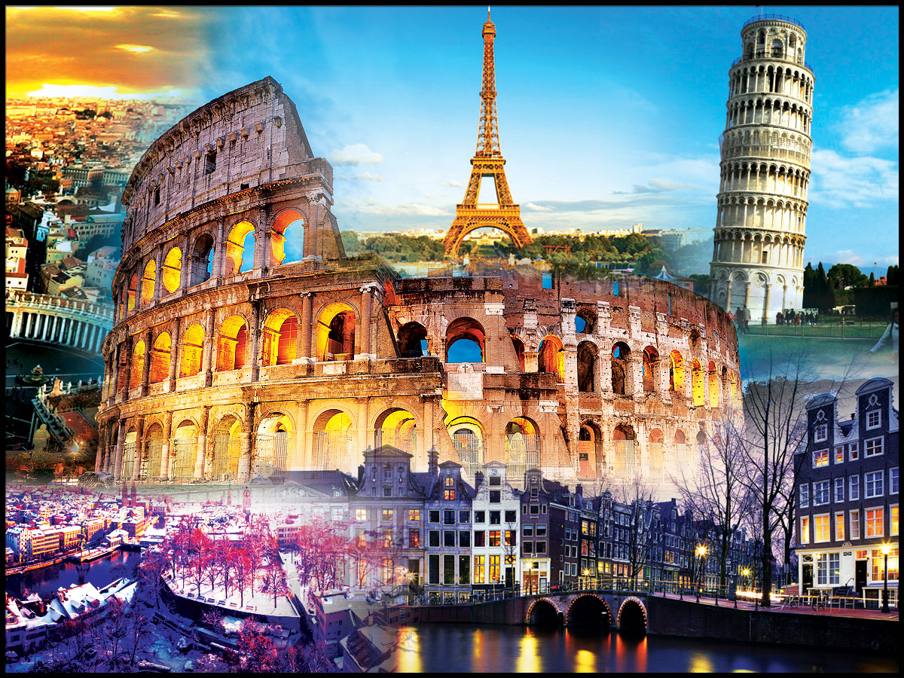
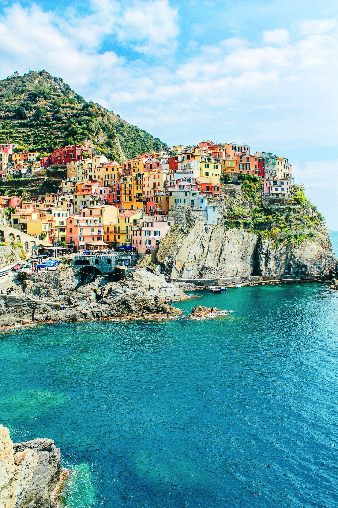
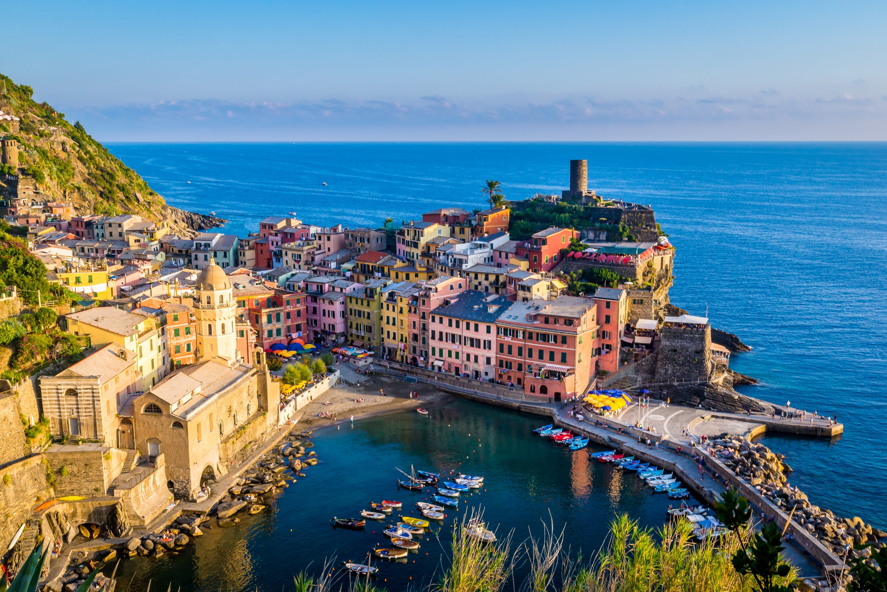
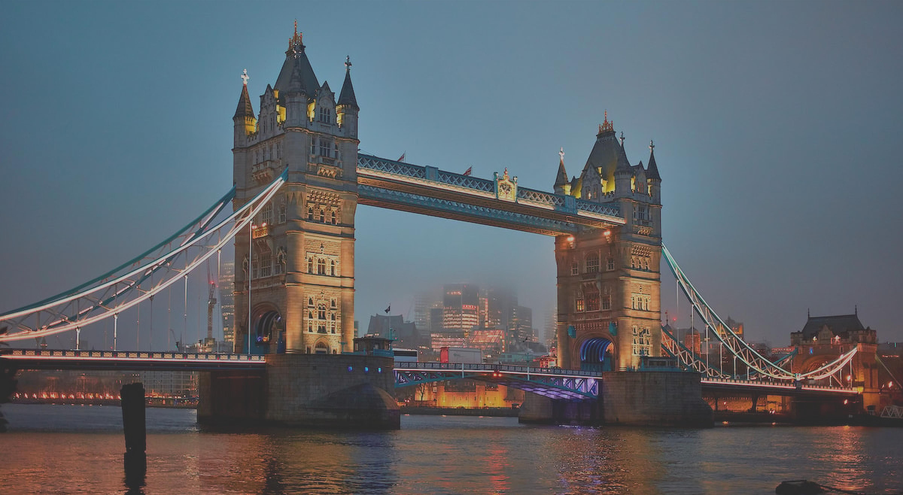
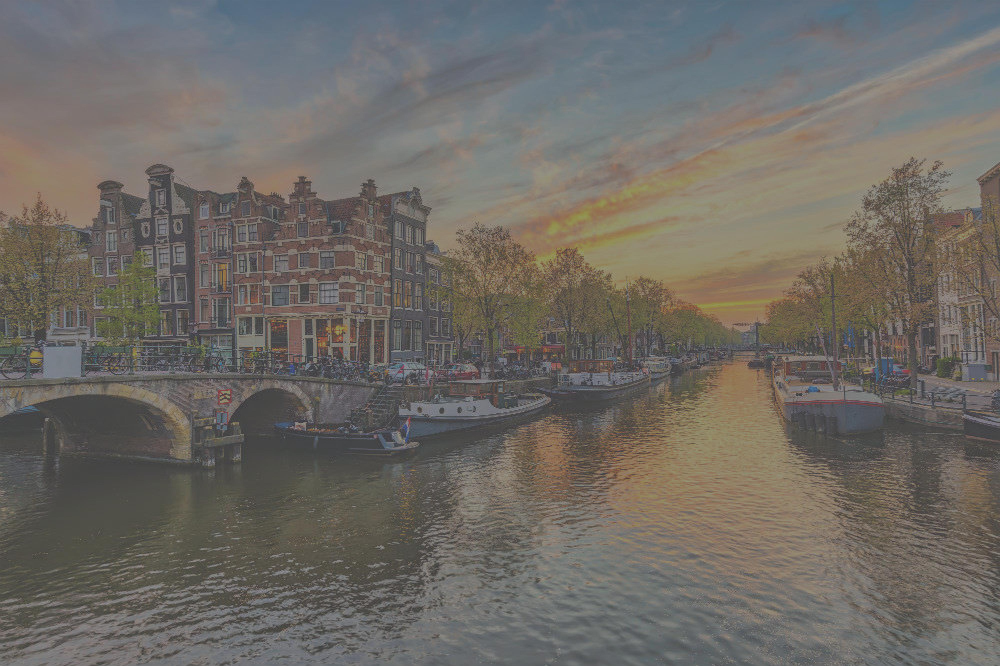

Welcome to our guide on five essential European countries that you should visit. These countries are not only geographically diverse but also possess rich cultural heritage and historical significance. Let's explore them!

## France
France, widely known for its romantic capital city Paris, is also home to iconic landmarks such as the Eiffel Tower and Louvre Museum. With its splendid cuisine, fashion, and historical sites, France attracts millions of tourists every year.

## Germany
Germany, the economic powerhouse of Europe, is renowned for its engineering excellence and technological innovation. From its vibrant cities like Berlin to its famous Oktoberfest in Munich, Germany offers a mix of modernity and cultural heritage.

## Italy
Italy, the birthplace of the Renaissance, is adorned with beautiful art, architecture, and historical treasures. From the timeless city of Rome to the picturesque canals of Venice, Italy is a must-visit for lovers of history, culture, and delicious food.

## Spain
Spain, known for its vibrant festivals, stunning beaches, and warm hospitality, offers a diverse experience. Whether you want to explore the architectural wonders of Barcelona or indulge in the vibrant flamenco culture of Seville, Spain has something for everyone.

## United Kingdom
The United Kingdom, comprising England, Scotland, Wales, and Northern Ireland, is a land of rich history, royal heritage, and stunning landscapes. From the iconic Big Ben in London to the breathtaking Scottish Highlands, the UK never fails to enchant visitors.

These are just a few highlights of the incredible diversity and beauty that European countries have to offer. Each country has its unique charm, history, and attractions, making Europe a continent worth exploring. Whether you're a history enthusiast, a food lover, or an adventurer, there's something for everyone in these amazing European destinations.

