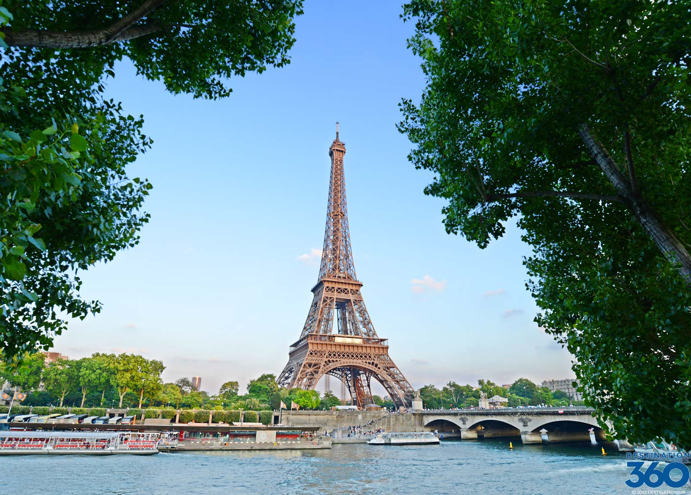
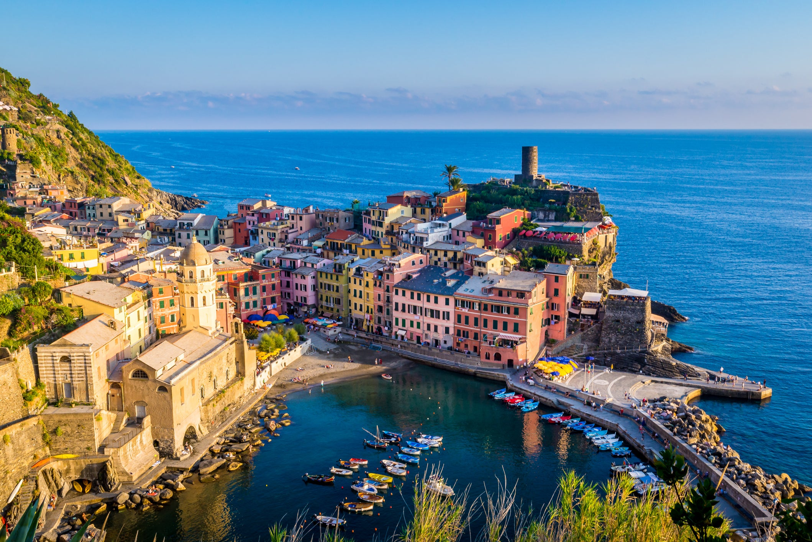
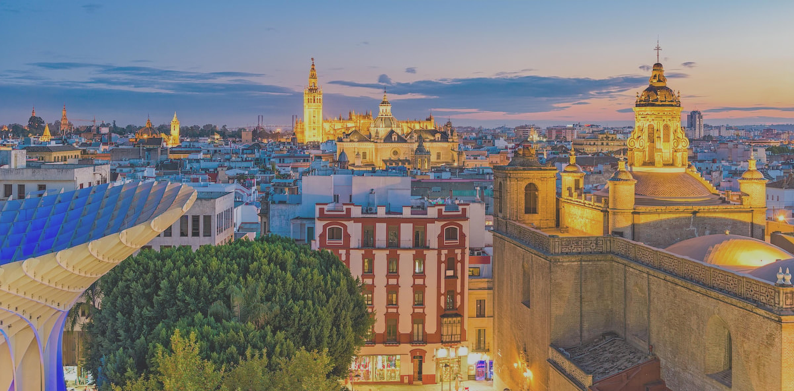
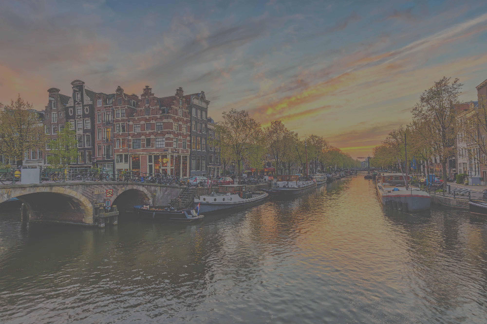

방문해야 할 필수 유럽 5개국 가이드에 오신 것을 환영합니다. 이들 국가는 지리적으로 다양할 뿐만 아니라 풍부한 문화유산과 역사적 의미를 지니고 있습니다. 탐험해 볼까요 !

## 프랑스
낭만적인 수도 파리로 널리 알려진 프랑스에는 에펠탑과 루브르 박물관과 같은 상징적인 랜드마크가 있습니다. 화려한 요리, 패션 및 유적지로 프랑스는 매년 수백만 명의 관광객을 끌어들입니다.

## 독일
유럽의 경제 강국인 독일은 엔지니어링 우수성과 기술 혁신으로 유명합니다. 베를린과 같은 활기찬 도시에서 뮌헨의 유명한 옥토버페스트에 이르기까지 독일은 현대성과 문화 유산이 조화를 이루고 있습니다.

## 이탈리아
르네상스의 발상지인 이탈리아는 아름다운 예술, 건축물, 역사적 보물로 장식되어 있습니다. 영원한 도시 로마에서 그림 같은 베니스 운하에 이르기까지 이탈리아는 역사, 문화 및 맛있는 음식을 사랑하는 사람들이 꼭 방문해야 할 곳입니다.

## 스페인
활기찬 축제, 멋진 해변, 따뜻한 환대로 유명한 스페인은 다양한 경험을 제공합니다. 바르셀로나의 경이로운 건축물을 탐험하고 싶든 세비야의 활기찬 플라멩코 문화에 빠져들고 싶든, 스페인은 모두를 위한 무언가를 가지고 있습니다.

## 영국
잉글랜드, 스코틀랜드, 웨일즈, 북아일랜드로 구성된 영국은 풍부한 역사, 왕족의 유산, 아름다운 풍경의 땅입니다. 런던의 상징적인 빅벤에서 숨이 멎을 듯 아름다운 스코틀랜드 고원에 이르기까지 영국은 방문객을 매혹시키는 데 실패하지 않습니다.

이것은 유럽 국가들이 제공해야 하는 놀라운 다양성과 아름다움의 몇 가지 하이라이트일 뿐입니다. 각 국가마다 고유한 매력, 역사 및 명소가 있어 유럽을 탐험할 가치가 있는 대륙으로 만듭니다. 역사 애호가, 음식 애호가, 모험가 등 이 놀라운 유럽 여행지에는 모두를 위한 무언가가 있습니다.

