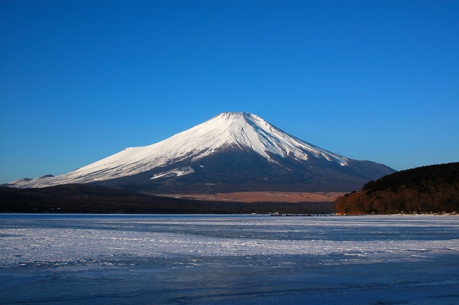
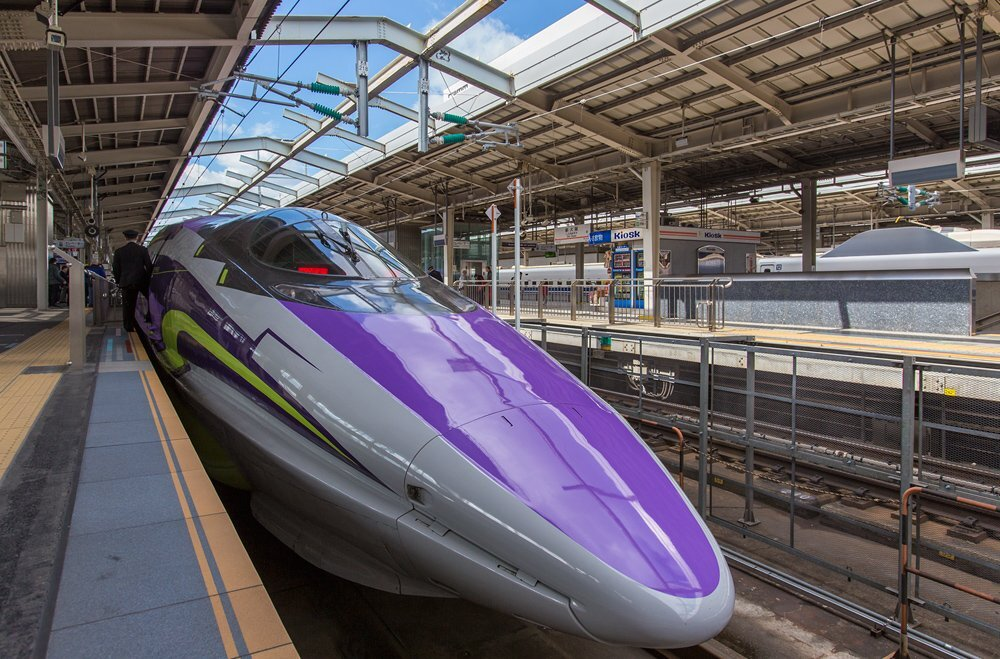

일본은 독특하고 다양한 문화와 역사적 유산을 가지고 있어, 일본 여행을 통해 다른 나라에서는 경험할 수 없는 새로운 문화적 체험을 할 수 있습니다. 여행을 시작하기 전에 꼭 알아야 할 세 가지를 소개합니다!

## 1. 후지산
첫째, 후지산. 일본의 상징적인 산으로, 이 웅장한 산은 전 세계에서 많은 관광객을 끌어모읍니다. 하지만 후지산 등반은 준비와 체력을 요구합니다. 등반 경로를 조사하고 적절한 장비를 가져가며 날씨 상황을 주의하세요.

## 2. 교통수단
둘째, 일본의 교통 수단. 효율적이고 확장된 철도망인 신칸센과 같은 기차는 이 나라를 탐험하는 이상적인 방법입니다. 여행 전에 일본레일패스를 구매하여 여행 경비를 절약하세요. 도시 내 이동의 주요 수단인 지하철 시스템에 익숙해지는 것도 잊지 마세요.

## 3. 일본의 예절과 관습
마지막으로, 일본의 예절과 관습입니다. 일본 사람들은 예의와 조화를 중요시하기 때문에 그들의 관습을 알아야 합니다. 인사로 절하는 것이 일반적이며, 집이나 전통적인 장소에 입장할 때는 신발을 벗는 것이 습관입니다. 개인 공간을 존중하고 공공장소에서 시끄럽지 않도록 주의하세요.

그러므로, 일본 여행을 떠나기 전에 이 세 가지 핵심 팁을 기억하세요. 후지산에 대비하고, 교통 수단을 알아두며, 일본의 관습을 존중하세요. 여러분의 모험을 즐기세요!

안전한 여행을 떠나세요!