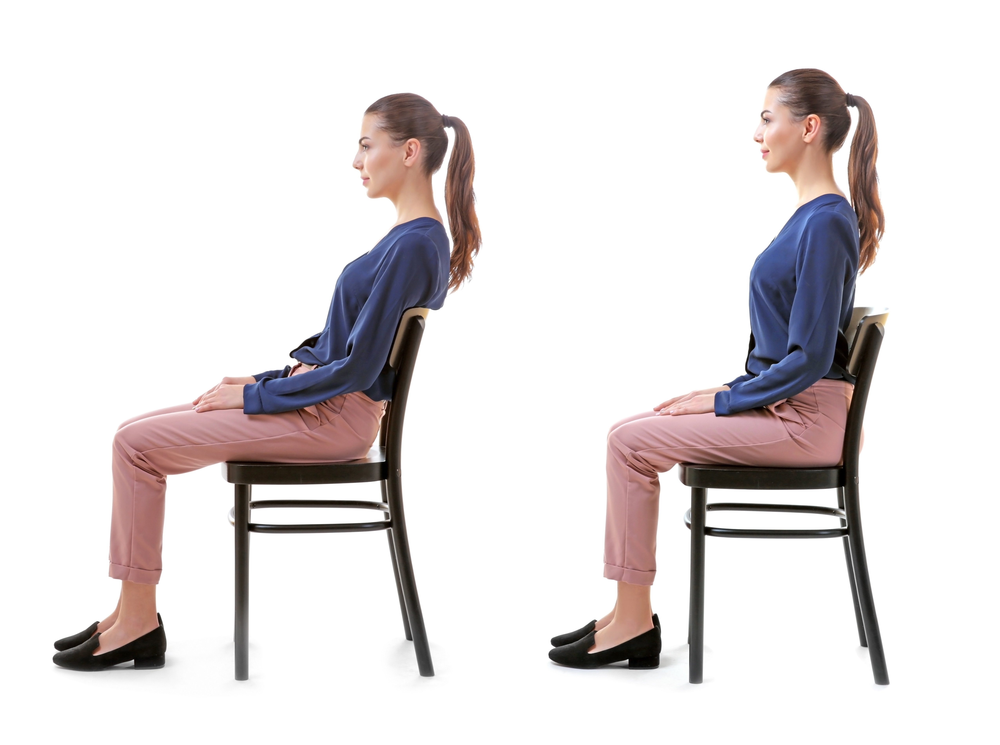
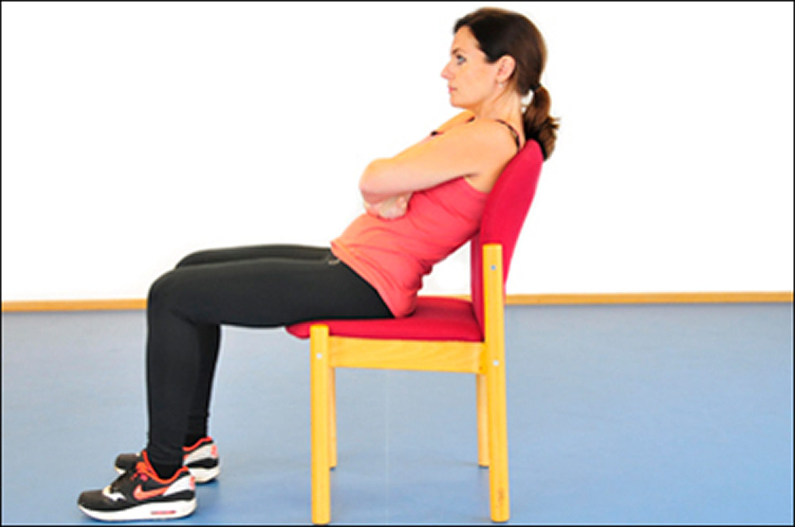
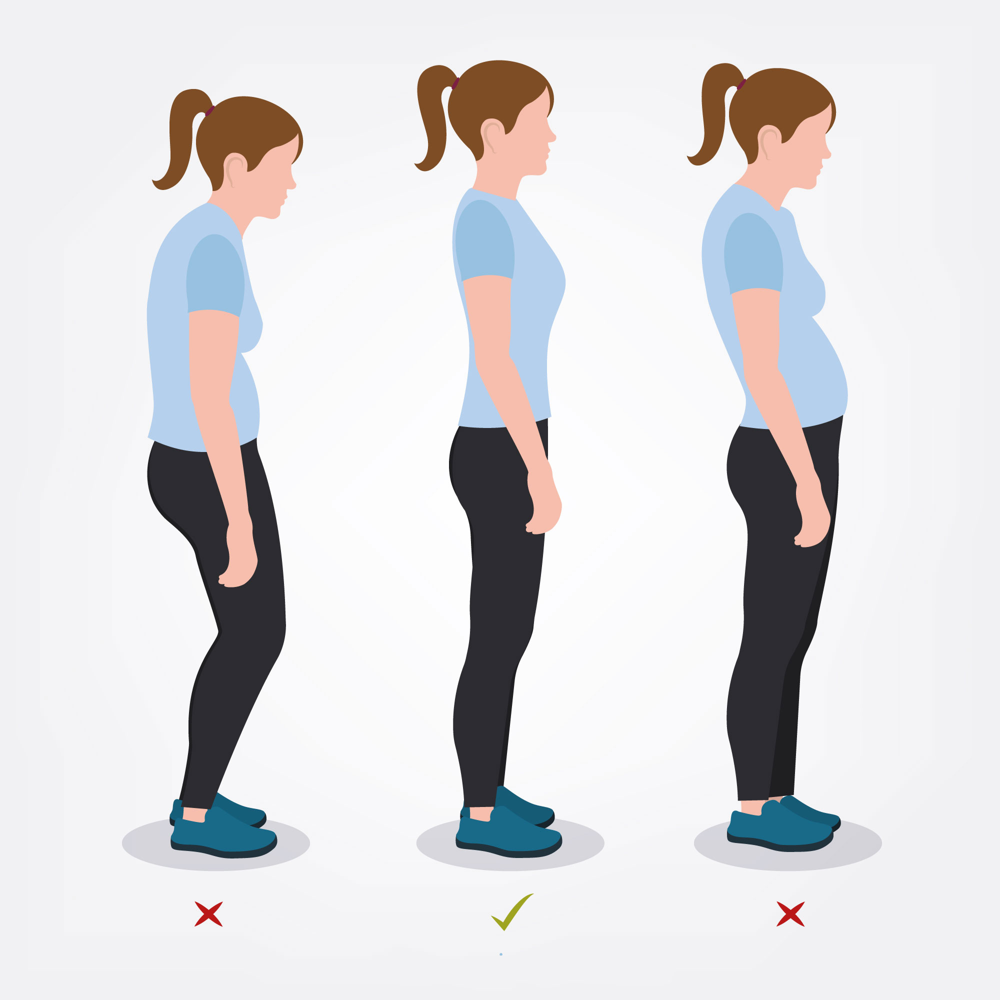
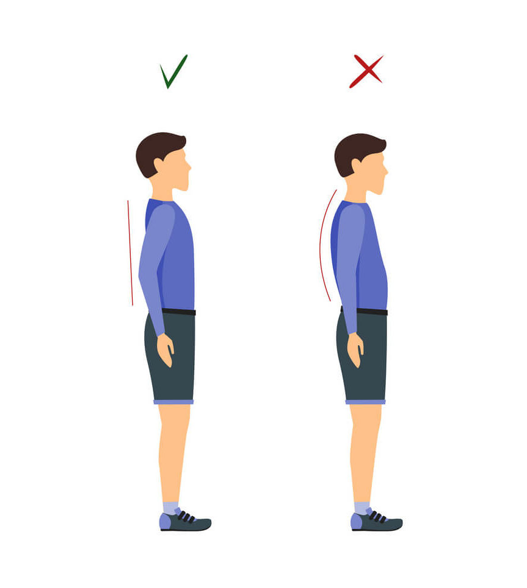
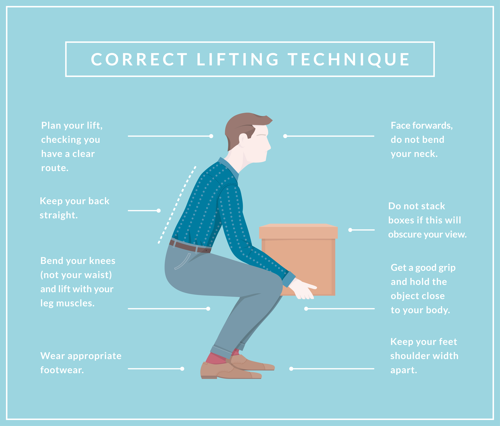
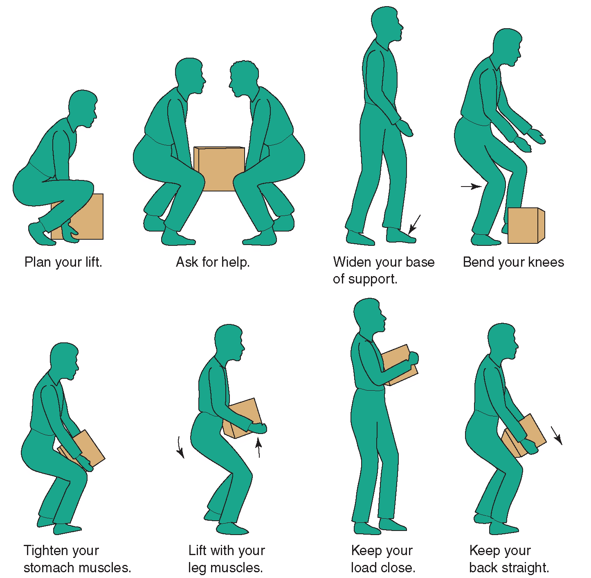
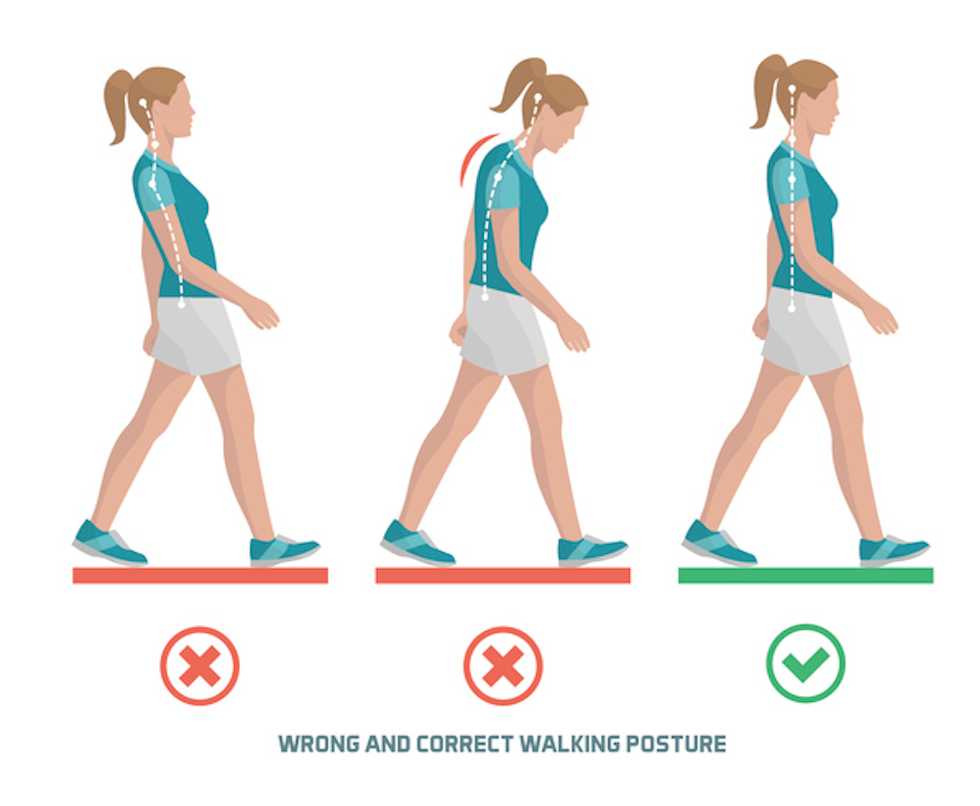

Maintaining good posture is crucial for a healthy spine and overall well-being. Here are five essential postures that you must know.

## 1. Sitting Posture
Sit with your back straight, shoulders relaxed, and feet flat on the floor. Avoid slouching or hunching forward.

## 2. Standing Posture
Stand tall with your head aligned with your spine, shoulders back, and abdomen pulled in. Distribute your weight evenly on both feet.

## 3. Sleeping Posture
Sleep on your back or side with a pillow that supports the natural curve of your neck and spine. Avoid sleeping on your stomach.

## 4. Lifting Posture
Bend your knees, keep your back straight, and lift objects close to your body. Avoid bending at the waist or twisting while lifting.

## 5. Walking Posture
Walk with your head held high, shoulders relaxed, and spine straight. Take confident strides and engage your abdominal muscles.

Practicing these five postures consistently can help prevent back pain and improve your overall posture and spinal health. Remember to be mindful of your posture throughout the day!

