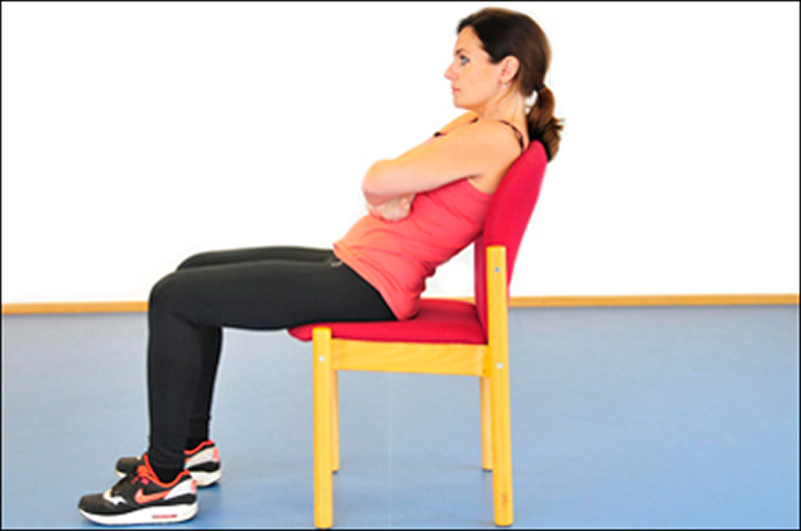
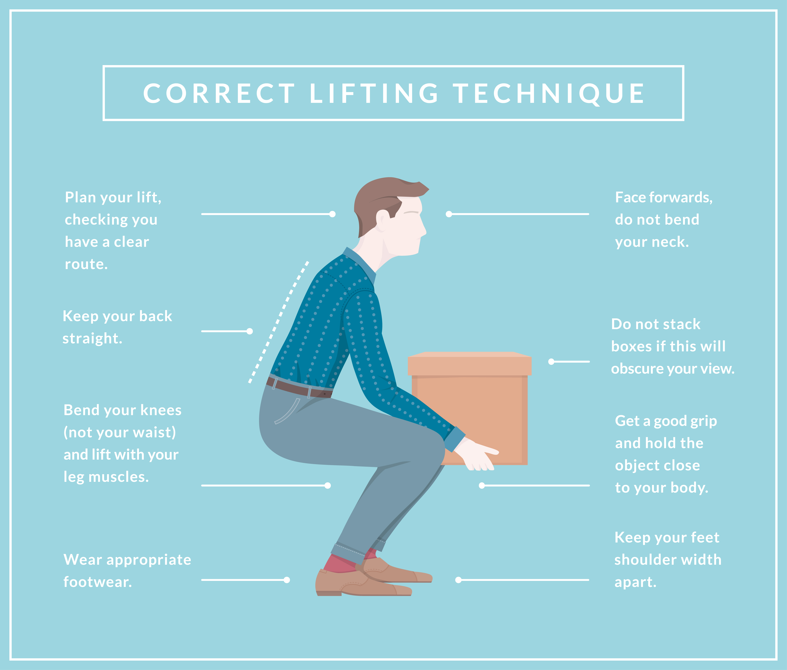
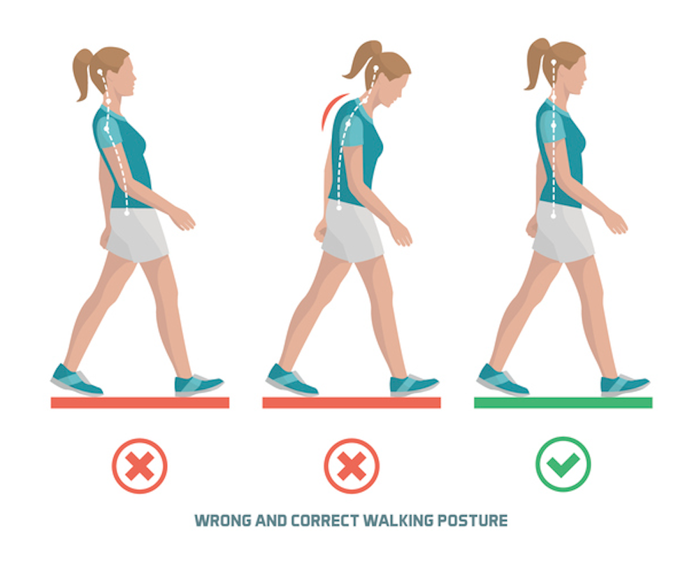

좋은 자세를 유지하는 것은 건강한 척추와 전반적인 건강한 삶에 매우 중요합니다. 다음은 반드시 알아야 할 다섯 가지 필수 자세입니다.

## 1. 앉은 자세
등을 곧게 펴고 어깨에 힘을 빼고 발을 바닥에 평평하게 대고 앉습니다. 몸을 구부리거나 앞으로 구부리는 것을 피하십시오.

## 2. 선 자세
척추, 어깨 뒤로, 복부가 당겨진 상태로 머리를 정렬하고 높이 서십시오. 두 발에 체중을 고르게 분배하십시오.

## 3. 잠자는 자세
목과 척추의 자연스러운 곡선을 지지하는 베개로 등을 대거나 옆으로 누워 주무십시오. 엎드려 자지 마십시오.

## 4. 들기 자세
무릎을 구부리고 등을 곧게 펴고 몸에 가까운 물체를 들어 올리십시오. 들어 올릴 때 허리를 구부리거나 비틀지 마십시오.

## 5. 걷는 자세
머리를 높이 들고 어깨에 힘을 빼고 척추를 곧게 펴고 걸으십시오. 자신감 있는 걸음을 내딛고 복근을 사용하세요.

이 5가지 자세를 꾸준히 실천하면 허리 통증을 예방하고 전반적인 자세와 척추 건강을 개선하는 데 도움이 됩니다. 하루 종일 자세에 유의하세요!

