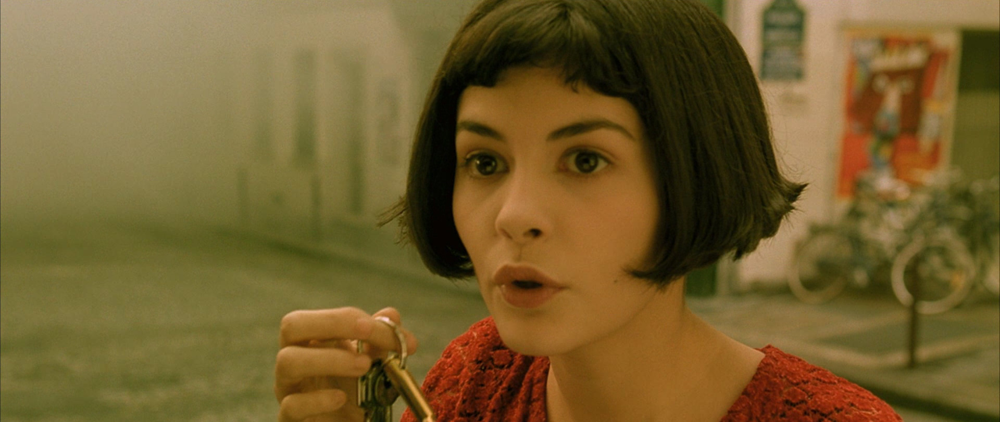
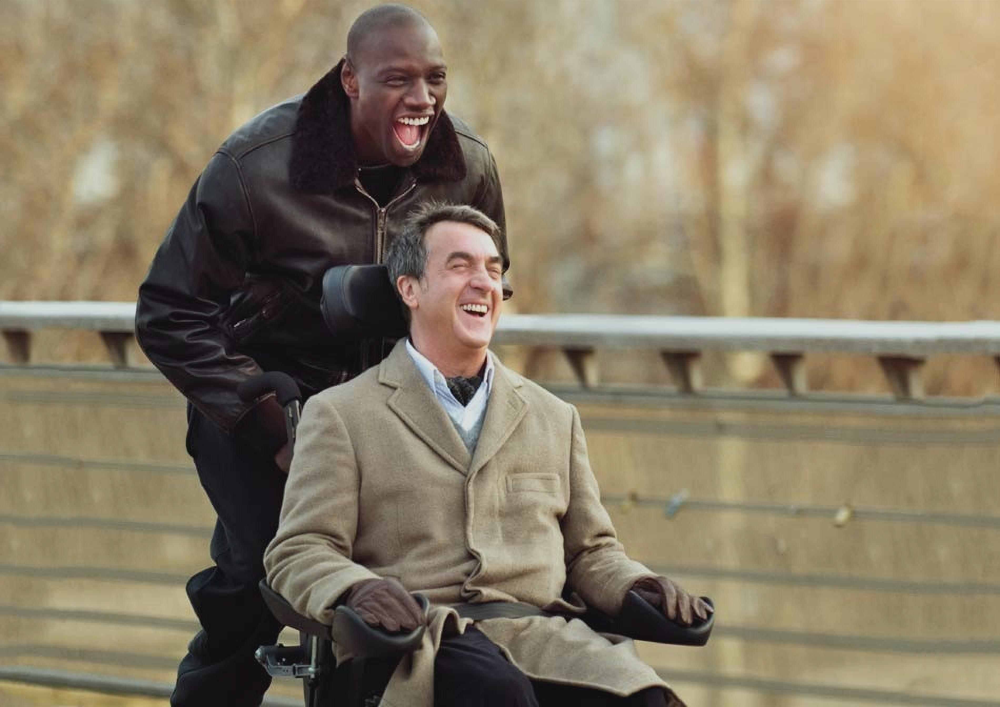
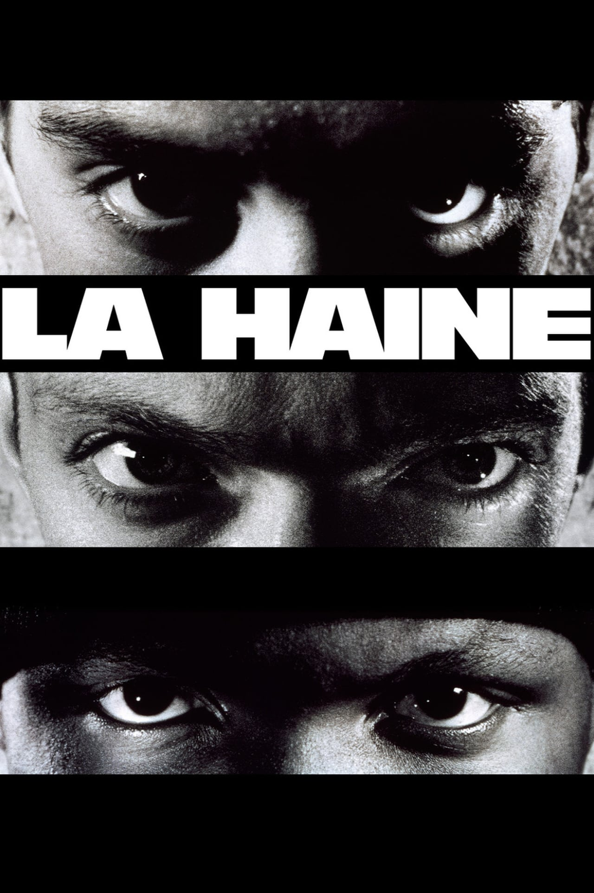
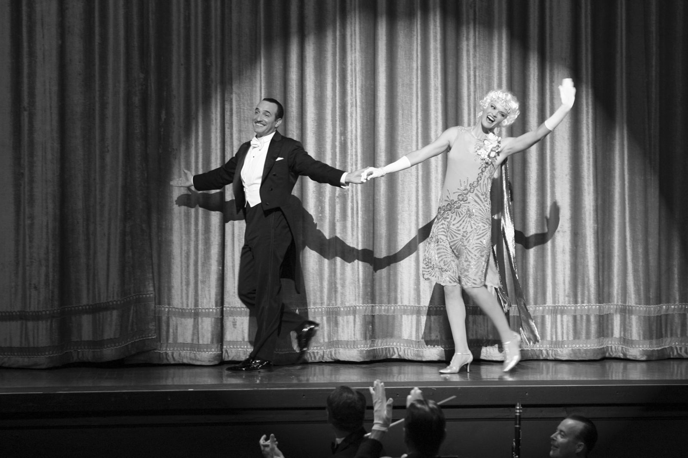

French movies provide a lens into the heart of French culture, from its artistic expression to societal reflections, offering a unique and immersive cinematic experience. We will explore five must-know French movies that have captivated audiences worldwide.

## Amélie
Amélie is a whimsical romantic comedy that follows the charming Amélie Poulain on her quest to bring happiness to those around her in Paris.

## The Intouchables
The Intouchables is a heartwarming true story about an unlikely friendship between a wealthy quadriplegic and his exuberant caregiver.

## Amour
Amour is a deeply emotional film that explores the complexities of love and aging as an elderly couple face the challenges of illness and mortality.

## La Haine
La Haine is a gritty drama that follows three friends from different ethnic backgrounds as they navigate the violent and oppressive suburbs of Paris.

## The Artist
The Artist is a silent black-and-white film that pays homage to the golden age of Hollywood and tells the story of a struggling actor during the transition to talkies.

These five French movies showcase the diversity and brilliance of French cinema, offering a captivating experience for film lovers around the world.

