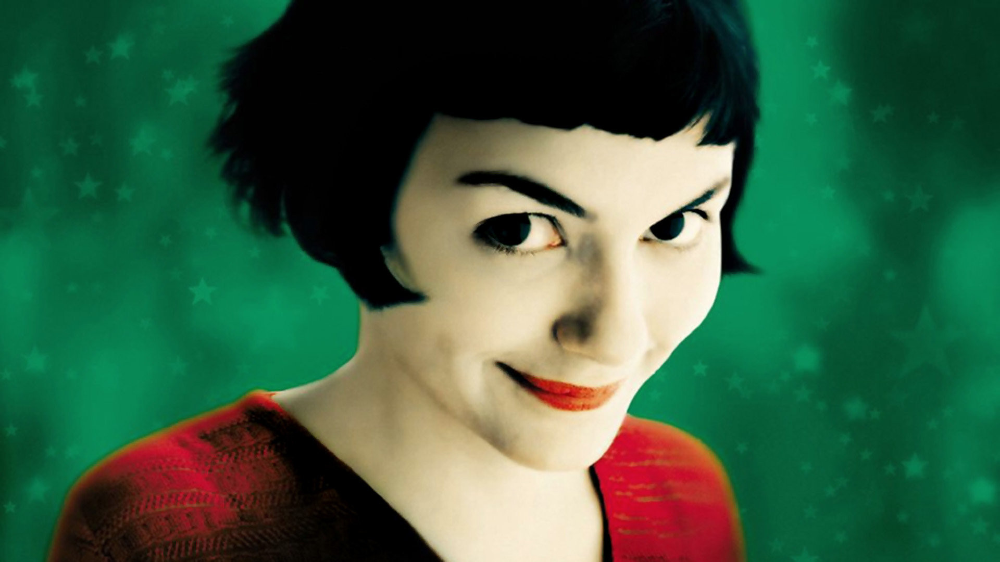
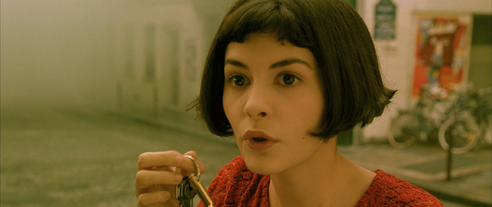
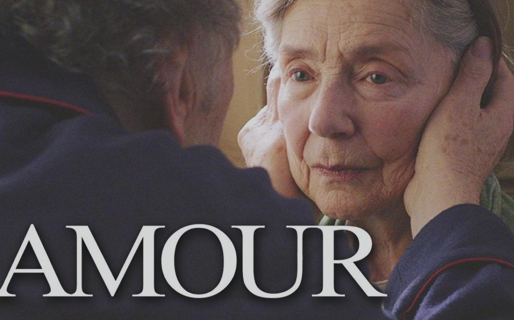
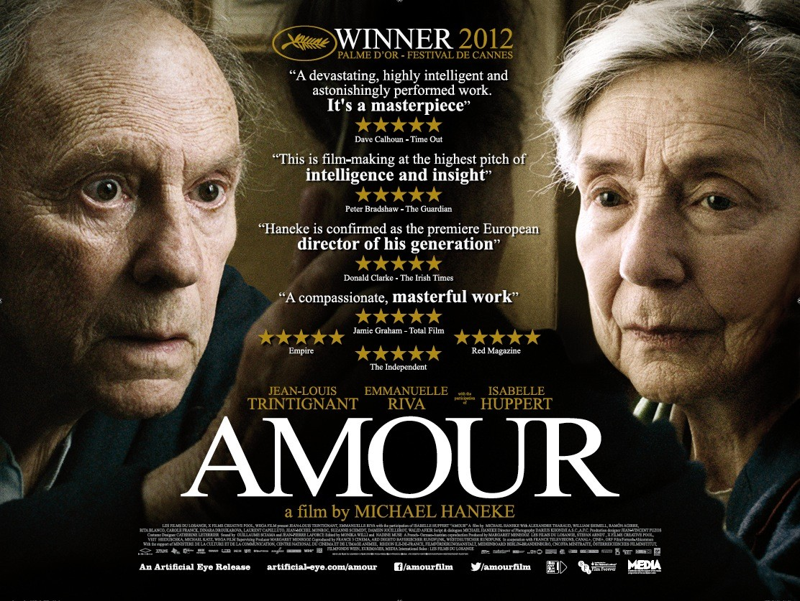
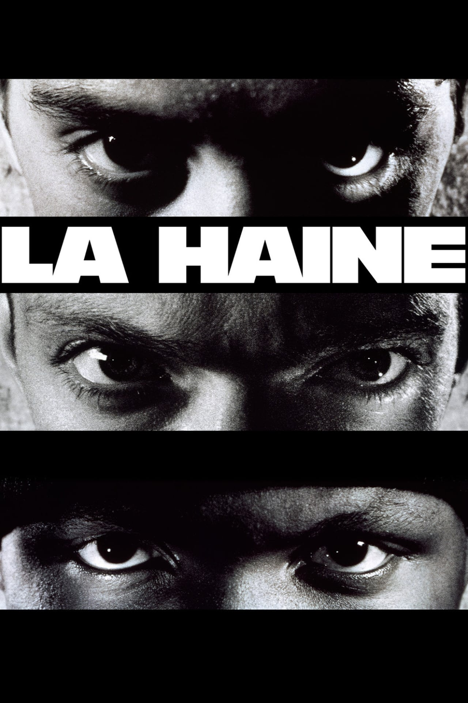
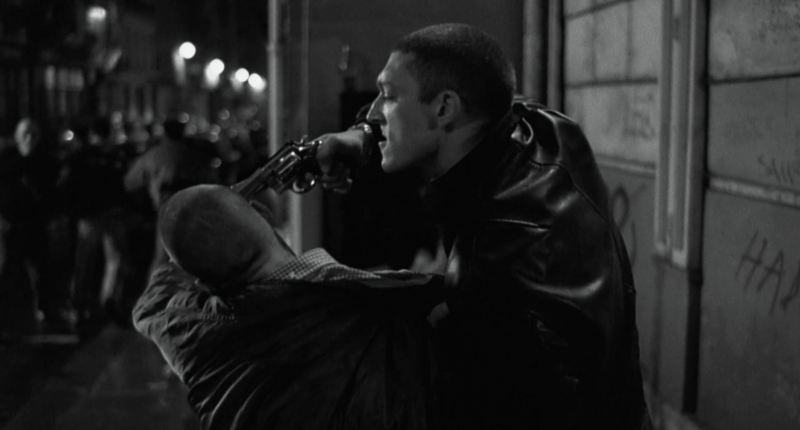
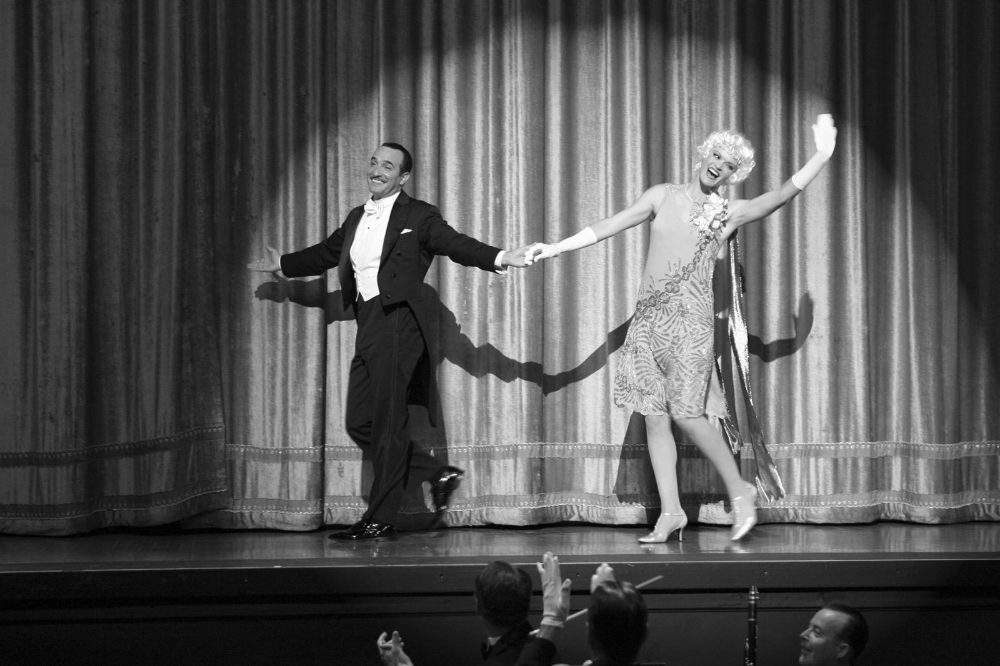
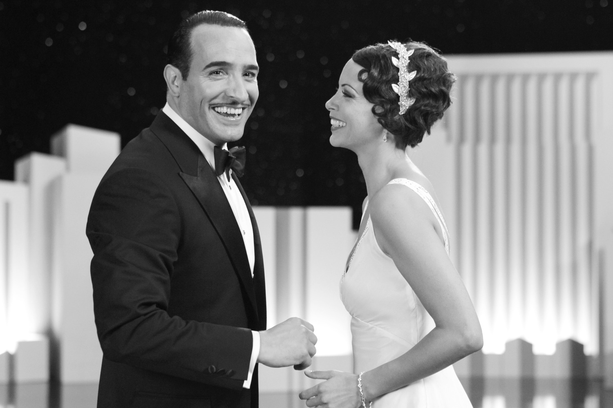

프랑스 영화는 예술적 표현에서 사회적 반영에 이르기까지 프랑스 문화의 중심에 렌즈를 제공하여 독특하고 몰입감 있는 영화 경험을 제공합니다. 전 세계 관객을 사로잡은 꼭 알아야 할 다섯 편의 프랑스 영화를 알아봅시다.

## 아멜리에
아멜리에는 매력적인 Amélie Poulain이 파리에서 주변 사람들에게 행복을 가져다주기 위한 탐구를 따라가는 기발한 로맨틱 코미디입니다.

## 언터쳐블
언터쳐블은 부유한 사지마비 환자와 그의 활기 넘치는 간병인 사이의 있을 법하지 않은 우정에 대한 가슴 따뜻한 실화입니다.

## 아무르
아무르는 노부부가 질병과 죽음의 도전에 직면하면서 사랑과 노화의 복잡성을 탐구하는 감동적인 영화입니다.

## 증오
증오오은 서로 다른 민족적 배경을 가진 세 친구가 폭력적이고 압제적인 파리 교외를 탐색하는 과정을 그린 거친 드라마입니다.

## 아티스트
아티스트는 할리우드의 황금기에 경의를 표하는 무성 흑백 영화로 유성 영화로 전환하는 동안 고군분투하는 배우의 이야기를 들려줍니다.

이 다섯 편의 프랑스 영화는 프랑스 영화의 다양성과 탁월함을 보여주며 전 세계 영화 애호가들에게 매혹적인 경험을 제공합니다.

