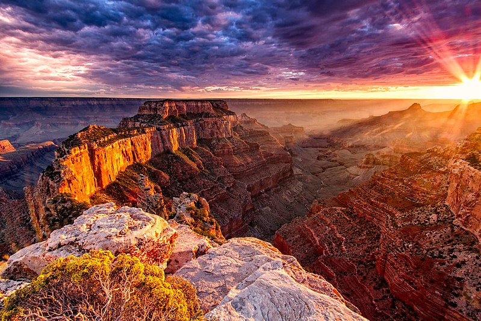
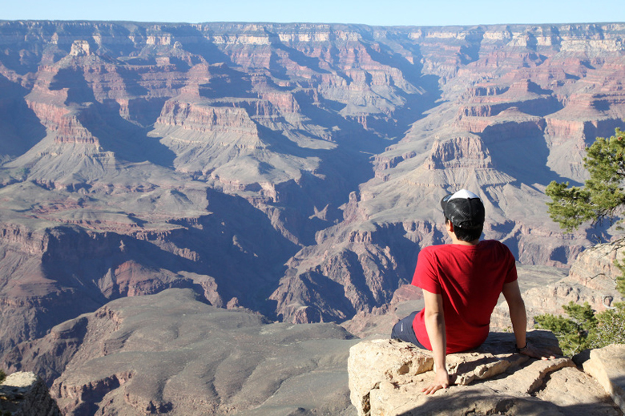
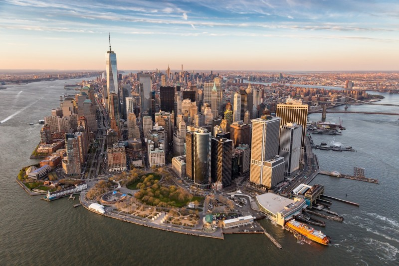
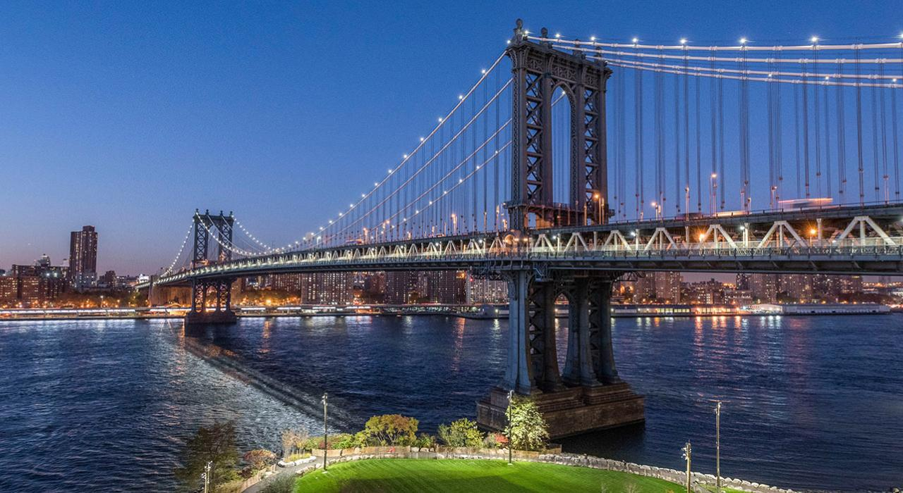
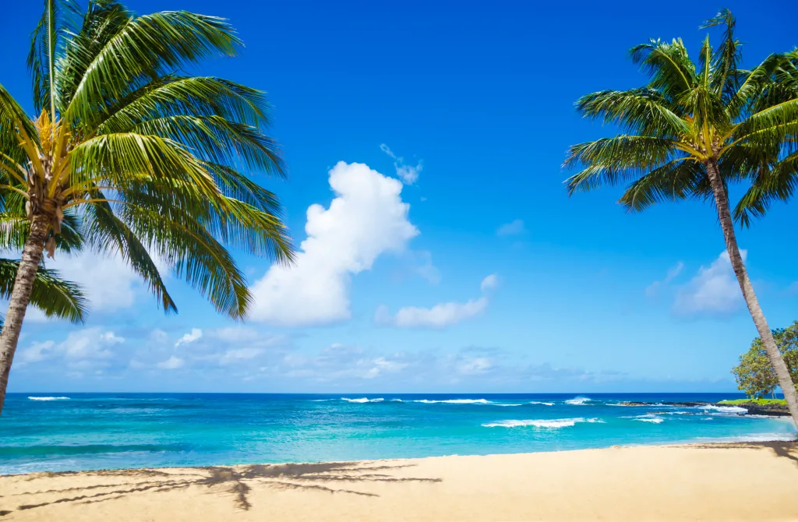
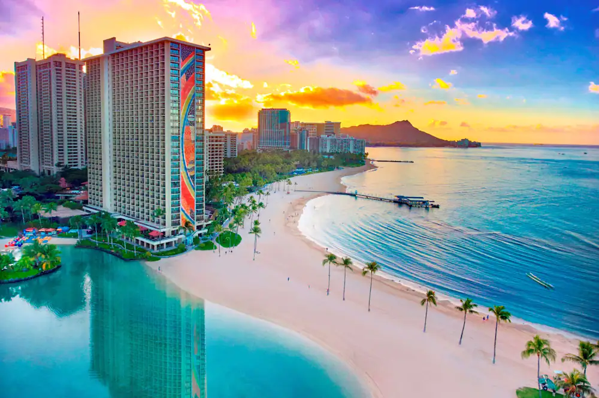

버킷리스트에 없으면 안 될 미국의 세 가지 놀라운 여행지에 대한 빠른 안내를 시작합니다. 여권을 챙기고 함께 여행을 떠나볼까요?

## 1. 그랜드캐니언

우리 첫 번째 여행지는 멋진 그랜드캐니언으로, 이는 캐니언 국립공원으로 알려진 아리조나에 위치해 있습니다. 총 277마일에 걸쳐 펼쳐진 이 장대한 자연의 경이로움은 숨막히는 경치와 다채로운 풍경을 선사합니다. 콜로라도 강이 캐니언을 뚫고 지나간 힘을 목격하며, 수백만 년 동안의 지구 역사가 드러나는 모습을 감상하세요.

## 2. 뉴욕시

다음 여행지는 잠들지 않는 활기찬 도시, 뉴욕시입니다! 아이콘적인 스카이라인, 타임스 스퀘어, 그리고 자유의 여신상으로 유명한 이 도시는 끝없는 볼거리를 제공합니다. 센트럴 파크를 탐험하거나 브로드웨이 쇼를 관람하거나, 세계 각국의 다양한 음식을 즐겨보세요. 빅애플의 멋진 경치를 담은 탑오브더록 관측 데크도 꼭 방문해보세요.

## 3. 하와이

마지막으로, 해가 비치는 햇살 가득한 하와이로 향해봅시다. 특히 아름다운 마우이 섬을 방문해보세요. 녹색 도로를 따라 신비로운 한아름을 탐험하거나, 할레아칼라 국립공원의 화산적 경이로움을 체험해보세요. 맑은 물에 몸을 담그고, 전설적인 파도를 타거나 잊지 못할 스노클링 어드벤처를 떠나보세요. 꼭 할레아칼라 정상에서 부활절처럼 멋진 일출을 구경하세요!

자연의 아름다움, 활력 넘치는 도시 경험, 아일랜드 낙원을 원한다면, 이 미국의 세 곳의 여행지는 틀림없이 잊지 못할 추억을 선사할 것입니다. 버킷리스트를 챙기고 오늘 당신의 잊을 수 없는 여행을 계획해보세요!
