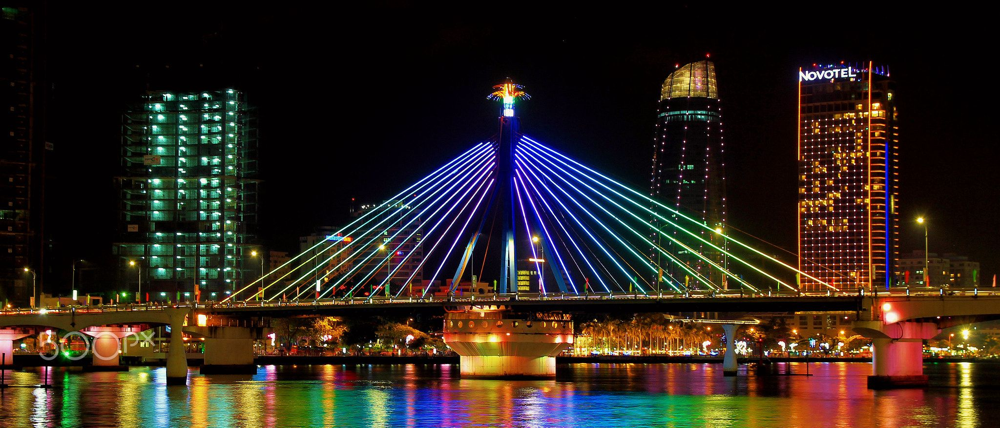
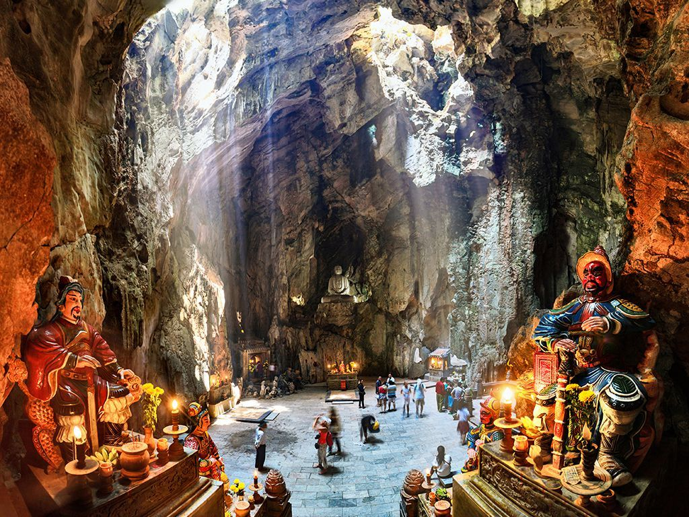
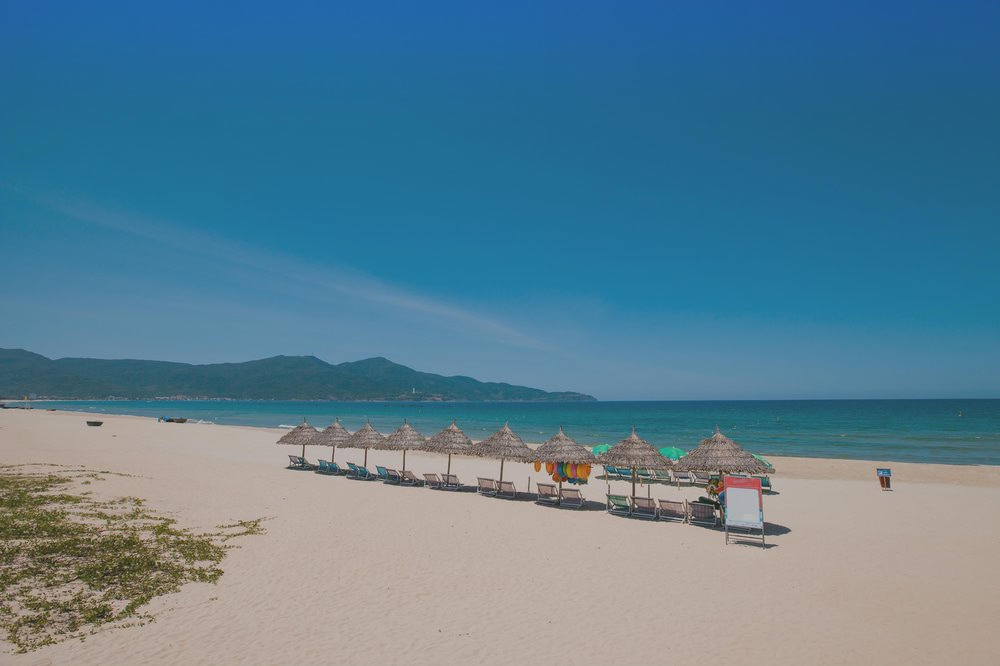
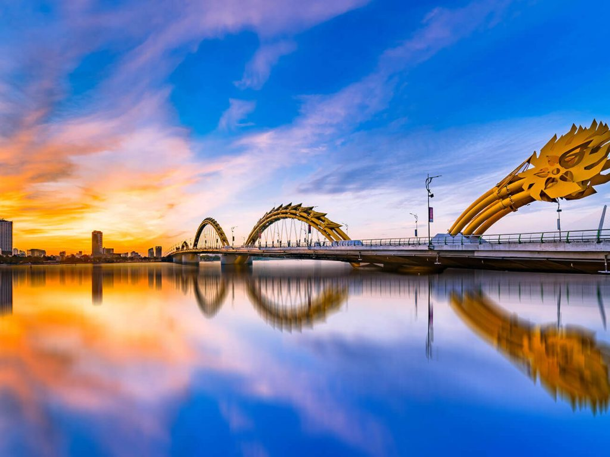
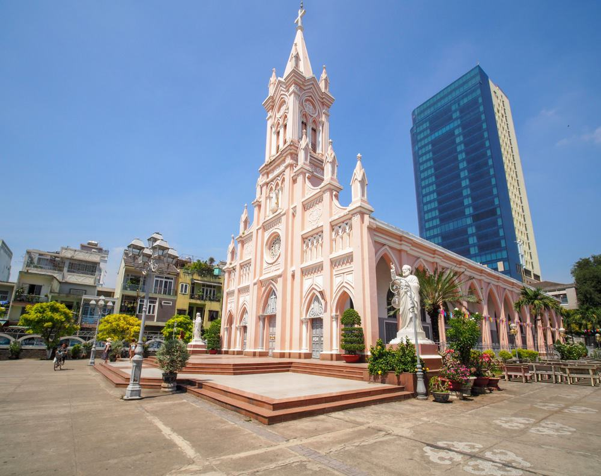

Welcome to Da Nang, a vibrant city in Vietnam known for its beautiful beaches and rich cultural heritage. In this script, we will explore five key aspects of Da Nang that you must know. Let's dive in!

## 1. Han River Bridge
The Han River Bridge is an iconic landmark in Da Nang, connecting the city center with the eastern side. It is known for its unique design and the spectacular light and sound show that takes place every night. Standing on the bridge, you can enjoy breathtaking views of the city and its surroundings.

## 2. Marble Mountains
Located just outside of Da Nang, the Marble Mountains are a group of five majestic limestone hills. Each mountain is named after one of the five elements: metal, wood, water, fire, and earth. Explore the caves, pagodas, and stunning viewpoints for a memorable experience.

## 3. My Khe Beach
Considered one of the most beautiful beaches in Vietnam, My Khe Beach boasts white sandy shores and crystal-clear waters. Whether you want to relax under the sun, swim, or try exciting water sports, this beach offers it all. Don't miss the chance to witness a mesmerizing sunset over the horizon.

## 4. Dragon Bridge
The Dragon Bridge is another iconic symbol of Da Nang. As the name suggests, it is designed in the shape of a dragon and stretches across the Han River. The bridge is not only a transportation route but also a tourist attraction, especially during the weekend when its head spits water and fire.

## 5. Da Nang Cathedral
Also known as the Con Ga Church (Rooster Church) due to its distinctive rooster-shaped weathercock, the Da Nang Cathedral is a beautiful French Gothic-style church. Situated in the heart of the city, it provides a tranquil escape and showcases Da Nang's cultural and architectural diversity.

Da Nang truly offers a mix of natural beauty, modern attractions, and cultural gems. From its iconic bridges and stunning beaches to the rich history and religious sites, there is something for everyone in this dynamic city. Plan your visit to Da Nang and discover the wonders it has in store for you!

