아름다운 해변과 풍부한 문화 유산으로 유명한 베트남의 활기찬 도시 다낭에 오신 것을 환영합니다. 이 스크립트에서는 반드시 알아야 할 다낭의 5가지 주요 측면을 살펴보겠습니다. 다이빙하자!

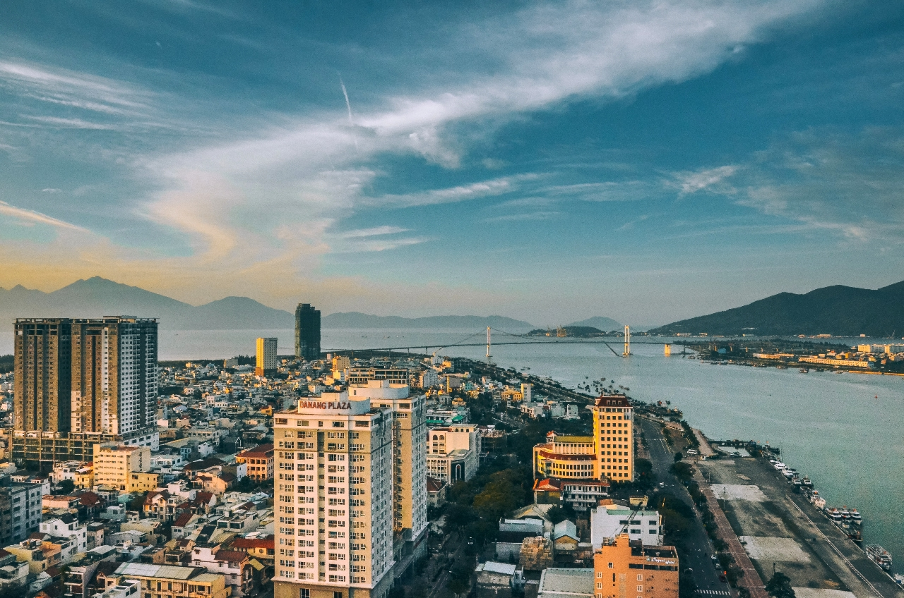

## 1. 한강대교
한강 다리는 도심과 동쪽을 연결하는 다낭의 상징적인 랜드마크입니다. 독특한 디자인과 매일 밤 펼쳐지는 화려한 빛과 소리의 쇼로 유명합니다. 다리 위에 서면 도시와 그 주변의 숨막히는 전경을 감상할 수 있습니다.

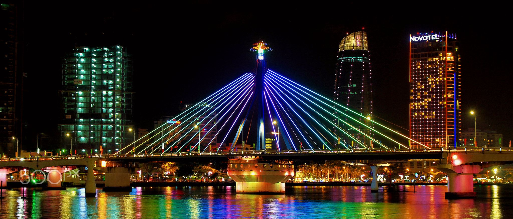
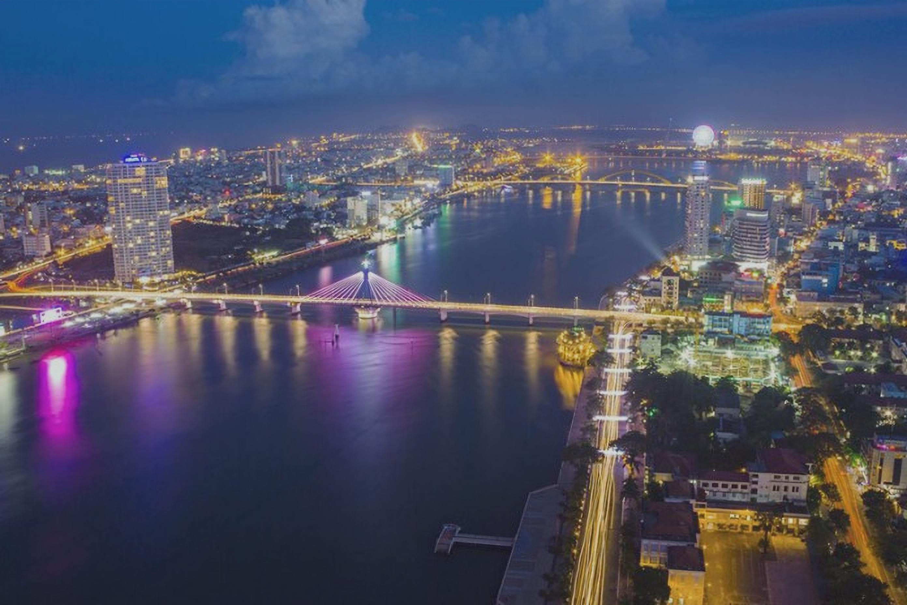

## 2. 오행산
다낭 바로 외곽에 위치한 오행산은 5개의 장엄한 석회암 언덕으로 이루어진 그룹입니다. 각 산은 금속, 나무, 물, 불, 흙의 다섯 가지 요소 중 하나의 이름을 따서 명명되었습니다. 기억에 남을 경험을 위해 동굴, 탑, 멋진 전망을 탐험하세요.

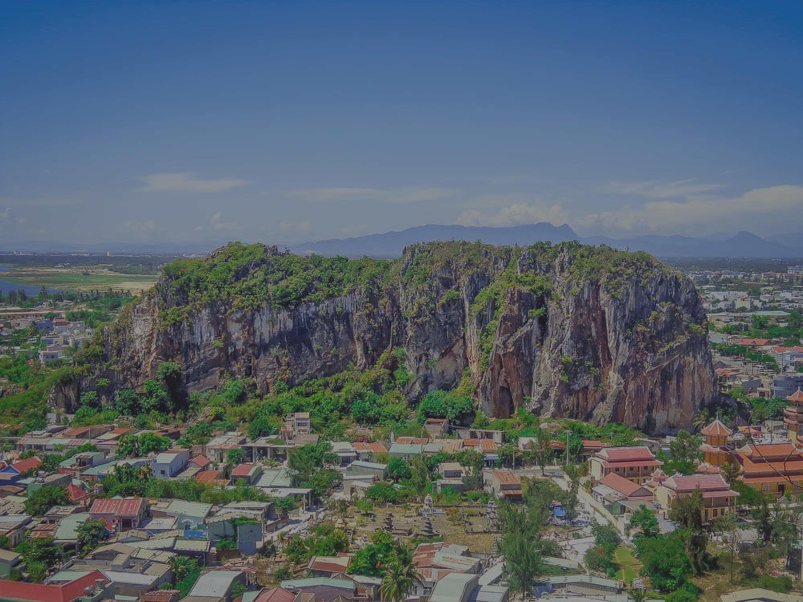
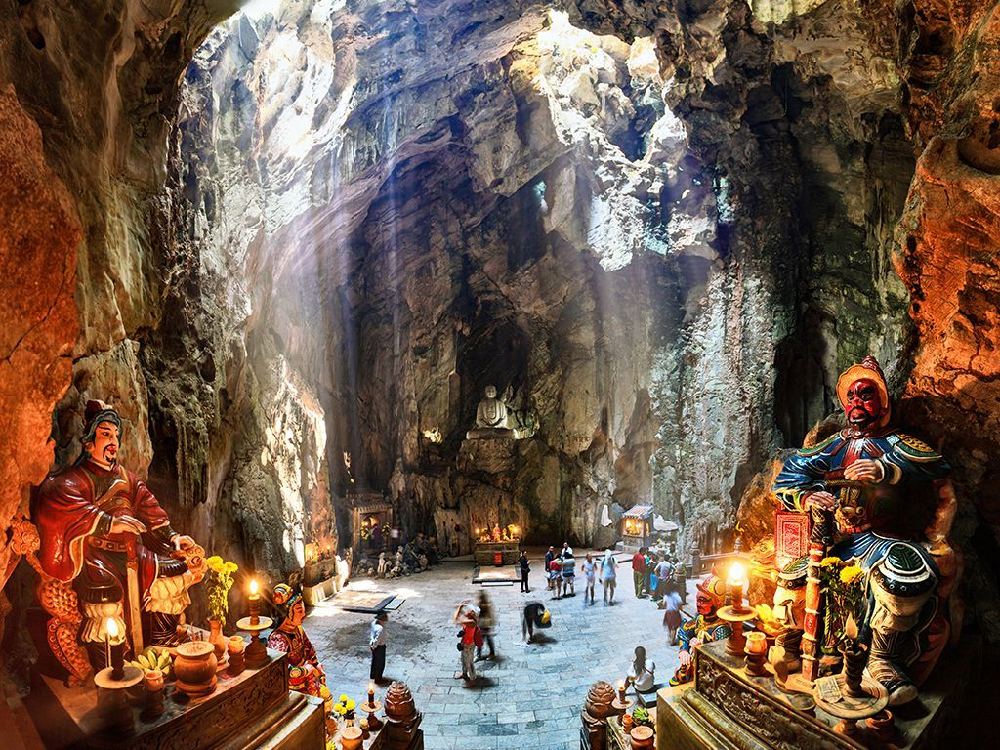

## 3. 미케 해변
베트남에서 가장 아름다운 해변 중 하나로 손꼽히는 미케 해변은 백사장과 맑은 바닷물을 자랑합니다. 태양 아래에서 휴식을 취하거나 수영을 하거나 신나는 수상 스포츠를 즐기고 싶다면 이 해변에서 모든 것을 제공합니다. 지평선 위로 황홀한 일몰을 목격할 기회를 놓치지 마세요.

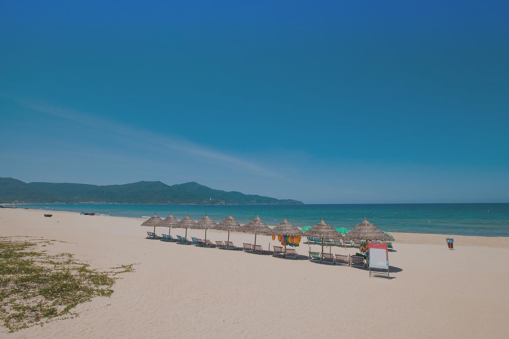
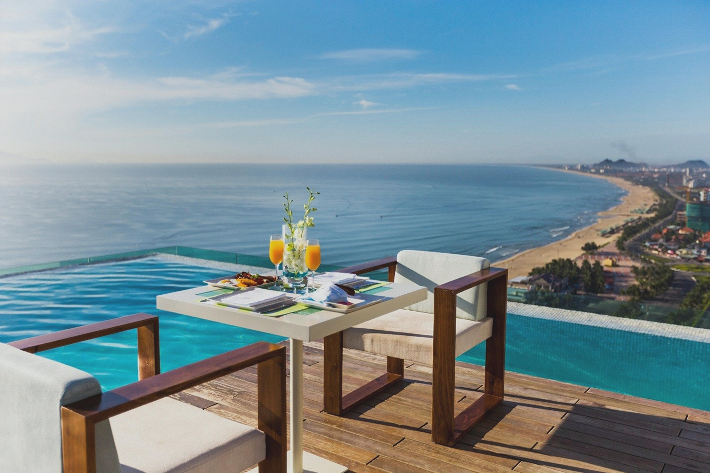

## 4. 드래곤 브리지
용다리는 다낭의 또 다른 상징입니다. 이름에서 알 수 있듯이 용 모양으로 디자인되어 한강을 가로질러 뻗어 있습니다. 다리는 교통수단일 뿐만 아니라 특히 주말이면 머리에서 물과 불이 뿜어져 나오는 관광명소이기도 하다.

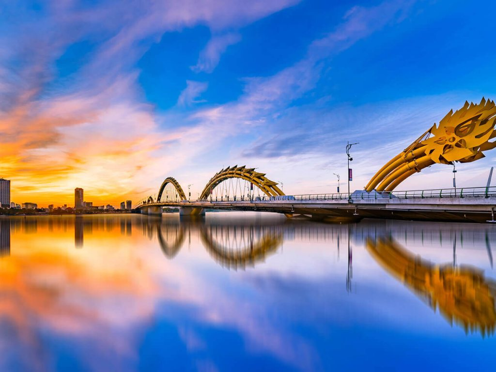
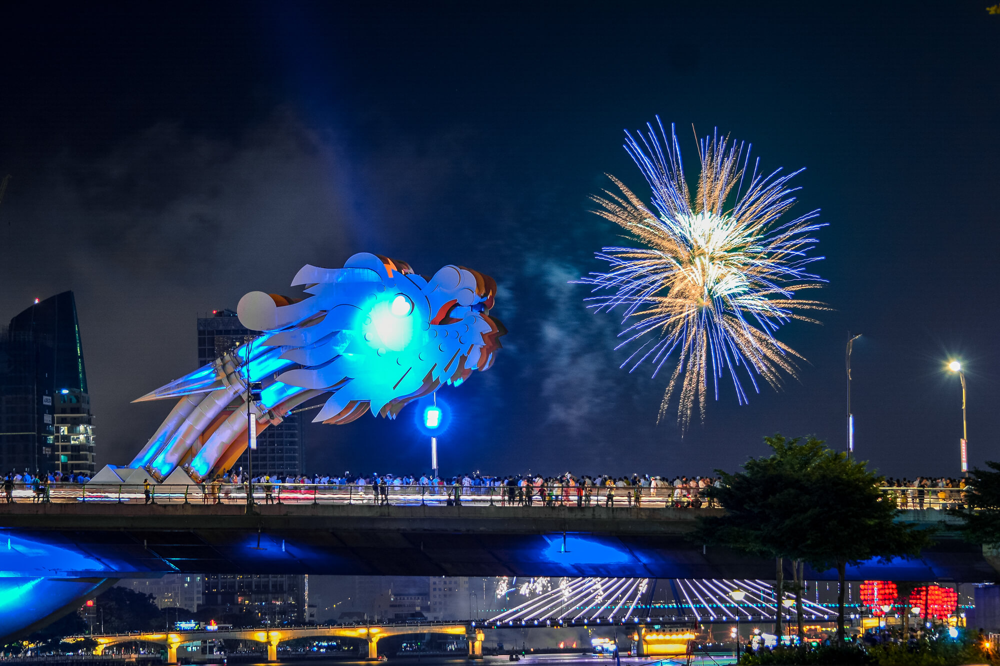

## 5. 다낭 대성당
독특한 수탉 모양의 풍향계 때문에 꼰가 교회(수탉 교회)라고도 알려진 다낭 대성당은 아름다운 프랑스 고딕 양식의 교회입니다. 도시 중심부에 위치한 이 호텔은 고요한 탈출을 제공하며 다낭의 문화 및 건축적 다양성을 보여줍니다.

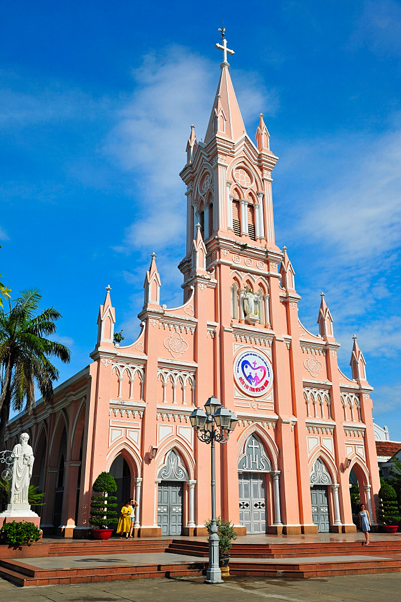
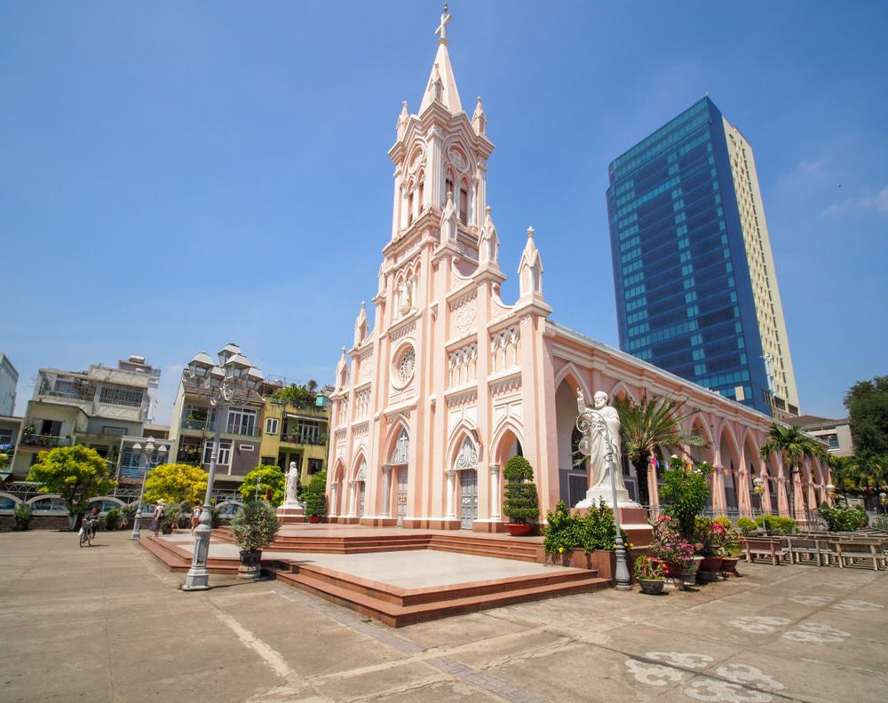

다낭은 진정으로 자연의 아름다움, 현대적인 명소 및 문화적 보석이 혼합된 곳입니다. 상징적인 다리와 멋진 해변부터 풍부한 역사와 종교 유적지에 이르기까지 이 역동적인 도시에는 모두를 위한 무언가가 있습니다. 다낭 방문을 계획하고 당신을 위해 준비된 경이로움을 발견하세요!

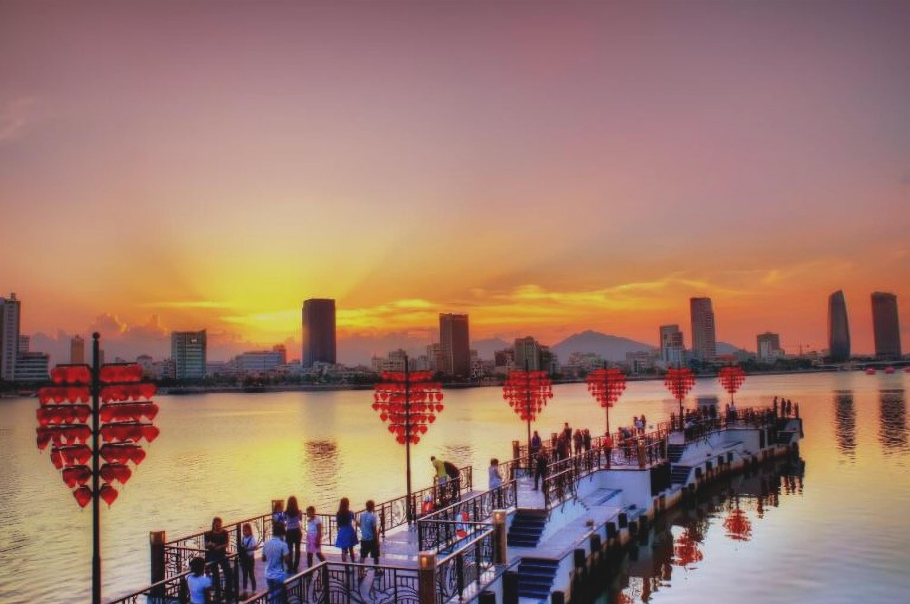
