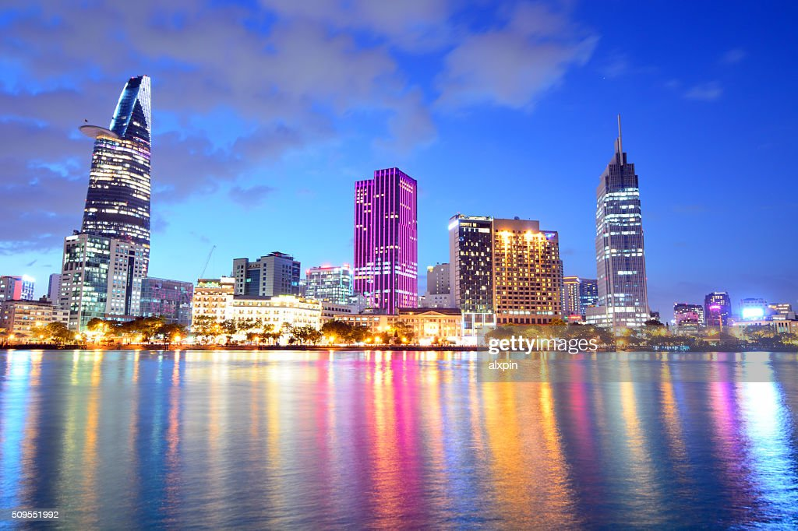
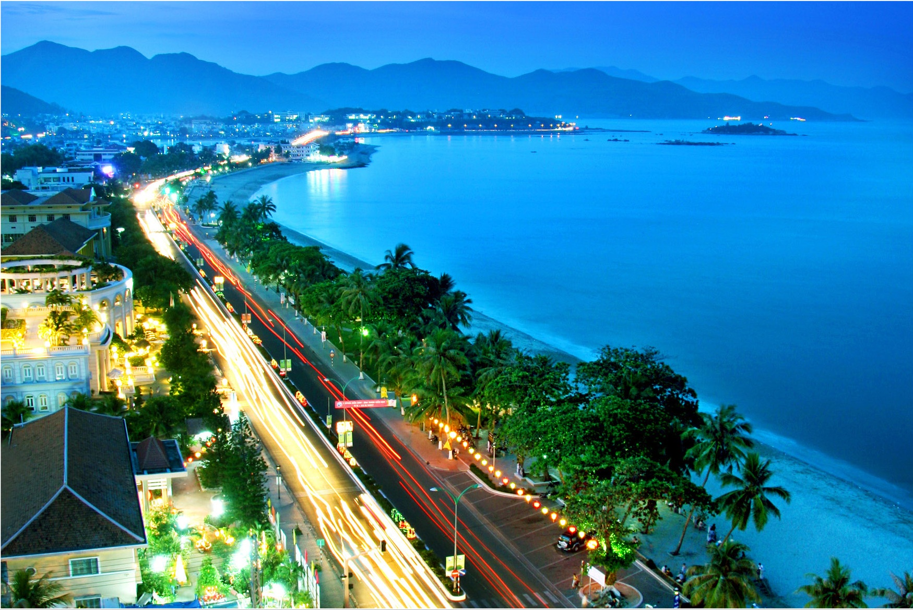
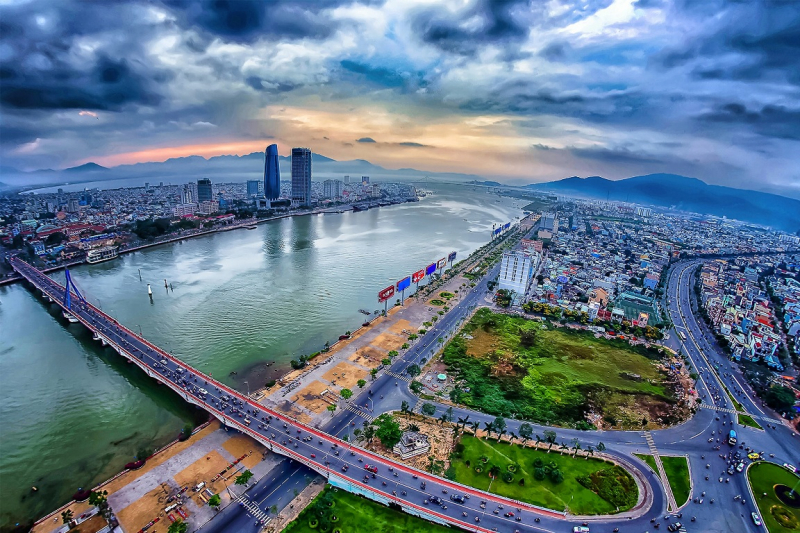
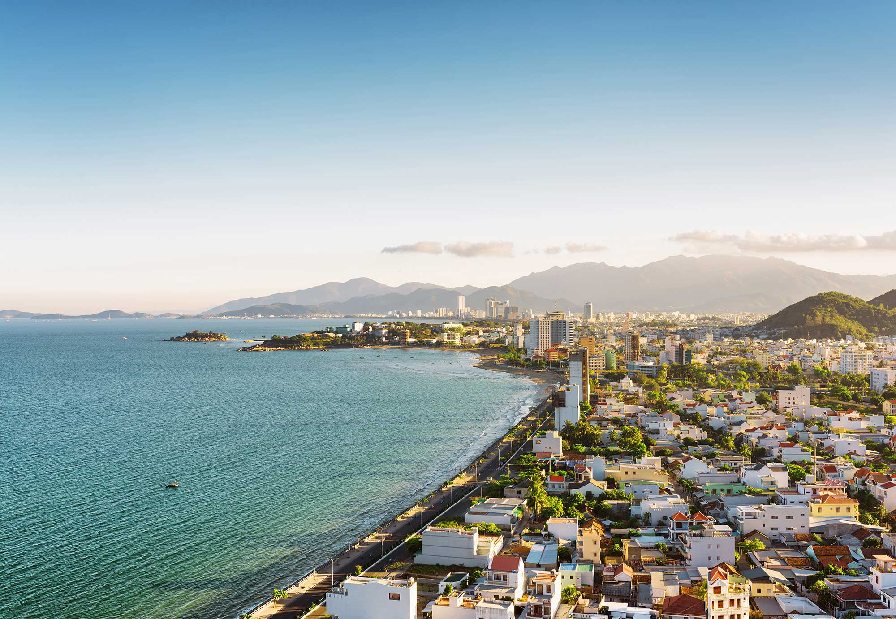

Vietnam is home to a diverse range of cities, each with its own unique cultural heritage and attractions. Let's explore five Vietnam cities that you simply cannot miss!

## Hanoi
Hanoi, the capital city of Vietnam, is known for its rich history, stunning architecture, and vibrant street life. Explore the majestic Hoan Kiem Lake, stroll through the charming Old Quarter, and visit iconic landmarks like the Ho Chi Minh Mausoleum. Don't forget to savor the flavors of the famous Vietnamese cuisine!

## Ho Chi Minh City
Formerly known as Saigon, Ho Chi Minh City is a bustling metropolis that combines traditional Vietnamese culture with modernity. Marvel at the impressive skyscrapers, immerse yourself in the city's historical landmarks such as the Reunification Palace, and shop till you drop at the vibrant Ben Thanh Market.

## Hoi An
Hoi An is a charming ancient town renowned for its well-preserved architecture and lantern-lined streets. Get lost in its narrow alleys, visit centuries-old houses, and enjoy the magical atmosphere of the nightly lantern festival. Don't miss the opportunity to have tailor-made clothing crafted by skilled local artisans.

## Da Nang
Located on the central coast of Vietnam, Da Nang is a vibrant city known for its beautiful beaches and modern bridges. Relax on the pristine sands of My Khe Beach, explore the Marble Mountains for a spiritual adventure, and experience the mesmerizing Dragon Bridge, which breathes fire and water every weekend night.

## Nha Trang
Nha Trang is a coastal city famous for its turquoise waters, white sandy beaches, and vibrant coral reefs. Enjoy a day of snorkeling or diving to discover the colorful marine life, visit ancient temples nestled in the mountains, and indulge in the city's delectable seafood cuisine.

Vietnam is a treasure trove of remarkable cities, each offering a unique glimpse into the rich history and culture of the country. Embark on an unforgettable journey and explore the wonders of Hanoi, Ho Chi Minh City, Hoi An, Da Nang, and Nha Trang.

