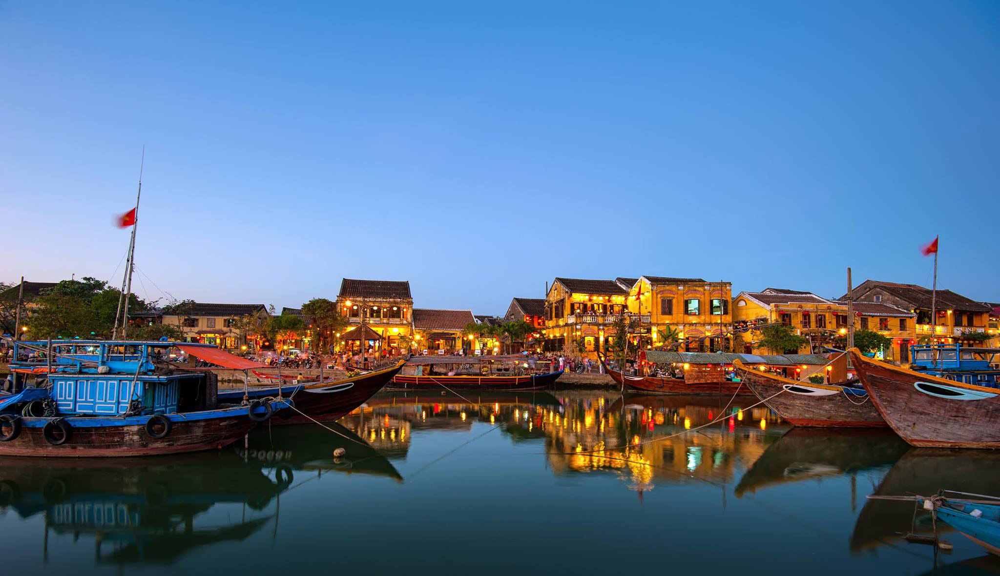

베트남에는 고유한 문화 유산과 명소를 지닌 다양한 도시가 있습니다.

절대 놓칠 수 없는 베트남 5개 도시를 탐험해 봅시다!

## 하노이

베트남의 수도인 하노이는 풍부한 역사, 멋진 건축물, 활기찬 거리 생활로 유명합니다.

장엄한 호안끼엠 호수를 탐험하고 매력적인 올드 쿼터를 거닐며 호치민 마우솔레움과 같은 상징적인 랜드마크를 방문하세요.
유명한 베트남 요리의 맛을 음미하는 것을 잊지 마세요!

## 호치민시

이전에 사이공으로 알려졌던 호치민시는 베트남 전통 ​​문화와 현대성이 결합된 번화한 대도시입니다.

인상적인 고층 건물에 감탄하고, 통일궁과 같은 도시의 역사적인 랜드마크에 푹 빠져보고, 활기 넘치는 벤탄 시장에서 쇼핑을 즐겨보세요.

## 호이안

호이안은 잘 보존된 건축물과 등불이 늘어선 거리로 유명한 매력적인 고대 도시입니다.

좁은 골목길에서 길을 잃고 수백 년 된 주택을 방문하고 야간 등불 축제의 마법 같은 분위기를 즐겨보세요.
숙련된 현지 장인이 맞춤 제작한 옷을 입을 수 있는 기회를 놓치지 마세요.

## 다낭

베트남 중부 해안에 위치한 다낭은 아름다운 해변과 현대적인 다리로 유명한 활기찬 도시입니다.
My Khe Beach의 깨끗한 모래 위에서 휴식을 취하고 영적인 모험을 위해 Marble Mountains를 탐험하고 주말 밤마다 불과 물을 내뿜는 매혹적인 Dragon Bridge를 경험하십시오.

## 나트랑

Nha Trang은 청록색 바다, 백사장 해변 및 활기찬 산호초로 유명한 해안 도시입니다.

다채로운 해양 생물을 발견하기 위해 스노클링이나 다이빙을 즐기며 산 속에 자리잡은 고대 사원을 방문하고 도시의 맛있는 해산물 요리에 빠져보세요.

베트남은 각 도시의 풍부한 역사와 문화를 독특하게 엿볼 수 있는 놀라운 도시의 보고입니다.
잊을 수 없는 여행을 떠나 하노이, 호치민시, 호이안, 다낭, 나트랑의 경이로움을 탐험하세요.

