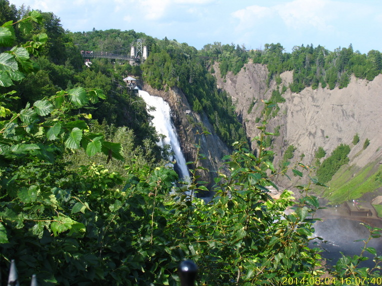

캐나다는 웅장한 자연 경관과 다양한 야외 활동을 즐길 수 있어 휴식과 모험을 동시에 경험할 수 있습니다.
이제 세계를 떠날 전에 꼭 방문해야 할 세 캐나다 여행지로 떠나봅시다. 이 멋진 장소들에 대해 반드시 알아야 할 중요한 정보를 알려드리겠습니다.

## 1. 밴프 국립공원
알버타 주의 록키 산맥에 위치한 밴프 국립공원은 자연의 낙원입니다. 반짝이는 푸른 호수와 웅장한 빙하가 펼쳐지는 이곳은 매 순간 숨막히는 경치를 선사합니다. 반드시 놓치지 말아야 할 명소로는 루이스 호수와 모레인 호수가 있으며, 밴프 마을도 귀여운 상점과 식당으로 가득찬 곳입니다.

## 2. 퀘벡 시
퀘벡 시는 돌 돌담길과 멋진 건축물로 유럽의 매력을 느낄 수 있는 곳입니다. 유네스코 세계 문화유산에 등재된 올드 퀘벡은 세계적으로 유명한 프론테나크 캐슬을 비롯한 역사적인 명소들이 모여 있습니다. 푸틴이나 메이플 시럽과 같은 현지의 특산품을 맛보고, 생기 넘치는 프랑스-캐나다 문화를 만끽해 보세요.

## 3. 밴쿠버 아일랜드
서부 해안에서 밴쿠버 아일랜드로 향해보세요. 이곳은 자연의 아름다움으로 가득찬 낙원입니다. 고래관찰로 돌고래와 고래 왕국의 웅장함을 직접 목격해보세요. 꽃의 공원으로 유명한 뷰차트 가든도 꼭 방문해야 할 곳입니다. 그리고 아일랜드의 수도인 빅토리아 도시를 천천히 돌아다닐 시간을 가질 것입니다.

이 세 가지 뛰어난 캐나다 여행지는 모두 사람들의 버킷 리스트에 꼭 포함되어야 하는 경험을 제공합니다. 밴프 국립공원의 매혹적인 아름다움, 퀘벡 시의 역사적인 매력, 그리고 밴쿠버 아일랜드의 경치의 아름다움을 즐기는 기회를 놓치지 마세요.