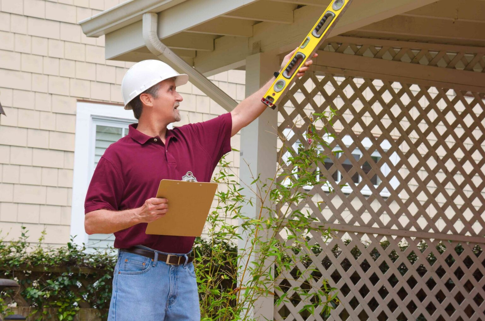

Buying a house is a major decision that requires careful consideration. Here are three important things you must know when purchasing a new home.

## 1. Location is Key
The first and foremost consideration when buying a house is its location. A good location can enhance your lifestyle and make your investment worthwhile. Consider factors such as proximity to schools, your workplace, and amenities like shopping centers and parks. Research the neighborhood and evaluate its potential for future growth and development.

## 2. Financing Options
Understanding your financing options is crucial in the home buying process. Explore different mortgage lenders and loan programs that suit your needs and financial circumstances. Determine your budget and calculate monthly mortgage payments, including interest rates and closing costs. Be sure to review your credit score and take steps to improve it if necessary.

## 3. Home Inspection
Never skip a home inspection before purchasing a house. Hire a professional inspector to thoroughly evaluate the property for any structural, electrical, or plumbing issues. This will help you identify potential problems and negotiate repairs or price adjustments. It's better to be aware of any hidden issues before making the final decision.

In conclusion, buying a house requires careful consideration of factors such as location, financing options, and a thorough home inspection. By understanding these important aspects, you can make an informed decision and ensure a successful home buying experience.

