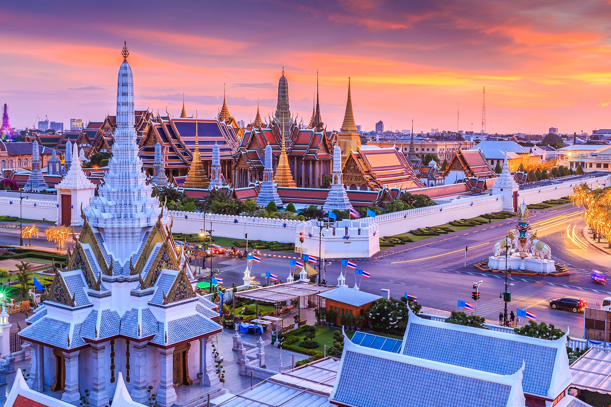
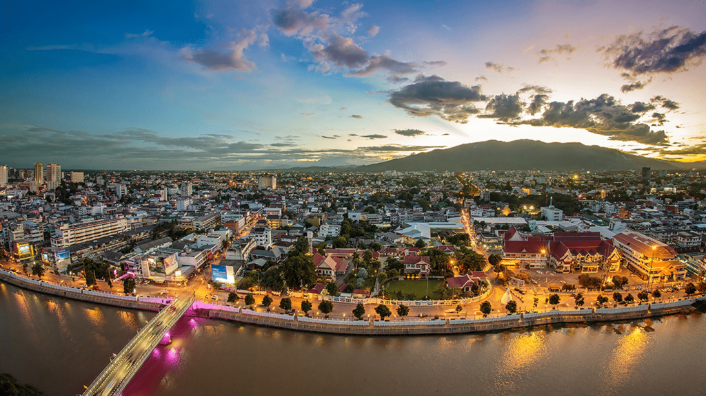
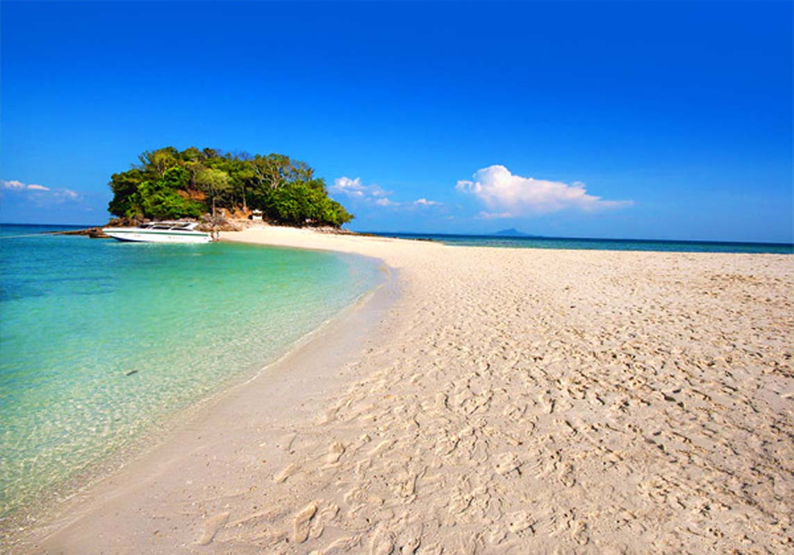
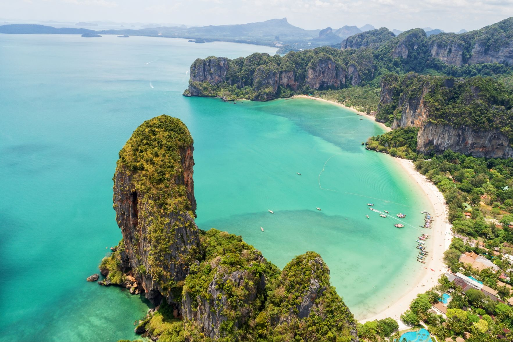
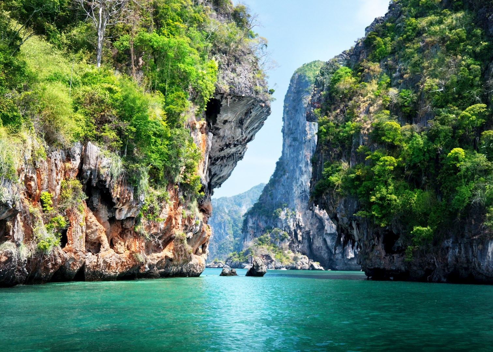
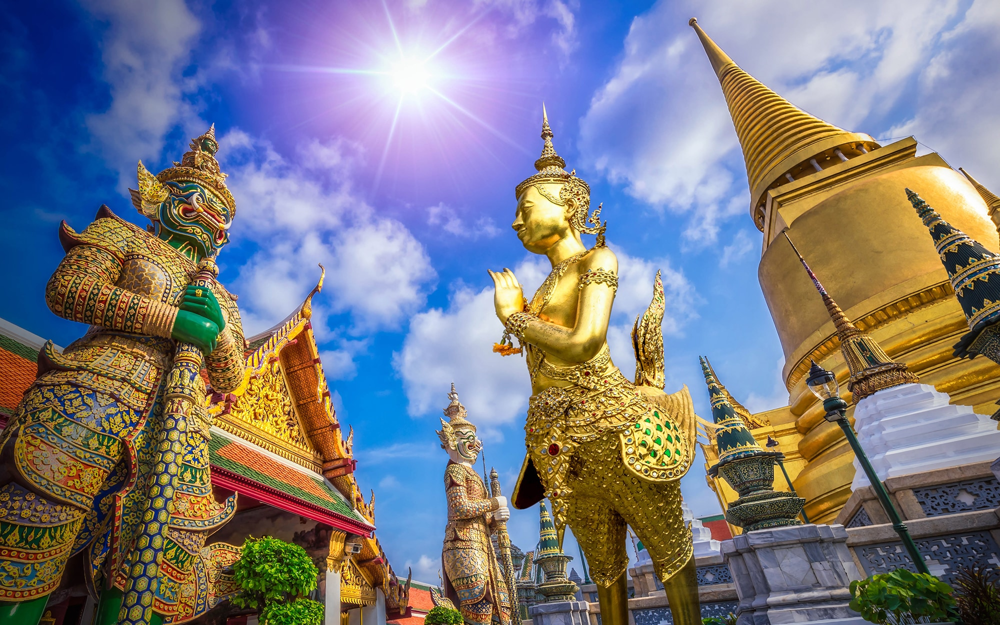

Welcome to our journey through 5 captivating cities in Thailand. Get ready to discover a blend of history, culture, and breathtaking landscapes. Let's begin!

## Bangkok: The Capital of Thailand
Bangkok, the bustling capital city of Thailand, is a vibrant metropolis that never sleeps. Immerse yourself in the enchanting chaos of street markets, visit magnificent temples like Wat Arun, and marvel at the grandeur of the Royal Palace. Don't forget to sample the mouthwatering street food!

## Chiang Mai: The Rose of the North
Chiang Mai, located in the mountainous region of Northern Thailand, offers a serene escape from the urban hustle. Explore ancient temples, participate in a traditional Thai cooking class, and witness the mesmerizing beauty of the Yi Peng Lantern Festival.

## Phuket: The Pearl of the Andaman Sea
Phuket, a renowned beach destination, is a paradise for sun-seekers. Relax on the picturesque beaches, indulge in exhilarating water sports, and experience the vibrant nightlife. You can also take a boat tour to the nearby Phi Phi Islands and marvel at their natural beauty.

## Krabi: Nature's Playground
Krabi, nestled on the Andaman Sea coastline, is a nature lover's dream. Explore the stunning limestone cliffs of Railay Beach, go island hopping to discover hidden gems like Koh Poda, and dive into the crystal-clear waters to witness the vibrant marine life.

## Ayutthaya: Ancient Capital and UNESCO World Heritage Site
Ayutthaya, a UNESCO World Heritage Site, takes you back in time to the ancient kingdom of Siam. Marvel at the magnificent ruins of temples and palaces, take a boat tour along the historic canals, and soak in the rich history of this once-glorious capital.

These 5 captivating cities in Thailand offer a diverse range of experiences, from vibrant city life to peaceful nature escapes. Prepare yourself for a memorable journey that will leave you longing to explore more. Thailand truly has something for everyone!

