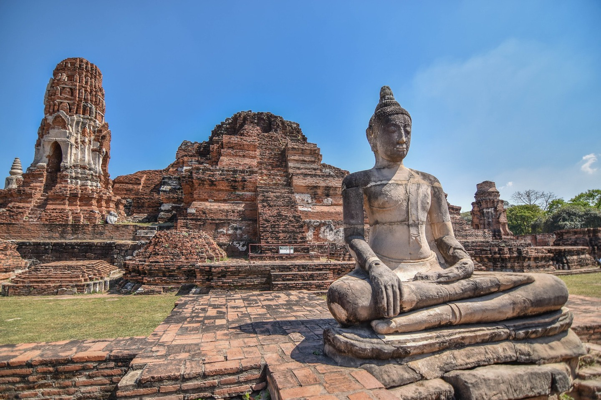

태국의 매력적인 5개 도시를 여행하는 여정에 오신 것을 환영합니다. 역사, 문화, 숨이 멎을 듯한 풍경이 어우러진 곳을 발견할 준비를 하세요.

## 방콕: 태국의 수도
번화한 태국의 수도 방콕은 잠들지 않는 활기찬 대도시입니다. 거리 시장의 황홀한 혼돈에 빠져들어 왓 아룬과 같은 웅장한 사원을 방문하고 왕궁의 웅장함에 경탄하십시오. 군침 도는 길거리 음식을 맛보는 것을 잊지 마세요!

## 치앙마이: 북쪽의 장미
태국 북부의 산악 지역에 위치한 치앙마이는 도시의 번잡함에서 벗어나 고요한 탈출구를 제공합니다. 고대 사원을 탐험하고 태국 전통 요리 교실에 참여하고 Yi Peng 등불 축제의 매혹적인 아름다움을 목격하세요.

## 푸켓: 안다만 해의 진주
해변으로 유명한 푸켓은 태양을 찾는 사람들의 천국입니다. 그림 같은 해변에서 휴식을 취하고 신나는 수상 스포츠를 즐기며 활기찬 밤문화를 경험해 보세요. 인근 피피섬으로 보트 투어를 떠나 자연의 아름다움에 감탄할 수도 있습니다.

## 끄라비: 자연의 놀이터
안다만해 해안선에 자리잡은 끄라비는 자연 애호가의 꿈입니다. 라일레이 비치의 멋진 석회암 절벽을 탐험하고 코 포다와 같은 숨겨진 보석을 발견하기 위해 섬 호핑을 떠나고 활기찬 해양 생물을 목격하기 위해 수정처럼 맑은 바닷물로 빠져보세요.

## 아유타야: 고대 수도이자 유네스코 세계 문화 유산
유네스코 세계문화유산인 아유타야는 시간을 거슬러 고대 시암 왕국으로 여러분을 안내합니다. 사원과 궁전의 웅장한 폐허에 경탄하고 유서 깊은 운하를 따라 보트 투어를 하며 한때 영광스러웠던 이 수도의 풍부한 역사에 흠뻑 빠져보세요.

태국의 매력적인 5개 도시는 활기찬 도시 생활부터 평화로운 자연 휴양에 이르기까지 다양한 경험을 제공합니다. 더 많은 것을 탐험하고 싶게 만드는 기억에 남을 여행을 준비하세요. 태국에는 진정으로 모두를 위한 무언가가 있습니다!

