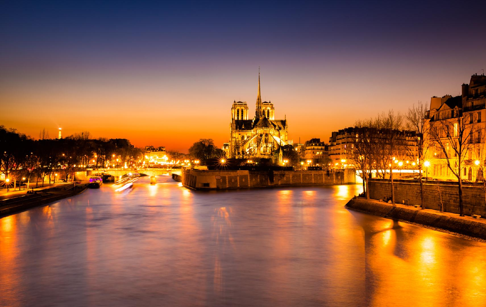
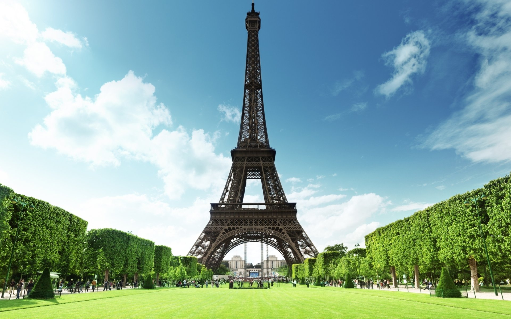
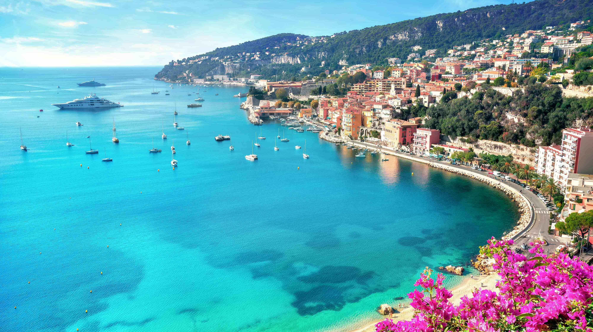
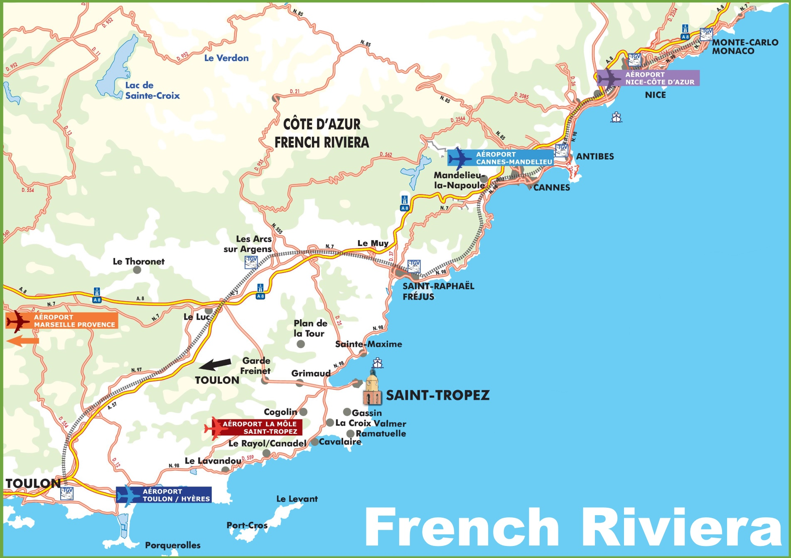
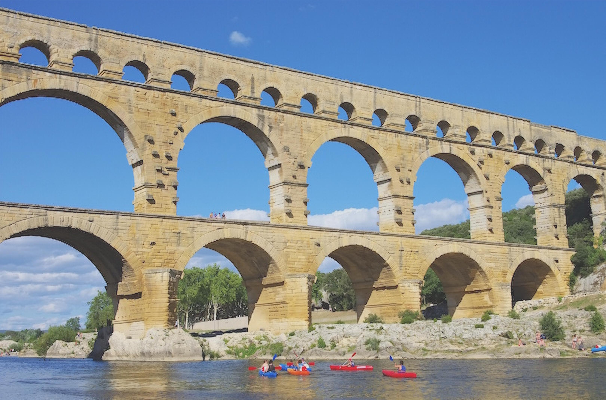
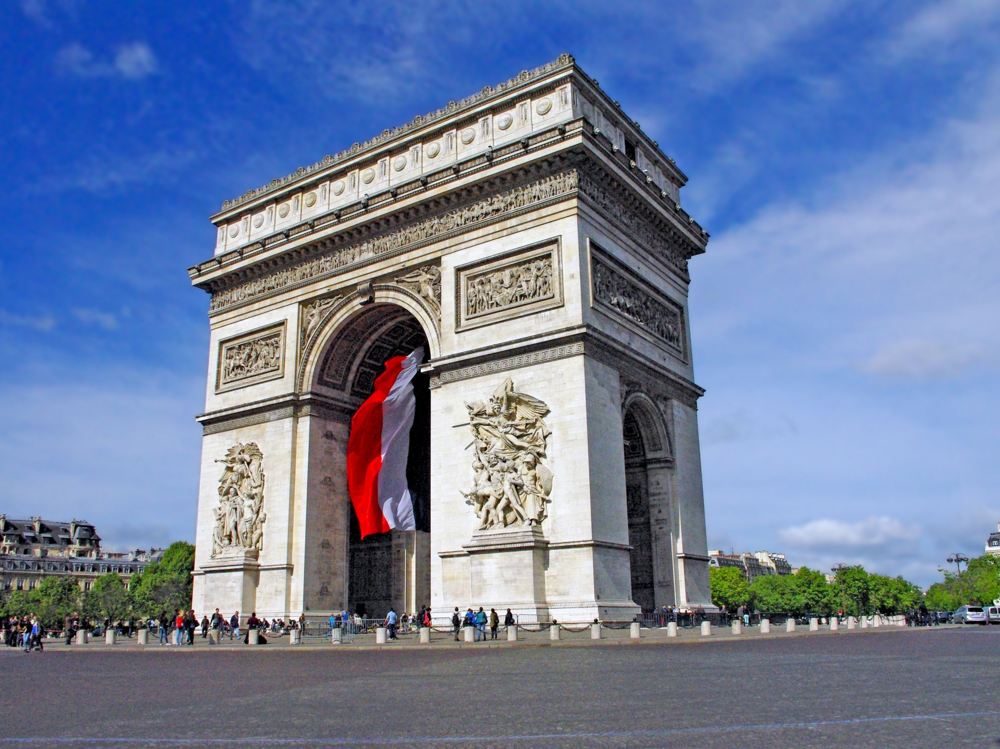
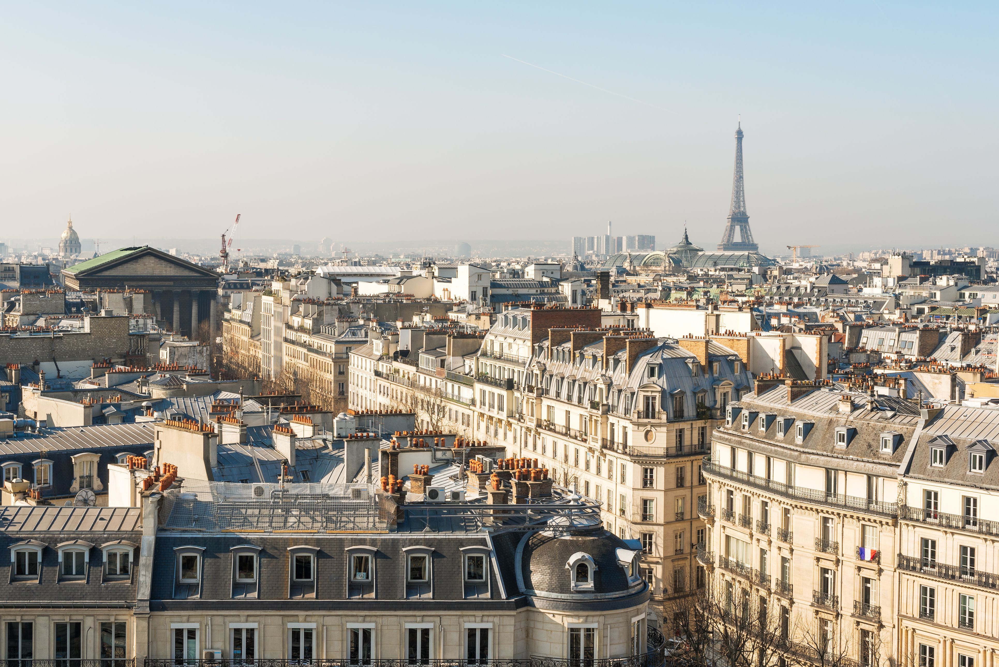

France is a beautiful country with a rich history and culture. Let's dive into five essential facts that you must know about France.

## 1. Paris: The City of Love
Paris, the capital of France, is often called the City of Love. It is famous for its iconic landmarks like the Eiffel Tower, Louvre Museum, and Notre-Dame Cathedral. Paris is known for its romantic ambiance, exquisite cuisine, and thriving art scene.

## 2. French Gastronomy: A Delight for Foodies
France is renowned for its exceptional cuisine and is considered a paradise for food lovers. French gastronomy is known for its delicate flavors, meticulous preparation, and use of fresh ingredients. Some famous French dishes include escargots, foie gras, coq au vin, and croissants.

## 3. The French Riviera: A Glamorous Coastal Destination
The French Riviera, also known as the Côte d'Azur, is a glamorous coastal region in the southeast of France. It stretches along the Mediterranean Sea and is famous for its picturesque beaches, luxurious resorts, and vibrant nightlife. The cities of Cannes, Nice, and Saint-Tropez are popular destinations in this region.

## 4. Historical Landmarks: Preserving the Past
France is home to numerous historical landmarks that attract tourists from around the world. The Palace of Versailles, Mont Saint-Michel, the Château de Chambord, and the Palace of the Popes are just a few examples of the country's rich architectural heritage. These landmarks offer a glimpse into France's glorious past.

## 5. Fashion and Style: The French Touch
France is globally recognized as a trendsetter in the fashion industry. Paris, particularly, is considered one of the fashion capitals of the world. French designers like Coco Chanel, Christian Dior, and Louis Vuitton have left an indelible mark on international fashion. The Paris Fashion Week is a highly anticipated event that showcases the latest trends and collections.

These are just a few highlights among the many fascinating aspects of France. From its romantic capital to its culinary delights and stunning landmarks, France offers a diverse and captivating experience for visitors. Explore this enchanting country and discover all that it has to offer!

