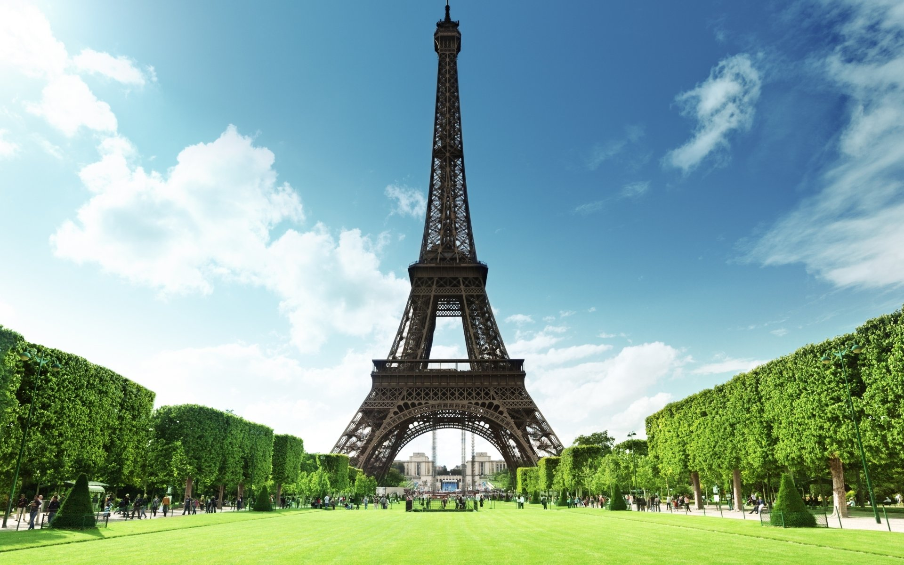
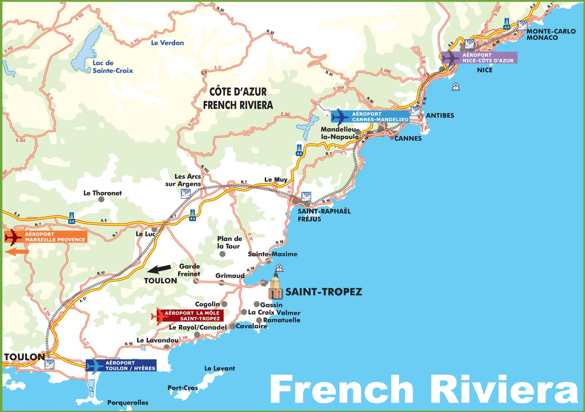
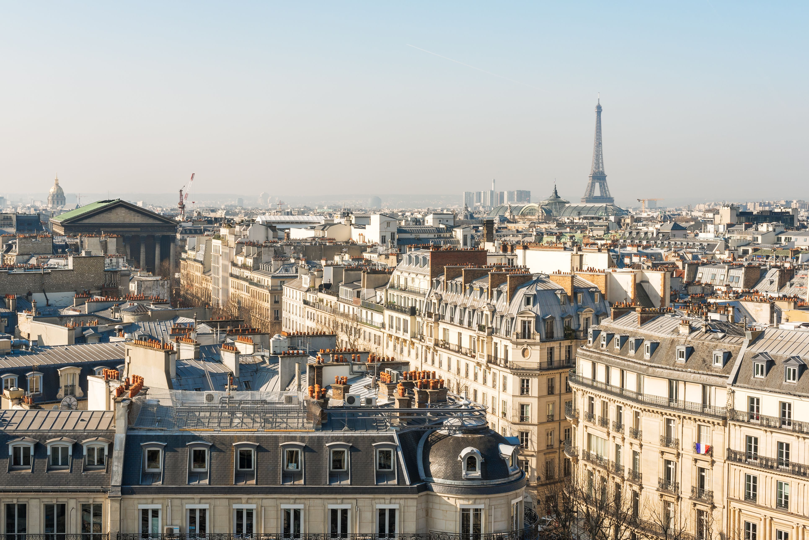

프랑스는 풍부한 역사와 문화를 지닌 아름다운 나라입니다. 프랑스에 대해 반드시 알아야 할 5가지 정보를 살펴보겠습니다.

## 1. 파리: 사랑의 도시
프랑스의 수도 파리는 흔히 사랑의 도시로 불린다. 에펠탑, 루브르 박물관, 노트르담 대성당과 같은 상징적인 랜드마크로 유명합니다. 파리는 낭만적인 분위기, 정교한 요리, 번창하는 예술 현장으로 유명합니다.

## 2. 프랑스 요리법: 식도락가를 위한 기쁨
프랑스는 뛰어난 요리로 유명하며 미식가들의 천국으로 여겨집니다. 프랑스 요리법은 섬세한 맛, 세심한 준비 및 신선한 재료 사용으로 유명합니다. 유명한 프랑스 요리로는 에스카르고, 푸아그라, 꼬꼬뱅, 크루아상 등이 있습니다.

## 3. 프렌치 리비에라: 매력적인 해안 여행지
Côte d'Azur라고도 알려진 프랑스 리비에라는 프랑스 남동부의 매력적인 해안 지역입니다. 지중해를 따라 뻗어 있으며 그림 같은 해변, 고급스러운 리조트 및 활기찬 밤문화로 유명합니다. 칸, 니스, 생트로페는 이 지역에서 인기 있는 여행지입니다.

## 4. 역사적 명소: 과거 보존
프랑스에는 전 세계 관광객을 끌어들이는 수많은 역사적 명소가 있습니다. 베르사유 궁전, 몽생미셸, 샹보르 성, 교황 궁전은 이 나라의 풍부한 건축 유산을 보여주는 몇 가지 예에 불과합니다. 이 랜드마크는 프랑스의 영광스러운 과거를 엿볼 수 있는 기회를 제공합니다.

## 5. 패션과 스타일: 프렌치 터치
프랑스는 세계적으로 패션 산업의 트렌드세터로 인정받고 있습니다. 특히 파리는 세계의 패션 수도 중 하나로 간주됩니다. Coco Chanel, Christian Dior 및 Louis Vuitton과 같은 프랑스 디자이너는 국제 패션에 지울 수 없는 흔적을 남겼습니다. 파리 패션 위크는 최신 트렌드와 컬렉션을 선보이는 매우 기대되는 행사입니다.

이것들은 프랑스의 많은 매력적인 면들 중 몇 가지 하이라이트일 뿐입니다. 낭만적인 수도에서 요리의 즐거움과 멋진 랜드마크에 이르기까지 프랑스는 방문객에게 다양하고 매력적인 경험을 제공합니다. 이 매혹적인 나라를 탐험하고 그것이 제공하는 모든 것을 발견하십시오!

