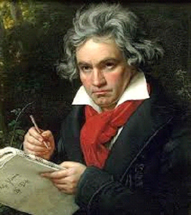
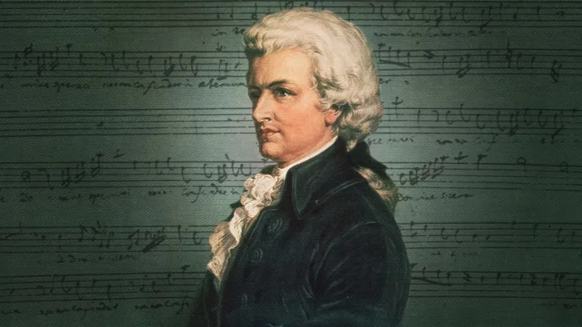
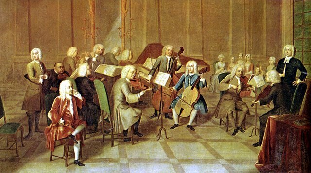
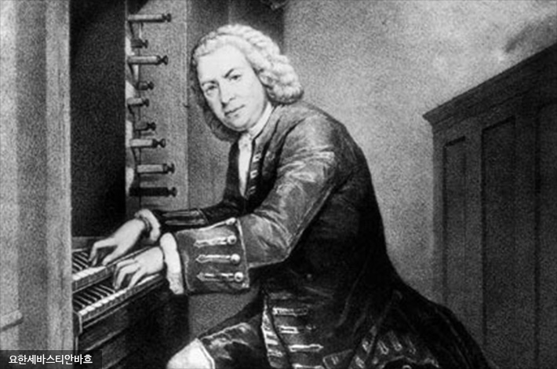

[클래식음악][topic]은 인간 정서와 예술적 표현을 깊이 있게 탐구하여 감정적인 풍요와 인지적인 성장을 제공 하고 역사적인 유산을 보존하며 우리의 문화와 정체성을 이해하고 현대 음악에 영감을 주는데 중요한 역할을 합니다.

이 중 우리가 죽기 전에 꼭 들어야 할 3곡을 소개하겠습니다.

## 1. [베토벤][main1]의 교향곡 제9번

이 상징적인 교향곡은 힘찬 결속력과 인간의 정신의 저항을 기리는 작품입니다. 그 중에서도 아무에게나 깊게 울리는 '기쁨의 노래'로 유명합니다.

## 2. [모차르트][main2]의 레퀴엠

유령같이 아름다운 이 곡은 청자들을 깊은 감정과 숙고의 세계로 이끕니다. 합창과 오케스트라의 조화로운 작품입니다.

## 3. [바흐][main3]의 브란덴부르크 협주곡 제3번

이 즐겁고 활기찬 작품은 [바흐][main3]의 오케스트레이션 작품 중 뛰어난 예시입니다. 각 악기가 한 명의 주인공처럼 표현되어 조화로운, 고무적인 경험을 선사합니다.

시간을 초월하여 세대를 연결하는 음악의 보편적 언어를 통해, 시대를 초월한 마스터피스에 몸을 빠져보세요.

[topic]: https://www.google.com/search?q=클래식음악
[main1]: https://www.google.com/search?q=모차르트
[main2]: https://www.google.com/search?q=바흐
[main3]: https://www.google.com/search?q=베토벤
