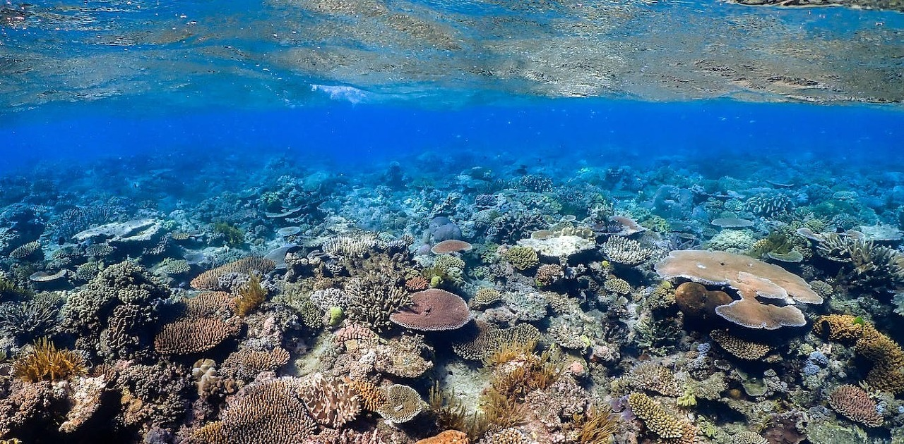
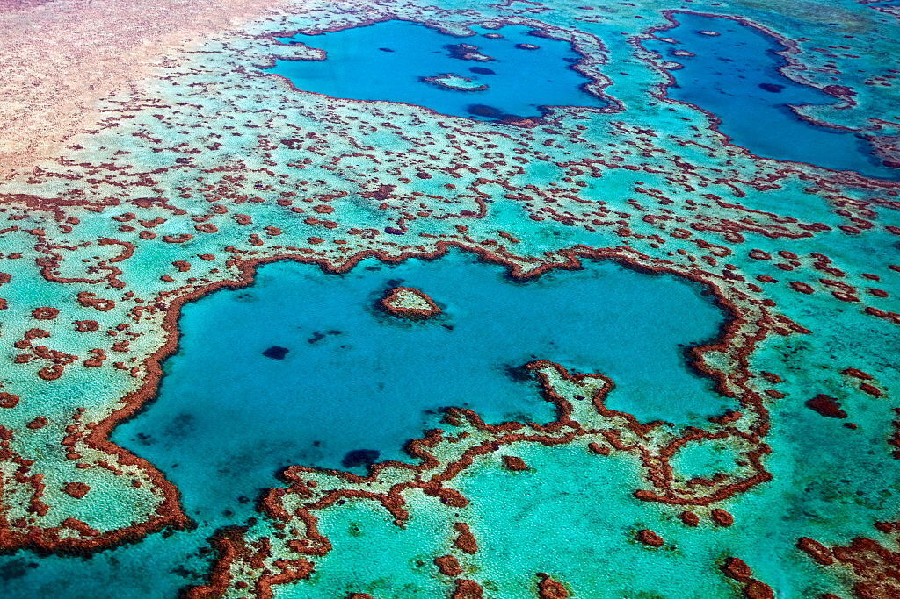
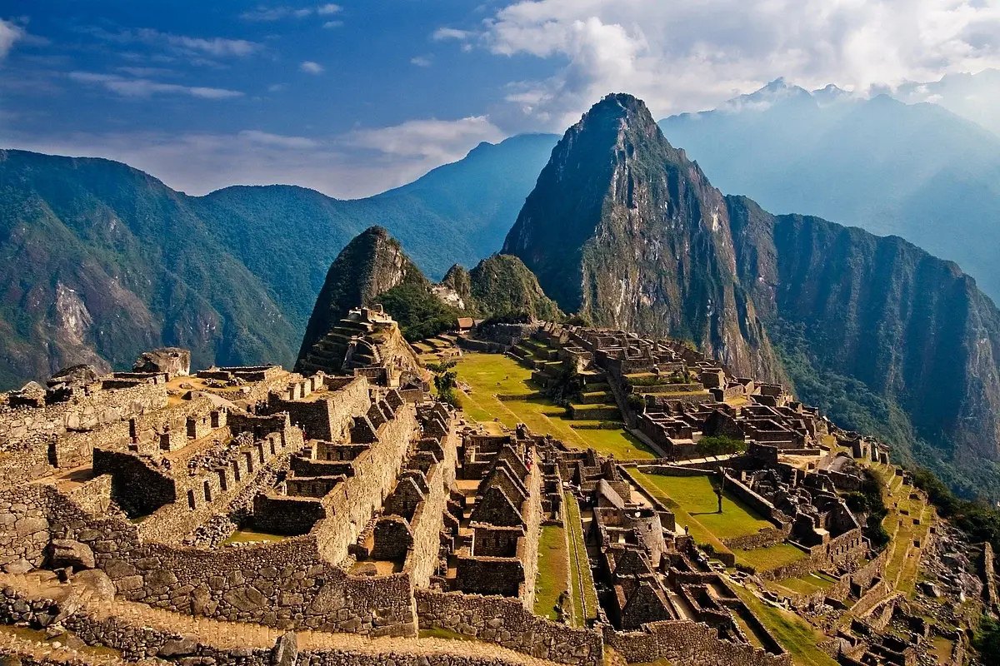
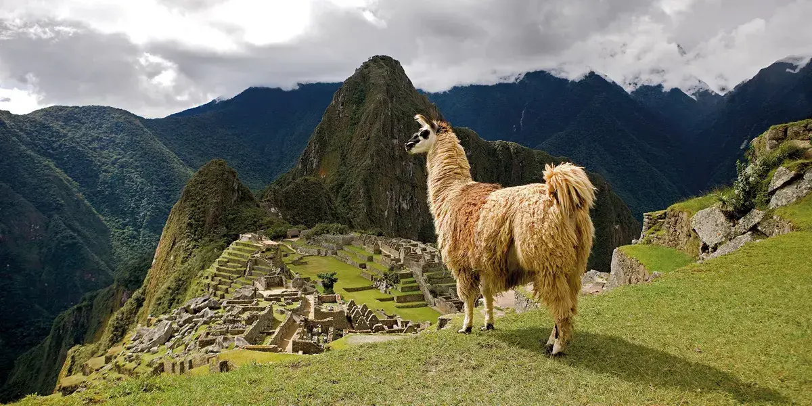
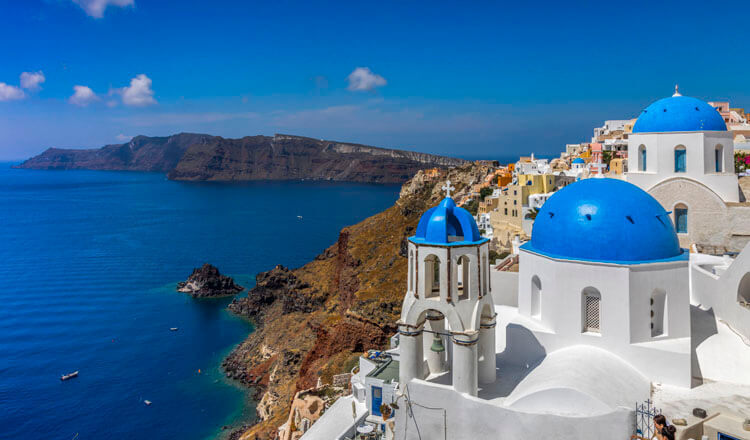
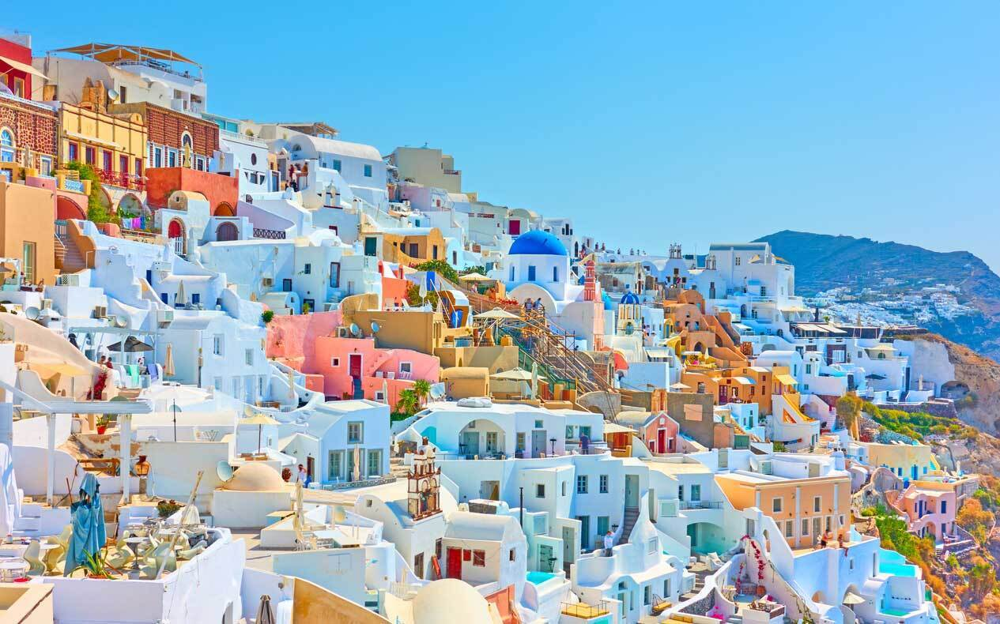

여기에서는 우리가 꼭 가보아야 할 세 가지 [해외 여행][topic] 장소를 소개합니다!

[해외 여행][topic]은 다양한 문화와 경험을 통해 시야를 넓히고 새로운 장소와 환상적인 경치를 탐험하며 더욱 풍부한 여행 경험을 쌓을 수 있습니다. 

## 1. [호주][main1]의 대산호초

먼저 [호주][main1] 앞 해안에 위치한 숨막히는 대산호초입니다. 세계 최대 규모의 산호초 생태계로 다양한 해양 생물과 생생한 산호 형태를 간직하고 있습니다.

## 2. [페루][main2]의 마추픽추

[페루][main2] 안데스 산맥 높은 곳에 자리한 인족 시대 도시 마추픽추입니다. 이 유네스코 세계 문화유산은 잉카 문명의 역사와 웅장한 건축을 소중히 보존하고 있습니다.

## 3. [그리스][main3]의 산토리니

[그리스][main3]의 그림 같은 섬 산토리니입니다. 특색 있는 흰색 건물과 에게 해를 비추는 아름다운 에게해 전경이 눈을 사로잡습니다. 매력적인 문화를 경험하고 현지 음식을 맛보며 환상적인 일몰을 감상해보세요.

이 멋진 장소들을 소중히 여기고 영원한 추억을 만드세요. 여행을 즐기고 글로벌 어드벤처를 최대한 즐겨보세요!

[topic]: https://www.google.com/search?q=해외여행
[main1]: https://www.google.com/search?q=호주
[main2]: https://www.google.com/search?q=페루
[main3]: https://www.google.com/search?q=그리스