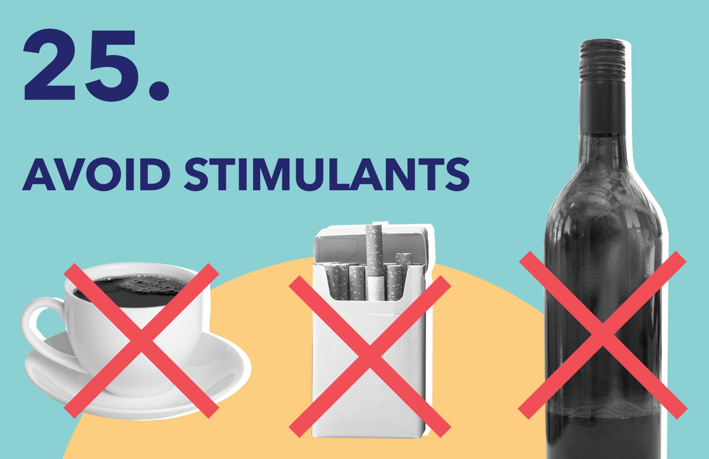

In today's fast-paced world, getting a good night's sleep is more important than ever. Here are 5 essential tips to ensure a restful sleep.

## Establish a Bedtime Routine
Set a consistent sleep schedule and engage in relaxing activities before bed. This signals your body and mind that it's time to wind down and prepares you for a restful sleep.

## Create a Comfortable Sleep Environment
Invest in a supportive mattress and pillows, control the room temperature, and reduce noise and light disturbances. Creating a cozy and peaceful sleep environment promotes better sleep quality.

## Limit Electronic Device Usage
Avoid using electronic devices, such as smartphones and laptops, at least an hour before bedtime. The blue light emitted by these devices can disrupt your sleep-wake cycle and make it harder to fall asleep.

## Practice Relaxation Techniques
Engage in activities that promote relaxation, such as meditation, deep breathing exercises, or gentle stretching. These techniques help reduce stress and promote a calm mind and body for a good night's sleep.

## Avoid Stimulants and Heavy Meals
Refrain from consuming caffeine, nicotine, and alcohol close to bedtime. Additionally, avoid eating heavy meals or spicy foods, as they can cause discomfort and disrupt your sleep. Opt for light snacks if needed.

By following these 5 essential tips, you can improve your sleep quality and wake up feeling refreshed and rejuvenated. Prioritize your sleep, and enjoy the benefits of a well-rested mind and body.

