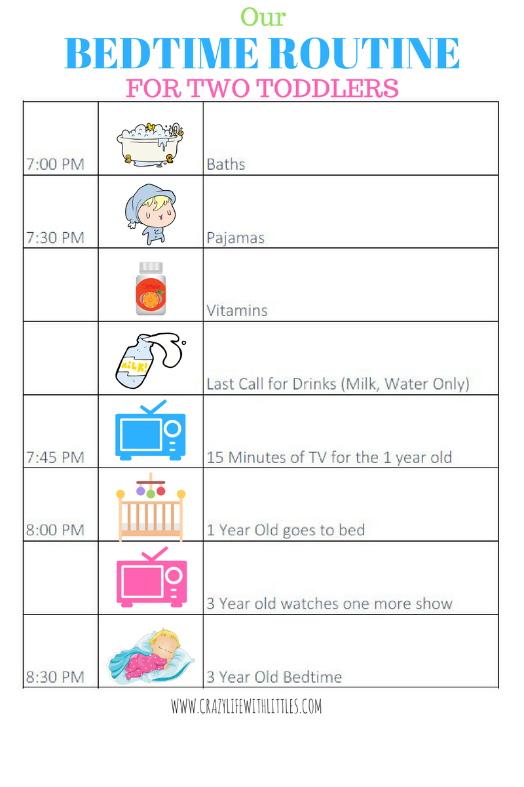
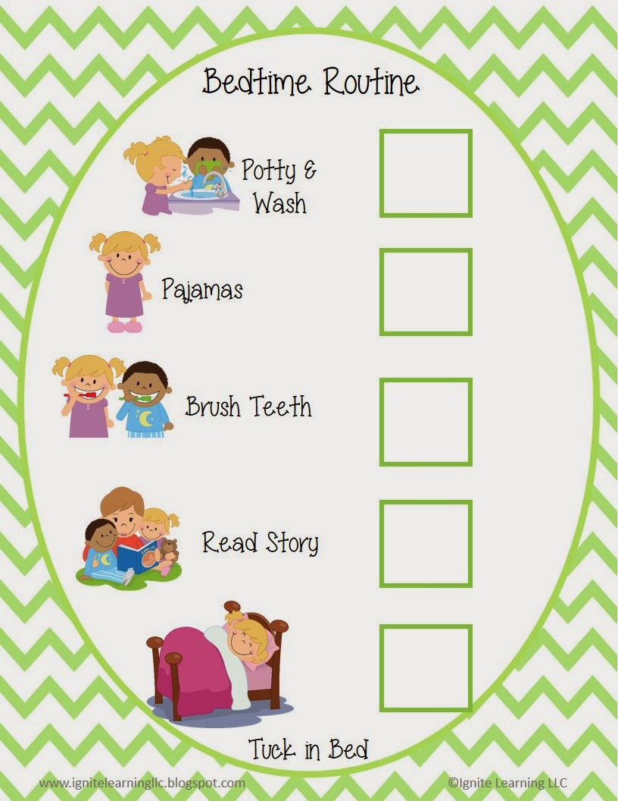
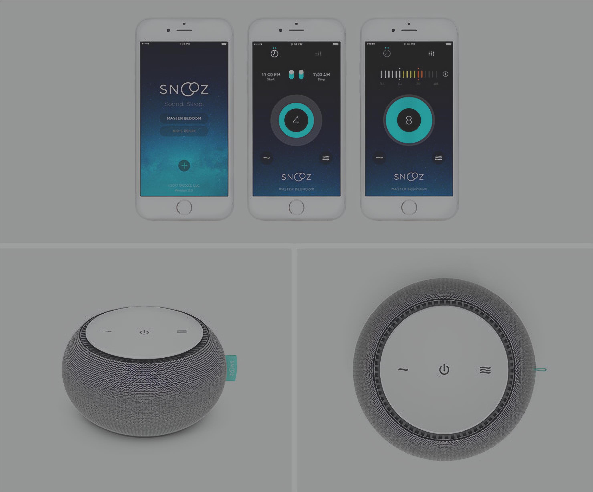
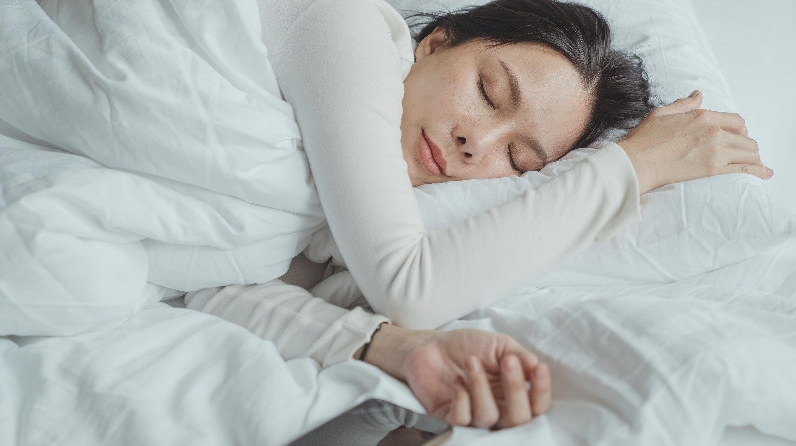
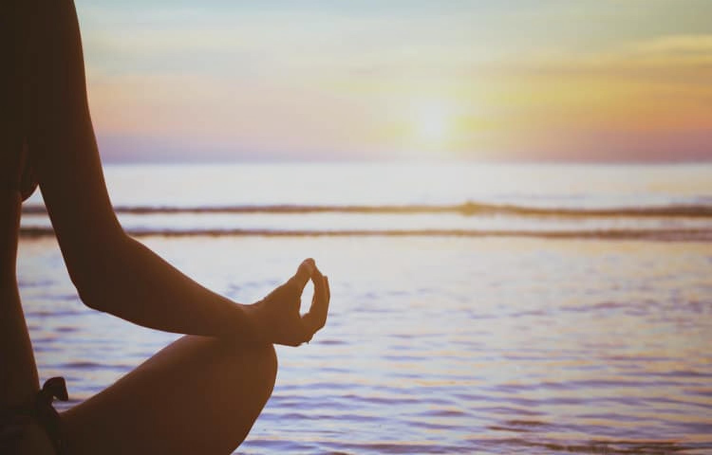
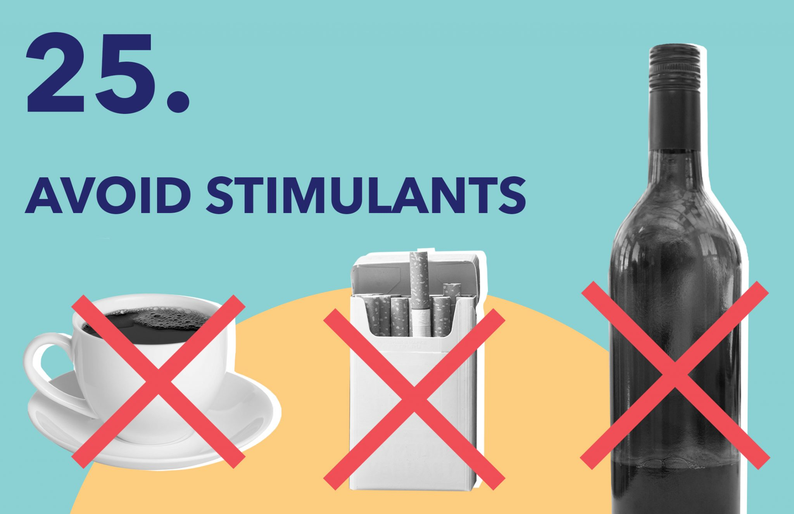

급변하는 오늘날의 세상에서 숙면을 취하는 것은 그 어느 때보다 중요합니다. 편안한 수면을 위한 5가지 필수 요령을 소개합니다.

## 취침 루틴 만들기
일관된 수면 일정을 정하고 잠자리에 들기 전에 편안한 활동을 하십시오. 이것은 당신의 몸과 마음에 긴장을 풀 시간임을 알리고 편안한 수면을 준비합니다.

## 편안한 수면 환경 조성
지지가 되는 매트리스와 베개에 투자하고, 실내 온도를 조절하고, 소음과 빛의 방해를 줄이십시오. 아늑하고 평화로운 수면 환경을 조성하면 수면의 질이 향상됩니다.

## 전자 장치 사용 제한
취침 최소 1시간 전에는 스마트폰, 노트북 등의 전자기기 사용을 피하세요. 이러한 장치에서 방출되는 청색광은 수면-각성 주기를 방해하고 잠들기 어렵게 만들 수 있습니다.

## 이완 기법 연습
명상, 심호흡 운동 또는 부드러운 스트레칭과 같이 휴식을 촉진하는 활동에 참여하십시오. 이러한 기술은 스트레스를 줄이고 숙면을 위해 마음과 몸을 차분하게 만드는 데 도움이 됩니다.

## 각성제와 과식 피하기
취침 시간에 가까운 카페인, 니코틴 및 알코올 섭취를 삼가하십시오. 또한 과식이나 매운 음식은 불편함을 유발하고 수면을 방해할 수 있으므로 피하십시오. 필요한 경우 가벼운 스낵을 선택하십시오.

이 5가지 필수 팁을 따르면 수면의 질을 개선하고 상쾌하고 활력을 되찾은 기분으로 일어날 수 있습니다. 수면을 우선순위에 두고 몸과 마음이 잘 쉬는 혜택을 누리십시오.

