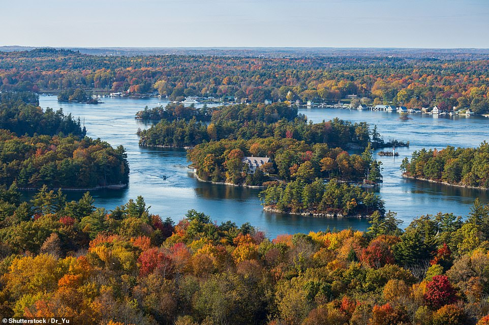
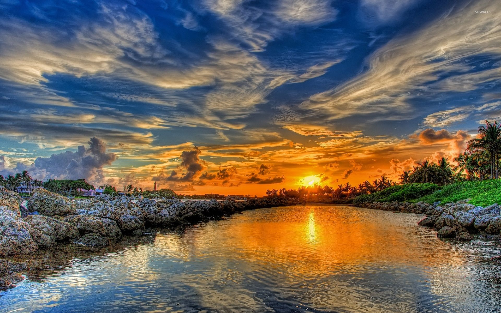
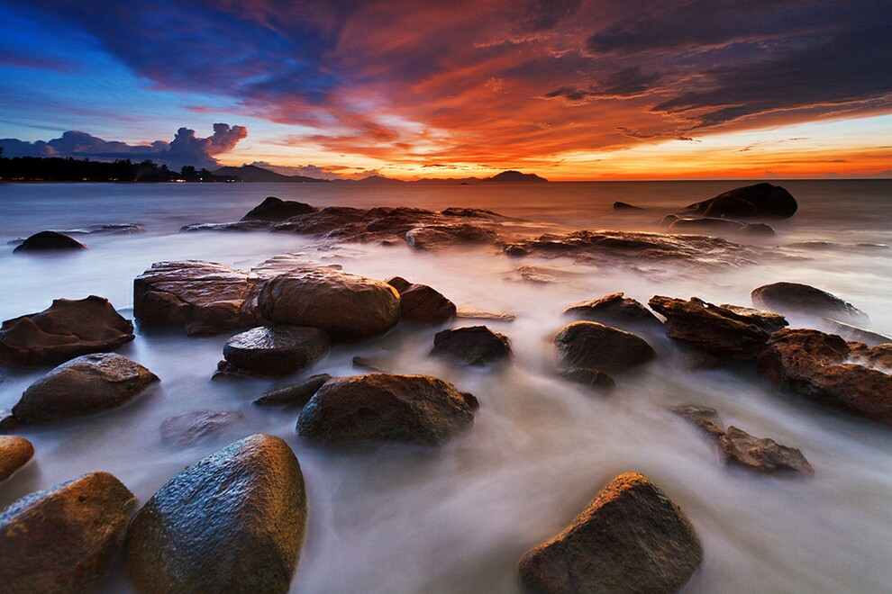

Discover the beauty of Canada's 1000 Islands and explore its unique attractions. From breathtaking landscapes to rich history, here are three key things to know about this incredible destination.

## Breathtaking Landscapes
The 1000 Islands region is renowned for its stunning natural beauty. With picturesque islands dotting the St. Lawrence River, visitors can enjoy panoramic views, lush forests, and majestic waterfalls. Don't miss the chance to witness the captivating sunsets that paint the skies over the islands.

## Rich History and Culture
The 1000 Islands area is steeped in history and culture. From visiting the famous Boldt Castle, a testament to the area's Gilded Age past, to exploring historic sites and museums, there are numerous opportunities to delve into the region's fascinating heritage. Learn about the Indigenous peoples who have inhabited the islands for centuries and uncover the stories that shaped this enchanting place.

## Outdoor Adventures and Activities
Embark on thrilling outdoor adventures in the 1000 Islands. Go kayaking or canoeing along the scenic waterways, try your hand at fishing in the abundant lakes, or take a cruise to explore the islands up close. Hiking trails, biking routes, and golf courses are also available for those seeking an active getaway. Experience the natural wonders of the region firsthand and create unforgettable memories.

Canada's 1000 Islands offer a remarkable blend of natural beauty, captivating history, and exciting activities. Whether you're an outdoor enthusiast, a history buff, or simply seeking a tranquil escape, this destination will not disappoint. Plan your trip to the 1000 Islands and immerse yourself in the wonders that await you.

