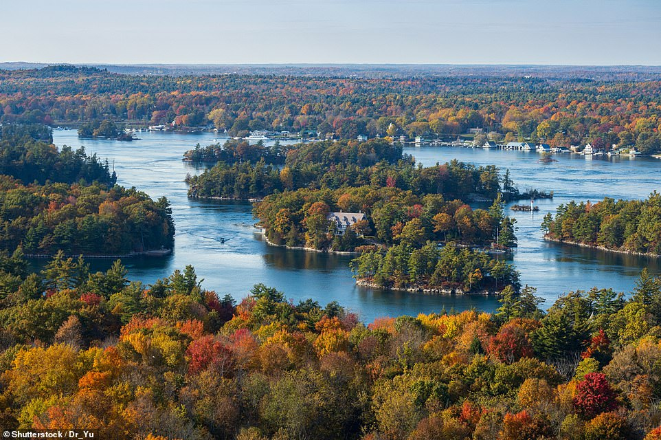
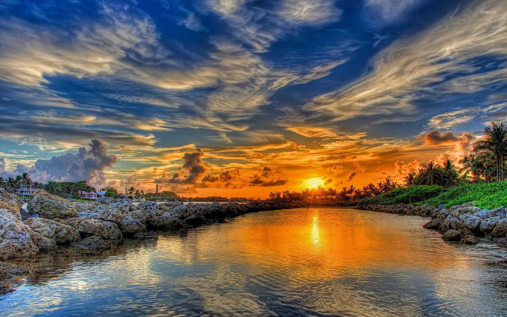
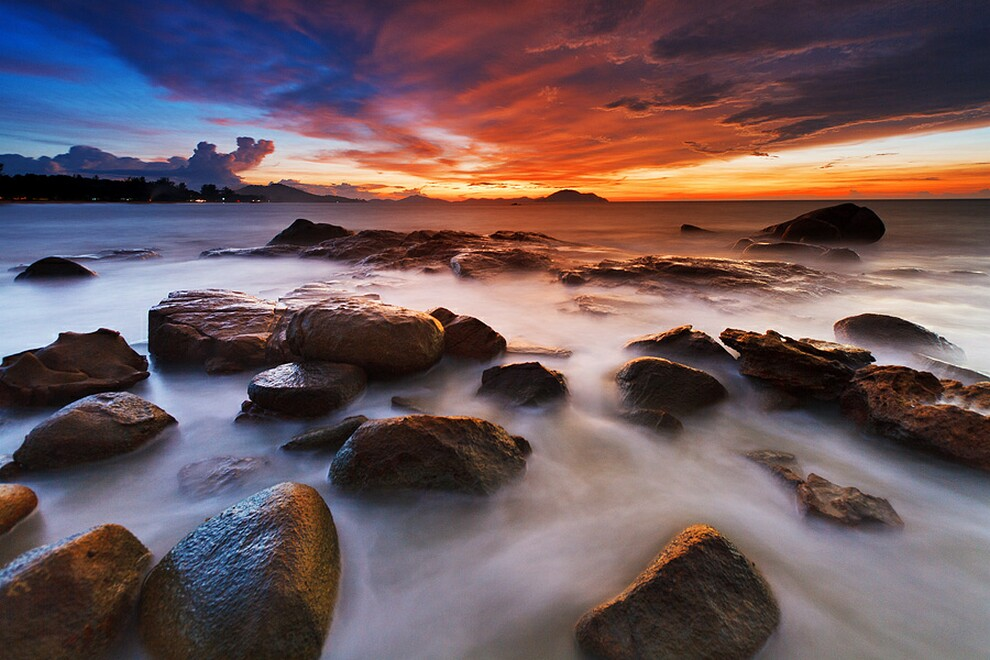
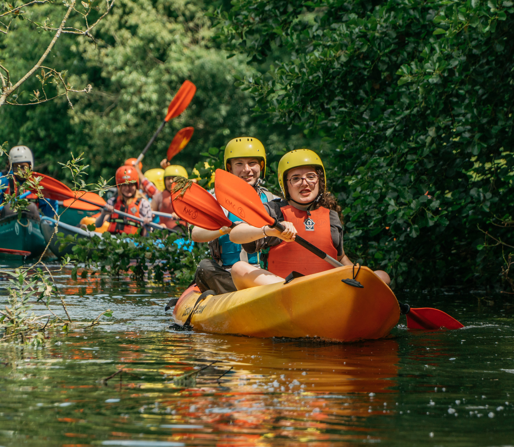
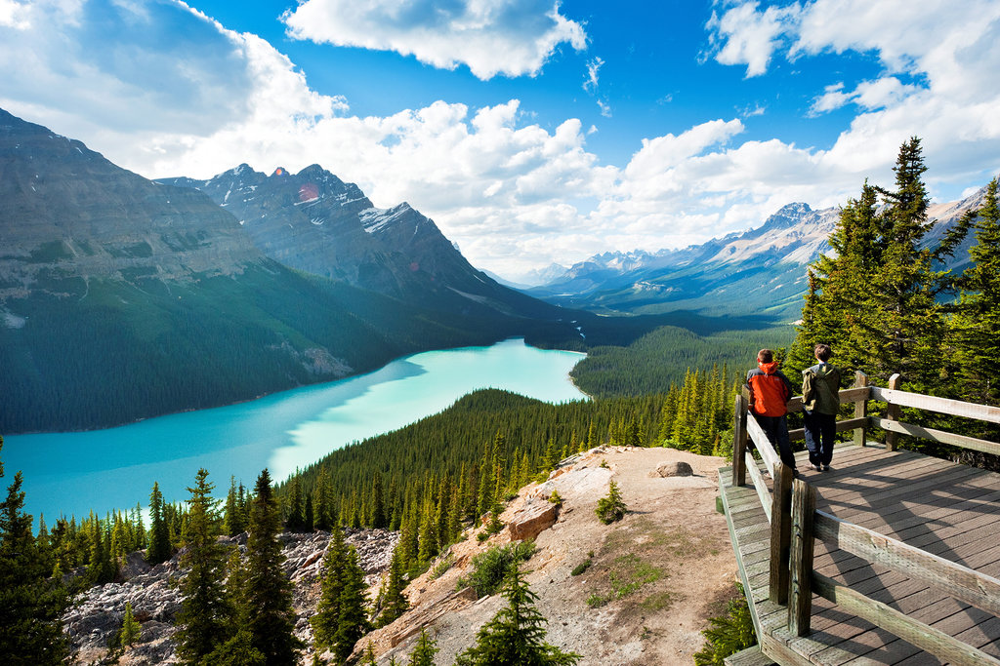

캐나다 1000개 섬의 아름다움을 발견하고 독특한 매력을 탐험하세요. 숨이 멎을 듯한 풍경에서 풍부한 역사에 이르기까지 이 놀라운 목적지에 대해 알아야 할 세 가지 핵심 사항이 있습니다.

## 숨막히는 풍경
1000 Islands 지역은 놀라운 자연의 아름다움으로 유명합니다. 그림 같은 섬이 세인트 로렌스 강을 점재하고 있어 방문객들은 탁 트인 전망, 울창한 숲, 장엄한 폭포를 즐길 수 있습니다. 섬 위로 하늘을 물들이는 매혹적인 일몰을 목격할 기회를 놓치지 마세요.

## 풍부한 역사와 문화
1000 Islands 지역은 역사와 문화가 깊은 곳입니다. 이 지역의 금박 시대 과거에 대한 증거인 유명한 볼트 성(Boldt Castle) 방문부터 사적지 및 박물관 탐험에 이르기까지 이 지역의 매혹적인 유산을 탐구할 수 있는 수많은 기회가 있습니다. 수세기 동안 섬에 거주해 온 원주민에 대해 알아보고 이 매혹적인 장소를 형성한 이야기를 알아보세요.

## 야외 모험 및 활동
1000 Islands에서 스릴 넘치는 야외 모험을 시작하세요. 경치 좋은 수로를 따라 카약이나 카누를 타거나 풍부한 호수에서 낚시를 해보거나 크루즈를 타고 섬을 가까이에서 탐험해 보세요. 활동적인 휴양을 원하는 사람들을 위해 하이킹 코스, 자전거 도로 및 골프 코스도 마련되어 있습니다. 이 지역의 경이로운 자연을 직접 경험하고 잊을 수 없는 추억을 만드십시오.

캐나다의 1000개 섬은 자연의 아름다움, 매혹적인 역사 및 흥미진진한 활동이 놀랍도록 조화를 이루고 있습니다. 야외 활동을 좋아하든, 역사를 좋아하든, 아니면 단순히 고요한 탈출을 추구하든, 이 목적지는 실망시키지 않을 것입니다. 1000개의 섬으로의 여행을 계획하고 여러분을 기다리고 있는 경이로움에 빠져보세요.

