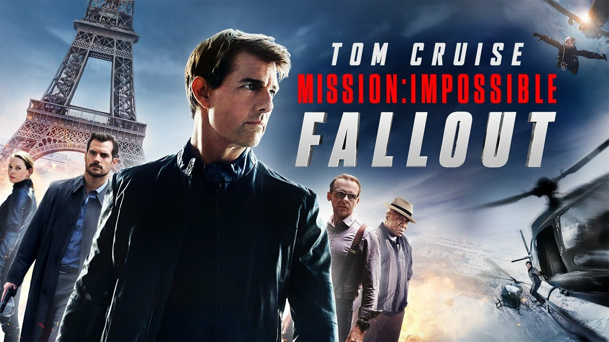
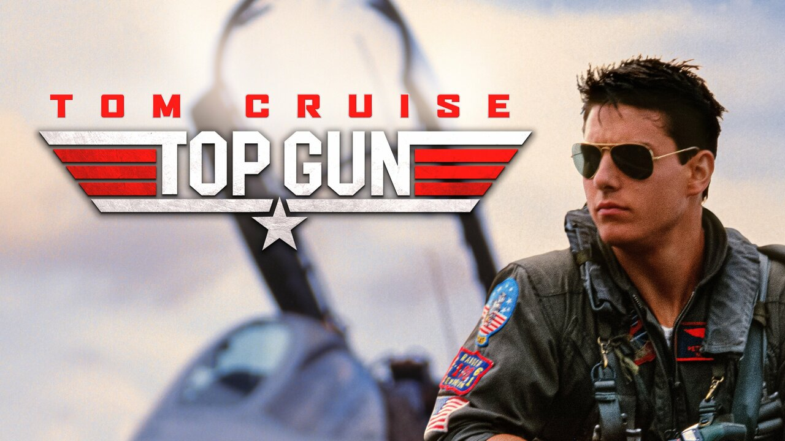

톰 크루즈, 할리우드의 아이콘적인 배우로서, 그의 연기력이 빛나는 여러 훌륭한 영화에 출연했습니다. 오늘은 우리가 죽기 전 꼭 봐야 할 톰 크루즈 영화 3편을 여러분께 소개합니다. 함께 초고속의 여행을 떠나볼까요?

## 1. 미션 임파서블 시리즈

가장 먼저, 미션 임파서블 시리즈를 만나보세요. 액션과 긴장감 그리고 숨막히는 스턴트로 가득 찬 이 작품은 크루즈가 이단의 임무를 수행하는 IMF 요원 이단 헌트 역할을 맡아 선보입니다. 초고층 건물을 타고 올라가거나 비행기 위에서 매달리는 등 스턴트를 직접 수행하는 크루즈의 헌신적인 연기는 전례 없는 경험을 선사합니다.

## 2. 탑건

다음으로, 탑 건을 소개합니다. 이 작품은 항공을 소재로 한 전설적인 영화입니다. 크루즈는 메이버릭이라는 이름의 유능한 해군 조종사 역할을 맡았습니다. 격렬한 조종사 전투, 기억에 남는 대사, 전설적인 사운드트랙이 함께 가득한 이 작품은 크루즈의 카리스마와 매력을 과시합니다. 속도에 대한 필요성을 느껴보세요!

## 3. 제리 맥과이어

마지막으로 제리 맥과이어를 만나봅시다, 감동적인 스포츠 드라마입니다. 크루즈는 개인적이고 직업적인 성장을 거듭하는 한 스포츠 에이전트의 역할을 맡았습니다. 이 작품은 충성심, 사랑, 행복을 그려냅니다. 크루즈의 강력한 연기력과 '돈을 보여줘!' 라는 전설적인 대사로 인해 반드시 볼 필요가 있는 작품입니다.

이 세 편의 톰 크루즈 영화는 그의 놀라운 필모그래피의 일부에 불과합니다. 액션 가득한 모험부터 감동적인 드라마까지, 크루즈는 세계적인 관객들에게 꾸준히 즐거움과 영감을 선사하고 있습니다. 이 작품들을 놓치지 마세요!